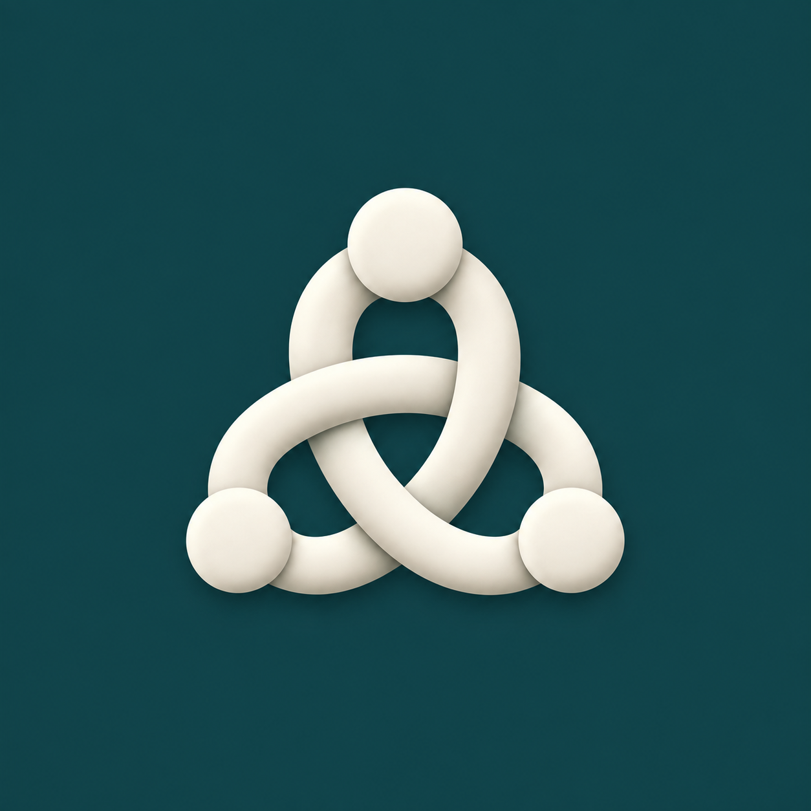

# Moor · 泊点

**代码留在自己的电脑，工作从任意设备继续。**

Moor 是基于 [Lody](https://github.com/LodyAI/Lody) 公共运行组件开发的独立项目，提供个人多设备访问、macOS 客户端和可自托管的移动 Web/PWA。手机或另一台电脑可以查看、继续和停止目标电脑上的 Agent 会话。

当前是个人使用的开发预览版：macOS Apple Silicon + Web/PWA。Windows、团队权限和公司 SSO 留待后续版本；macOS 安装包尚未完成开发者签名与公证。

## 0.2 的三个改进

- **连接状态与恢复**：客户端分别显示执行组件、本机工作区和中转服务的实时状态。执行组件意外退出后最多尝试恢复三次，连续失败后可手动重试。已有运行实例不会被终止，恢复过程不重放指令。
- **会话导航**：切换工作区、按项目筛选、按会话标题或项目名称搜索，按最近活动排序。重新打开页面时恢复之前的电脑、工作区、会话和本机草稿；手机使用可收起的会话抽屉。
- **输出阅读**：支持常用 Markdown、代码块复制、终端命令与输出、退出码、文件修改前后对照及变更统计。实时更新时保留已展开的工具记录。Agent 输出中的 HTML 不执行，也不自动加载远程图片。

## 使用

1. 在 Mac 打开 **Moor → 连接设置**，添加本机项目，选择 Codex 或 Claude，并完成相应 Agent 的本机登录。
2. 打开**本机工作区**。它通过本地连接使用执行组件，不依赖中转服务或远程账号。
3. 部署中转服务，在 Web 页面创建个人账号，点击**添加电脑**，将服务地址和一次性配对码填入 Mac。
4. 第二台 Mac 使用同一服务配对。在**我的所有电脑**或手机浏览器中登录同一账号，即可选择明确的执行电脑、项目和 Agent。
5. iPhone 使用 Safari 访问 HTTPS 地址，再选择**添加到主屏幕**。

已创建的会话始终由原电脑执行。切换电脑不会迁移项目或会话。关闭访问页面或 Mac 窗口不停止任务；明确退出客户端会停止它拥有的执行组件。电脑休眠、关机时无法执行，模型网络不可达时 Agent 也可能无法工作。

## 本地优先的数据模型

| 位置           | 持久化内容                                 |
| -------------- | ------------------------------------------ |
| 执行电脑       | 项目、Agent 配置、完整会话、请求去重记录   |
| 中转服务       | 账号、登录凭据哈希、设备绑定与撤销         |
| 手机和其他电脑 | 按需获取的会话缓存、自己的草稿、待确认请求 |

中转服务只在内存中转发正文，不保存完整会话副本。主机离线时，访问端只能阅读自己已经缓存的会话；浏览器缓存不构成备份。当前使用 HTTPS/WSS，尚无端到端加密，中转进程能够看到转发中的内容。

浏览器使用 Loro/Flock 生成文档操作，执行主机校验后接收。CRDT 同步不等于指令已经执行：

- **送达**必须由执行主机确认。
- **结果待确认**保留原请求编号，点击“重试确认”检查或完成同一个请求。
- **离线草稿**不会在重连后自动发送。
- **审批**只接受匹配当前回合、当前请求的有效响应，不自动批准。
- **并发指令**由主机校验会话状态；过期请求会被拒绝，并保留输入。

## 开发与构建

需要 Git、Node.js 24+、Corepack 和 pnpm 10.20.0。

```sh
git clone https://github.com/zZOMZz/moor.git
cd moor
node scripts/setup-runtime.mjs
corepack pnpm install --frozen-lockfile
corepack pnpm check
corepack pnpm test
corepack pnpm build
```

`setup-runtime` 按 [runtime.json](runtime.json) 拉取固定版本的公共 Lody 源码与所需 ACP 子模块到被忽略的 `.runtime/lody`，安装依赖并准备协议相关构建。它不需要任何 Lody 私有仓库。现有目录版本不一致时会停止，不覆盖本地修改。

若已准备好该版本的 Lody 工作区，可以显式复用：

```sh
node scripts/setup-runtime.mjs --source /path/to/Lody
corepack pnpm install --frozen-lockfile
```

```text
src/relay/     个人账号、设备绑定、临时消息转发
src/bridge/    主机校验、本地 IPC、请求去重
src/web/       桌面与移动浏览器共用界面
src/desktop/   Electron 壳、项目选择、连接诊断
scripts/       固定版本运行组件准备、构建与打包
```

### macOS 安装包

桌面启动优先打开随应用提供的本机工作区，中转在后台连接；访问其他电脑时使用菜单“我的所有电脑”。本机页面更新仅清理可重新生成的界面缓存，保留草稿与待确认请求。页面加载失败或超时会提供手动重试，重试加载不会自动发送任务。

Codex 执行时优先使用 `/Applications/Codex.app` 附带的 CLI，其次查找 Homebrew 的 `codex`，未找到时使用固定 Lody 版本管理的运行组件。可在启动 Moor 前通过 `MOOR_CODEX_PATH` 指定可执行文件的绝对路径；已有 Agent 配置中的显式路径保持不变。模型提示需要更新 Codex 时，应更新实际选中的本机 Codex。执行错误详情会直接显示在会话中。

在目标架构的 Mac 上构建：

```sh
node scripts/setup-runtime.mjs --build
corepack pnpm package:mac
```

结果位于 `release/macos-arm64/Moor.app` 与同目录 ZIP。客户端附带 Electron、Node 和 Lody 执行组件，运行时不需要源码目录、Node 或 pnpm。当前打包流程只构建本机架构，不生成 Windows 安装包。

包采用本地 ad-hoc 签名供开发验证，正式分发需使用开发者证书和公证。Lody 当前每个系统用户仅允许一个本地执行实例；若已有实例，请正常退出它，再点击 Moor 的**重新连接**。

升级旧版 Lody Personal 时，客户端优先复用原应用数据目录；浏览器数据库和凭据标识保留兼容。Web 更新在下次页面加载时生效，可使用浏览器刷新或客户端的 **窗口 → 刷新页面**。草稿仍保存在本机。

### 中转服务包

```sh
corepack pnpm package:relay
cd release/relay
MOOR_PUBLIC_DIR=./public MOOR_DATA_DIR=./data node server.mjs
```

浏览器访问 `http://localhost:3078`。首次启动会打印初始化口令文件的位置，使用该口令创建个人账号。邮箱只是登录标识，服务不发送邮件。

服务包 `release/moor-relay-0.2.0.tar.gz` 解压后可独立运行。公网或内网部署时，配置 `MOOR_ORIGIN=https://你的域名` 并通过 HTTPS 反向代理访问。电脑主动连接中转，无需开放电脑上的入站端口。

| 环境变量           | 默认值或作用                                              |
| ------------------ | --------------------------------------------------------- |
| `MOOR_ORIGIN`      | 浏览器访问的完整 origin；开发默认 `http://localhost:3078` |
| `HOST` / `PORT`    | `127.0.0.1` / `3078`                                      |
| `MOOR_DATA_DIR`    | 账号及设备数据库目录，默认 `.data`                        |
| `MOOR_PUBLIC_DIR`  | Web 静态资源目录，源码启动默认 `dist/public`              |
| `MOOR_SETUP_TOKEN` | 可选的首次初始化口令                                      |

兼容旧版 `PERSONAL_*` 环境变量，优先使用 `MOOR_*`。调试客户端可用 `MOOR_DESKTOP_DATA_DIR` 指向独立的测试数据目录。

### Docker 与 HTTPS

先生成服务包，再复制 `deploy/.env.example` 为 `deploy/.env`，填写服务器域名：

```sh
docker compose -p moor --env-file deploy/.env -f deploy/compose.yaml up -d --build
docker compose -p moor --env-file deploy/.env -f deploy/compose.yaml exec relay cat /data/setup-token
```

`relay-data` 卷保存账号和设备信息，Caddy 卷保存证书。公网入口需允许 80/443。该服务需要常驻 Node 进程、WebSocket 与 SQLite 文件，不是可直接上传的 Cloudflare Worker。

从公网迁往内网时，停止旧服务并完整备份数据卷；恢复到新服务，调整域名、证书及 `MOOR_ORIGIN`。域名变化时重新登录和配对，浏览器草稿与缓存不会跨域名迁移。完整命令与双 Mac/iPhone 验收步骤见 [部署与迁移说明](deploy/README.md)。已有部署应沿用原 Compose 项目名。项目与完整会话仍在各执行电脑，无需搬到服务端。

## 验证与范围

`pnpm test` 使用合成数据、公共 IPC 数据平面和确定性的故障信号，覆盖主机确认、请求去重、离线与审批竞争，以及会话选择、输出转义和恢复上限。本机 Docker 已验证 HTTPS/WSS、合成双主机路由和停机备份恢复；发布包另有测试确保运行数据不会进入压缩包。真实双 Mac + iPhone、真实 Agent 登录、目标服务器证书和网关、Windows 打包仍需在相应设备与环境验收，不能由本机模拟代替。

当前不支持团队成员权限、SSO、服务端历史副本、跨主机迁移项目、任意远程终端及额外 MCP 配置。架构保留独立的账号与设备边界，后续可扩展。

## 开源与品牌

Apache-2.0，见 [LICENSE](LICENSE) 和 [NOTICE](NOTICE)。Moor 是独立衍生项目，Lody 的署名和公共源码边界保持不变。图标通过内置 ImageGen 生成，提示词与资产说明见 [品牌说明](assets/brand/README.md)。
