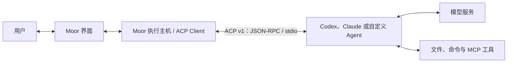
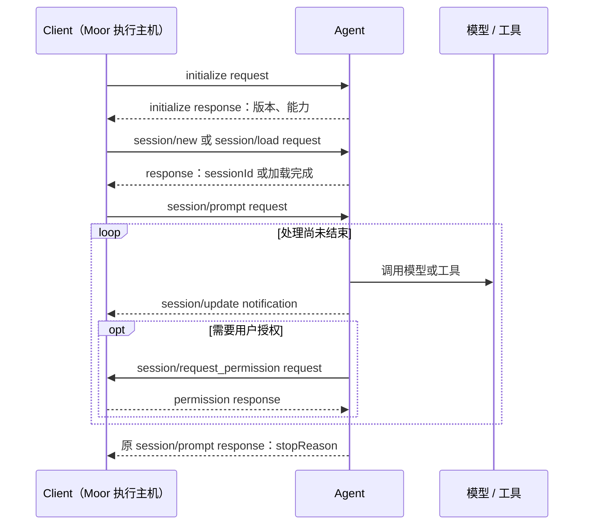

# ACP 入门：从 completions、response 与 message 理解协议

本文面向第一次真正接触 ACP 的读者。读完后，你应该能回答四个问题：ACP 连接谁和谁、一条用户消息怎样跑完整个回合、为什么正文不在最终 `response` 里，以及怎样在 Moor 仓库中跑一个不调用真实模型的 ACP 实验。

本文所说的 ACP 是 **Agent Client Protocol**。版本范围是 Moor 0.2.0 当前锁定的 `@agentclientprotocol/sdk` 1.4.0 稳定入口，也就是 ACP v1；内置适配器版本是 Codex ACP 1.11.0 和 Claude Agent ACP 0.76.0。SDK 中单独导出的实验性 v2 不在本文范围内。协议的当前定义以 [ACP v1 官方文档](https://agentclientprotocol.com/protocol/v1/overview)为准，Moor 的实际兼容范围还要以仓库锁定版本、实现和测试为准。

## 先用一句话理解 ACP

ACP 是客户端与编码 Agent 之间的双向协议：客户端发送用户指令并提供界面能力，Agent 流式报告文字、计划和工具调用，也可以反过来请求权限或向用户提问。



这里最重要的边界是：

- ACP 连接的是 **Client 与 Agent**，不是应用直接调用某个模型的推理接口。
- Agent 可以在一个回合里多次调用模型和工具；ACP 把整个过程投影给客户端。
- 在 Moor 中，浏览器不是直接的 ACP Client。执行主机中的适配层才是 Client，Agent 进程运行在项目所在电脑上。

官方架构也把 ACP 描述为基于 JSON-RPC、支持实时通知和反向请求的 Client–Agent 协议，参见 [ACP 架构](https://agentclientprotocol.com/get-started/architecture)。

## 用 completions、Responses 与 message 做类比

如果你使用过模型 API，下面的类比最容易建立第一层直觉。它们只帮助理解，并不是字段的一一转换。

| 你熟悉的概念                    | 在模型 API 中通常表示什么                 | ACP 中最接近的概念                                                |
| ------------------------------- | ----------------------------------------- | ----------------------------------------------------------------- |
| `completion` / Chat Completions | 给模型一组 `messages`，得到一次生成结果   | 一次 `session/prompt` 启动的 **prompt turn**                      |
| Responses API 的 `response`     | 包含模型输出 item、状态和用量等的结果对象 | 多个 `session/update` 加上最后的 `PromptResponse` 才构成完整观察  |
| `message`                       | 带角色的用户或助手内容                    | 输入侧的 `prompt: ContentBlock[]`，以及输出侧的 `*_message_chunk` |
| 流式 `delta` / event            | 逐段产生的模型输出                        | `session/update` 通知中的 `agent_message_chunk` 等更新            |
| `finish_reason` / 完成状态      | 本次模型生成为什么停止                    | `PromptResponse.stopReason`，但 ACP 的范围是整个 Agent 回合       |

[OpenAI Chat Completions](https://developers.openai.com/api/reference/resources/chat/subresources/completions/methods/create) 接收一组消息并返回 chat completion；[OpenAI Responses API](https://developers.openai.com/api/reference/resources/responses/methods/create) 则以 `input` 和输出 items 表达一次模型响应。ACP 位于更外层：Agent 可能在一次 ACP 回合中产生多次模型 response、调用多个工具并等待一次或多次人工决定。

因此不要直接写出下面这种等式：

```text
一个 ACP session/prompt = 一次模型 API 请求
```

更准确的关系是：

```text
一个 ACP prompt turn
  = 一条用户指令
  + 零到多次模型调用
  + 零到多次工具调用或人工交互
  + 多条实时更新
  + 一个结束响应
```

ACP v1 没有名为 `completions` 或 `responses` 的方法。最值得记住的句子是：

> `session/prompt` 启动回合，`session/update` 承载过程和正文，原 `session/prompt` 的 response 宣布回合结束。

## 先认清 JSON-RPC 的三种报文

ACP v1 使用 JSON-RPC 2.0。双方在同一连接上都可能发消息，但线路上的报文只有三种基本形态。

### Request：需要对方回答

Request 有 `id`、`method`，通常还有 `params`。接收方以后必须用同一个 `id` 返回 result 或 error。

```json
{
  "jsonrpc": "2.0",
  "id": 2,
  "method": "session/prompt",
  "params": {
    "sessionId": "native-session-1",
    "prompt": [{ "type": "text", "text": "请解释这个项目的入口" }]
  }
}
```

### Notification：只通知，不等待回答

Notification 有 `method`，但没有 `id`。没有 `id` 不是遗漏，而是在声明“不要响应”。流式正文就是这样送达的。

```json
{
  "jsonrpc": "2.0",
  "method": "session/update",
  "params": {
    "sessionId": "native-session-1",
    "update": {
      "sessionUpdate": "agent_message_chunk",
      "messageId": "agent-message-1",
      "content": { "type": "text", "text": "项目入口位于 " }
    }
  }
}
```

### Response：回答先前的 Request

Response 没有 `method`，用同一个 `id` 与 Request 配对。成功时带 `result`，失败时带 `error`，二者不能混用。

```json
{
  "jsonrpc": "2.0",
  "id": 2,
  "result": { "stopReason": "end_turn" }
}
```

失败响应的形状则是：

```json
{
  "jsonrpc": "2.0",
  "id": 2,
  "error": { "code": -32602, "message": "Invalid params" }
}
```

`response` 在这里是 JSON-RPC 的通用概念，不等于名为 Responses 的模型 API。ACP 官方概览对 Request/Notification、错误和响应的约定有完整说明，参见 [Communication Model](https://agentclientprotocol.com/protocol/v1/overview#communication-model)。

## 一次完整回合怎样发生

典型连接依次经历初始化、建立或加载会话、发送 prompt、接收更新，最后结束回合。



### 1. 初始化并协商能力

所有会话之前都必须先 `initialize`。Client 报告自己能处理什么，Agent 返回协议版本及自己的能力。

```json
{
  "jsonrpc": "2.0",
  "id": 0,
  "method": "initialize",
  "params": {
    "protocolVersion": 1,
    "clientInfo": { "name": "Moor", "version": "0.2.0" },
    "clientCapabilities": { "plan": {} }
  }
}
```

```json
{
  "jsonrpc": "2.0",
  "id": 0,
  "result": {
    "protocolVersion": 1,
    "agentCapabilities": {
      "loadSession": true,
      "promptCapabilities": {
        "image": false,
        "audio": false,
        "embeddedContext": false
      }
    },
    "agentInfo": { "name": "example-agent", "version": "1.0.0" },
    "authMethods": []
  }
}
```

能力协商不是装饰信息。未报告的可选能力必须按“不支持”处理。例如 `loadSession` 缺失时不能调用 `session/load`，未报告图片能力时也不能把图片塞进 prompt。详细规则见 [ACP 初始化](https://agentclientprotocol.com/protocol/v1/initialization)。

### 2. 新建或加载 Agent 会话

新会话至少给出绝对工作目录和 MCP 服务列表：

```json
{
  "jsonrpc": "2.0",
  "id": 1,
  "method": "session/new",
  "params": {
    "cwd": "/Users/demo/project",
    "mcpServers": []
  }
}
```

Agent 返回自己的原生会话编号：

```json
{
  "jsonrpc": "2.0",
  "id": 1,
  "result": { "sessionId": "native-session-1" }
}
```

恢复时改用 `session/load`，同时传回 `sessionId`、`cwd` 和本次要连接的 MCP 服务。Agent 可以在加载期间用 `session/update` 回放历史；这不是新一轮回答。创建与恢复的完整契约见 [ACP Session Setup](https://agentclientprotocol.com/protocol/v1/session-setup)。

### 3. 用 prompt 发送一条用户 message

Chat Completions 常见输入是 `messages: [{ role, content }]`；ACP 的 `session/prompt` 不接收这样的角色数组。它已经知道这是当前用户输入，因此发送的是 `ContentBlock[]`：

```json
{
  "jsonrpc": "2.0",
  "id": 2,
  "method": "session/prompt",
  "params": {
    "sessionId": "native-session-1",
    "prompt": [
      { "type": "text", "text": "请解释 src/main.ts" },
      {
        "type": "resource_link",
        "uri": "file:///Users/demo/project/src/main.ts",
        "name": "src/main.ts"
      }
    ]
  }
}
```

文本和资源链接是基础输入；图片、音频和嵌入资源受初始化时的 `promptCapabilities` 约束。Client 应先适配能力，再构造 prompt，不能发送后才期待 Agent 降级处理。

### 4. Agent 用 update 流出 message 与工具状态

Agent 的正文可以分成任意数量的 chunk。相同的 `messageId` 表示它们属于同一条逻辑消息：

```json
{
  "jsonrpc": "2.0",
  "method": "session/update",
  "params": {
    "sessionId": "native-session-1",
    "update": {
      "sessionUpdate": "agent_message_chunk",
      "messageId": "agent-message-1",
      "content": { "type": "text", "text": "`src/main.ts` " }
    }
  }
}
```

```json
{
  "jsonrpc": "2.0",
  "method": "session/update",
  "params": {
    "sessionId": "native-session-1",
    "update": {
      "sessionUpdate": "agent_message_chunk",
      "messageId": "agent-message-1",
      "content": { "type": "text", "text": "负责启动服务。" }
    }
  }
}
```

Client 把这两段组合后，用户看到的是一条消息：

```text
`src/main.ts` 负责启动服务。
```

`messageId` 是不透明标识，不应从格式中推导业务含义。在 ACP v1 中它可以省略；存在时，相同 ID 的 chunk 属于同一 message，ID 改变表示新 message。常见 `sessionUpdate` 还包括：

| `sessionUpdate`             | 用途                                 |
| --------------------------- | ------------------------------------ |
| `user_message_chunk`        | 回放或报告用户消息片段               |
| `agent_message_chunk`       | 展示给用户的 Agent 正文片段          |
| `agent_thought_chunk`       | Agent 报告的思考片段                 |
| `tool_call`                 | 建立一个工具调用及其初始状态         |
| `tool_call_update`          | 按 `toolCallId` 更新状态、内容或结果 |
| `plan`                      | 报告当前计划                         |
| `available_commands_update` | 更新可用命令                         |
| `usage_update`              | 报告当前上下文用量和可选的累计费用   |

不要把每个 chunk 当成一条聊天消息，也不要等最终 response 才显示内容。官方的回合示例见 [ACP Prompt Turn](https://agentclientprotocol.com/protocol/v1/prompt-turn)。

### 5. Agent 可以反过来请求 Client

ACP 是双向的。工具需要许可时，Agent 向 Client 发出带 `id` 的 `session/request_permission` Request：

```json
{
  "jsonrpc": "2.0",
  "id": "permission-1",
  "method": "session/request_permission",
  "params": {
    "sessionId": "native-session-1",
    "toolCall": {
      "toolCallId": "tool-1",
      "title": "修改 src/main.ts",
      "kind": "edit",
      "status": "pending"
    },
    "options": [
      { "optionId": "allow", "name": "允许一次", "kind": "allow_once" },
      { "optionId": "reject", "name": "拒绝", "kind": "reject_once" }
    ]
  }
}
```

Client 展示选择并用同一个 `id` 回答：

```json
{
  "jsonrpc": "2.0",
  "id": "permission-1",
  "result": {
    "outcome": { "outcome": "selected", "optionId": "allow" }
  }
}
```

这正是只按“请求发出方”和“请求接收方”来理解 client/server 容易困惑的地方：Client 会调用 Agent 方法，Agent 也会调用 Client 方法。实现 Client 时必须持续读取同一连接上的消息；如果一味阻塞等待 prompt 的最终 response，而不处理反向权限请求，双方会互相等待。

### 6. 最终 response 只宣布这一回合结束

没有待处理工作时，Agent 回答最初 `id: 2` 的 `session/prompt`：

```json
{
  "jsonrpc": "2.0",
  "id": 2,
  "result": { "stopReason": "end_turn" }
}
```

注意这里没有助手正文。正文已经通过前面的 `session/update` notifications 送达。锁定 SDK 还允许 `PromptResponse` 携带可选的 `usage`，但把该字段标记为实验性；客户端不能假定每个 Agent 都会上报。`PromptResponse` 的核心字段是 `stopReason`：

| `stopReason`        | 含义                                   |
| ------------------- | -------------------------------------- |
| `end_turn`          | Agent 正常结束本回合，没有继续请求工具 |
| `max_tokens`        | 达到 token 限制                        |
| `max_turn_requests` | 本回合允许的模型请求次数耗尽           |
| `refusal`           | Agent 拒绝继续                         |
| `cancelled`         | Client 取消了回合                      |

`end_turn` 只说明协议回合正常收束，不证明用户目标已经正确完成，也不证明生成的代码通过测试。Moor 将正常返回记录为 `handled`，但结果质量仍要从正文、工具结果和项目状态判断。

还要区分两类失败：

- JSON-RPC `error` 表示这次方法调用本身失败。
- 成功的 `PromptResponse` 加 `stopReason` 表示方法有一个可解释的停止结果。

## message 一词为什么特别容易混淆

阅读 ACP 代码时，`message` 至少可能指三件不同的事：

1. **JSON-RPC message**：线路上的任何 Request、Notification 或 Response。
2. **会话中的逻辑 message**：用户或 Agent 在界面上看到的一条内容。
3. **带 `messageId` 的 chunks**：构成某条逻辑 message 的一组实时片段。

判断它是哪一种时，看所在层次而不是只看变量名：

```text
线路层：JSON-RPC message
  └─ params.update：session update
       └─ content：一个 ContentBlock
            └─ 若干同 messageId 的 chunk 组成逻辑 message
```

另外，`session/prompt` 的 `id`、ACP `sessionId`、`messageId` 与 `toolCallId` 各自解决不同的关联问题，不能互换：

| 标识            | 关联什么                        |
| --------------- | ------------------------------- |
| JSON-RPC `id`   | 一个 Request 与它的 Response    |
| ACP `sessionId` | Agent 内的一段会话上下文        |
| `messageId`     | 同一会话内一条逻辑消息的 chunks |
| `toolCallId`    | 一个工具调用及其后续更新        |

## 取消不是另一条 completion 请求

Client 取消活动回合时发送 `session/cancel` Notification，因此它自身没有 response：

```json
{
  "jsonrpc": "2.0",
  "method": "session/cancel",
  "params": { "sessionId": "native-session-1" }
}
```

Client 应同时把仍待处理的权限请求回答为 `cancelled`；Agent 应尽快停止模型与工具工作，最终仍以 `stopReason: "cancelled"` 回答原来的 `session/prompt` Request。换言之，取消通知表达意图，原 prompt 的 response 才收束回合。

已经执行的外部副作用不会因为协议取消而自动回滚。例如文件已经写入后再取消，文件不会凭空恢复。连接中断时如果没有拿到最终 response，也不能仅凭“发过取消”推断 Agent 已停止。

## ACP 与 MCP 有什么区别

两者经常一起出现，但连接方向和职责不同：

```text
用户界面 / 编辑器 -- ACP --> 编码 Agent -- MCP --> 工具或数据服务
```

- ACP 解决 Client 怎样驱动 Agent、接收实时输出、展示工具过程并处理人工交互。
- MCP 解决 Agent 或模型怎样发现和调用工具、资源与外部服务。
- `session/new` 和 `session/load` 可以把 MCP 连接描述交给 Agent，但这不会把 MCP 变成 ACP，也不意味着两套协议共用一条线路。

在 Moor 中，额外 MCP 配置和凭据留在执行主机，只把本回合已授权的连接描述交给 Agent；具体边界见[本机 MCP](mcp.md)。

## 在 Moor 中怎样映射

通用 ACP 概念进入 Moor 后，还会多一层自己的会话、持久化和安全边界。

| 通用 ACP         | Moor 中的处理                                          |
| ---------------- | ------------------------------------------------------ |
| ACP Client       | 执行主机内的 `AgentDriver` / ACP 适配层，不是浏览器    |
| ACP Agent        | 锁定的 Codex/Claude 适配器，或本机明确登记的自定义 ACP |
| ACP `sessionId`  | Agent 原生会话 ID，只在执行主机私有保存                |
| Moor `sessionId` | Moor 自己的会话、路由与历史标识                        |
| `session/update` | 主机过滤、规范化支持的更新并写入当前 Moor 助手回合     |
| `PromptResponse` | 用于判断 Agent 回合怎样结束，并读取可验证的可选用量    |

两种会话 ID 的关系是：

```text
Moor sessionId ──主机私有映射──> Agent nativeSessionId
```

每次手动发送时，Moor 打开固定版本的 Agent：没有原生 ID 就调用 `session/new`，已有 ID 就先调用 `session/load`，应用本轮已验证的选项，再调用 `session/prompt`。加载期间的历史回放不会被当作本轮新回复；本轮完成后关闭所拥有的 Agent 进程并保留私有映射。详见[会话与回合](session.md#moor-会话与-agent-原生会话)。

Moor 当前通过 stdio 启动本机 Agent 子进程，用 NDJSON 表达 JSON-RPC：标准输出的每一行必须是一条完整 JSON 报文。诊断信息应写到 stderr，不能把普通日志混进 stdout。执行主机不向 ACP 声明文件系统或终端代理能力；Agent 在自身运行环境中能做什么，是另一层权限边界。

Moor 自己拥有并持久化会话格式，不读取其他应用的数据库，也不会把 ACP 的任意扩展元数据直接复制进共享历史。中转负责在线转发而不保存会话正文；原生 Agent 上下文也不等于 Moor 历史的备份。

## 在仓库里完成第一次实践

仓库自带一个确定性的合成 ACP Agent。它使用真实 stdio 和 JSON-RPC 往返，但不读取真实账号、不调用模型，也不访问项目文件。

先安装锁定依赖，然后运行 ACP 专项测试：

```sh
corepack pnpm install --frozen-lockfile
corepack pnpm exec tsx --test tests/acp.test.ts
```

你应看到两个测试通过。它们分别验证：

- `initialize → session/new → session/prompt → session/update → permission → PromptResponse` 的完整往返，以及随后用 `session/load` 恢复原生会话。
- 活动 prompt 收到取消后正常收束，没有偷偷开始另一轮执行。

建议按以下顺序阅读代码：

1. [合成 Agent](../scripts/synthetic-agent.mjs)：先看最小 JSON-RPC 分发器怎样处理 `initialize`、`session/new`、`session/prompt`、权限响应和取消。
2. [ACP 专项测试](../tests/acp.test.ts)：看 Client 侧怎样收集 updates、回应权限并恢复会话。
3. [Moor ACP 适配层](../src/runtime/acp.ts)：再看生产代码怎样启动子进程、协商能力、绑定活动回合、过滤私有信息、处理超时和关闭进程。
4. [AgentDriver 边界](../src/runtime/agent.ts)：最后看 ACP 如何被收敛成 Moor 内部的 `open`、`prompt`、`cancel` 与回调接口。

第一次阅读 `synthetic-agent.mjs` 时，可以只追踪四个编号：

```text
prompt 的 JSON-RPC id ────────────────> 最终 PromptResponse
permission 的 JSON-RPC id ────────────> 用户选择响应
sessionId ─────────────────────────────> 所有会话内操作
toolCallId ────────────────────────────> tool_call 与 tool_call_update
```

理解这四条关联后，再看计划、用量、附件、MCP 和扩展会容易很多。

## 实现自己的最小 Client 时

用 SDK 而不是手写请求关联、并发分发和报文校验。下面是与 Moor 当前适配层相同的核心结构，省略了子进程关闭、超时和错误处理，不能直接当作生产实现：

```ts
import { spawn } from 'node:child_process';
import { Readable, Writable } from 'node:stream';
import { ClientSideConnection, ndJsonStream, PROTOCOL_VERSION } from '@agentclientprotocol/sdk';

const child = spawn('/absolute/path/to/acp-agent', [], {
  stdio: ['pipe', 'pipe', 'inherit'],
});

async function main() {
  const connection = new ClientSideConnection(
    () => ({
      sessionUpdate: async ({ update }) => {
        if (update.sessionUpdate === 'agent_message_chunk') {
          console.log(update.content);
        }
      },
      requestPermission: async () => ({
        outcome: { outcome: 'cancelled' },
      }),
    }),
    ndJsonStream(
      Writable.toWeb(child.stdin) as WritableStream<Uint8Array>,
      Readable.toWeb(child.stdout) as ReadableStream<Uint8Array>,
    ),
  );

  const initialized = await connection.initialize({
    protocolVersion: PROTOCOL_VERSION,
    clientInfo: { name: 'learning-client', version: '0.1.0' },
    clientCapabilities: {},
  });

  if (initialized.protocolVersion !== PROTOCOL_VERSION) {
    throw new Error('不支持 Agent 选择的 ACP 版本');
  }

  const created = await connection.newSession({
    cwd: process.cwd(),
    mcpServers: [],
  });

  const completed = await connection.prompt({
    sessionId: created.sessionId,
    prompt: [{ type: 'text', text: '你好，ACP！' }],
  });

  console.log(completed.stopReason);
}

main().finally(() => child.kill());
```

这个骨架刻意让权限请求一律返回 `cancelled`。真正展示权限 UI 时，必须把响应绑定到仍在等待的精确请求和活动回合，不能把旧页面上的选择应用到新请求。生产代码还必须处理进程退出、线路损坏、超时、身份范围和未知结果，不能在 response 丢失后盲目重发可能已有副作用的操作。

## 新手最常见的错误

| 错误理解或实现                                       | 正确做法                                             |
| ---------------------------------------------------- | ---------------------------------------------------- |
| 把 ACP 当作另一种模型 completions API                | 把它看作 Client 驱动完整编码 Agent 的会话协议        |
| 等 prompt response 到达后才找正文                    | 实时消费 `session/update`；response 主要给出停止原因 |
| 收到一个 chunk 就新建一条 UI 消息                    | 按 update 类型与可用的 `messageId` 组合内容          |
| 给 Notification 返回 `{ result: {} }`                | Notification 没有 `id`，不得响应                     |
| 只等自己的 Request，不处理 Agent 反向 Request        | 始终并发分发线路消息，及时处理权限和问题             |
| 未协商就发送图片、恢复会话或 MCP 连接                | 先检查 `initialize` 的实际能力，缺失即不支持         |
| 混用 JSON-RPC id、sessionId、messageId 和 toolCallId | 分别按请求、会话、消息和工具调用建索引               |
| 把 `end_turn` 当作任务验收通过                       | 它只表示协议回合正常结束，仍需检查结果和测试         |
| 发出 cancel 就认定副作用已撤销                       | 等原 prompt 收束，并单独核查已经发生的外部状态       |
| response 丢失后自动再发原 prompt                     | 将结果视为未知，先核查；重放可能重复修改或外部操作   |
| 把 Agent 日志写到 stdout                             | stdio 模式的 stdout 只写 NDJSON，日志写 stderr       |

## 自测题

1. 为什么两个 `agent_message_chunk` 可以早于 `session/prompt` 的 response 到达？
2. `session/update` 为什么没有 JSON-RPC `id`？
3. 权限请求中的 `id` 和 `toolCallId` 各自关联什么？
4. 为什么一次 ACP prompt turn 可能包含多次模型 Responses API 调用？
5. 收到 `stopReason: "end_turn"` 后，还要检查哪些信息才能判断任务真的完成？
6. Moor 的 `sessionId` 与 Agent 返回的 ACP `sessionId` 为什么不能合并成一个字段？

参考答案：正文需要实时流出，因此 updates 与 prompt 并行；Notification 不期待响应；`id` 配对权限 Request/Response，`toolCallId` 配对工具及其更新；Agent 会在工具结果后再次调用模型；还要检查正文、工具状态、文件和测试；两种 ID 分别属于 Moor 持久会话与 Agent 原生上下文，生命周期和所有者不同。

继续阅读：[会话与回合](session.md) · [Agent 交互](agent-interactions.md) · [核心架构](core.md) · [开发与验证](development.md) · [文档目录](README.md)。
