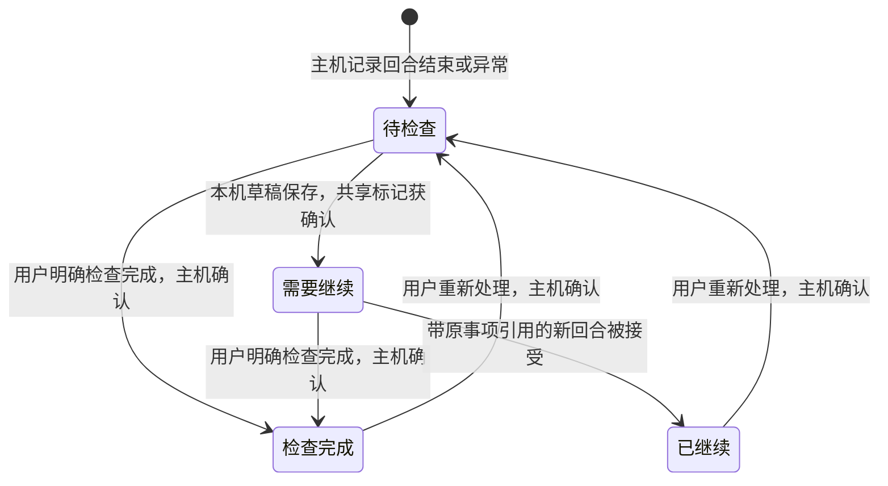

# 跨设备待办与任务收尾工作台

状态：首版实现。本文记录产品行为、主机接口和验收范围；实现经过合成测试，真实双 Mac、iPhone Safari/PWA 与真实 Agent 验收仍待完成。

设计面向个人多设备使用：用户离开执行电脑后，可以从手机发现阻塞、处理审批、检查结果，再从同一账号下的其他设备继续。会话仍是执行上下文；工作台组织需要用户处理的事项，不建立另一套 Agent 调度系统。

## 1. 产品目标与首版范围

典型场景：家中 Mac 与随身 Mac 同时运行多个会话。手机打开“个人开发”工作区，看到 1 个审批请求、1 个执行失败、2 个已经结束但尚未检查的结果。用户处理审批、检查一个结果、为另一个结果写下后续要求；回到电脑后，可以看到共享的处理进度。未发送的后续要求仍是手机自己的草稿，电脑不会自动取得或执行它。

首版提供：

- 工作区级“待我处理”入口，跨项目、跨执行电脑聚合审批、失败/中断和结束结果。
- 原因明确的事项卡片、回合定位、原始审批详情和当前有效性检查。
- 同一中转账号下的已查看、检查完成和需要继续状态；操作以主机确认结果为准。
- 从结果创建后续草稿，手动发送后建立与原事项的关联。
- 已处理记录、离线缓存、确认丢失后的手动重试和移动端交互。

首版不包含定时提醒、批量批准、自动重试执行、自动生成总结、跨设备草稿同步或代码验收证明。桌面通知与 Web Push 由现有通知路线接入同一事项来源；正文搜索、附件、真实 diff、Git/worktree 和 PR 操作继续按各自路线推进。

产品用词固定为：**执行结束、待检查、检查完成、需要继续、已继续**。“检查完成”是用户对该回合结果的处置记录，不是测试通过或代码质量的证明。Agent 调用正常返回也不表述为“任务成功”。

## 2. 页面与交互

### 入口和布局

工作区选择器下增加“待我处理”入口，保留原项目与会话导航。切换工作区时切换事项集合；不默认混合多个工作区或中转账号。

桌面采用事项列表与详情两栏；手机先显示列表，点开事项进入详情，返回时恢复分类、滚动位置和选中项。手机上的审批选项和结果操作保留在正常文档流内，触控目标至少 44px，不遮挡原始请求或草稿。

默认分类为“待我处理”，另有“已处理”。支持项目和执行电脑筛选。待处理列表依次分组为：

1. **等待审批**：按等待时间从早到晚排列。
2. **失败与中断**：最近发生的在前。
3. **需要继续**：已明确需要后续工作的结果，最近修改的在前。
4. **待检查**：已结束但尚未完成检查的结果，最近结束的在前。

单项结果一旦标为“需要继续”，归入该处理分组，同时保留原失败原因；尚未处理的失败才归入“失败与中断”。列表按会话聚合显示，同一会话在同一分类中只占一张卡片，归入其最高优先级的待处理分组。卡片显示该原因及其他待处理项数量；详情逐项列出对应回合和审批。导航角标计数为“待处理会话数”，来自各副本返回的完整总数；分组标题显示已加载的会话数，不把分页内容冒充全量分组计数。卡片可同时包含已经查看及尚未查看的事项。

卡片包含标题、项目、执行电脑、原因、发生时间和同步状态。主机离线时显示“缓存 · 最后同步于 …”；部分主机不可用时，列表顶部显示覆盖范围，例如“已同步 1/2 台电脑，另一台显示缓存”，不能把缺失数据显示为没有待办。首次打开且无缓存时显示“该电脑离线，待办状态未知”。

### 打开事项

打开详情先显示已有缓存，再请求主机当前状态。只有本次由用户打开、对应版本确实已经展示时，访问端才提交幂等的“已查看”记录；后台刷新、预取和收到通知均不触发。该记录只影响未读提示，不改变待处理分类、审批或执行状态。若记录未确认，仍保持未确认提示，不在重连时自动补交；查看记录与明确的审批/处置使用独立请求状态，不让未读提示阻塞用户处理。

详情显示对应回合的输入、结束状态、最后一段回复或结构化错误，并提供“打开原会话”定位入口。首版摘要是限长摘录并附来源，不调用 Agent 另写总结；工具提供的 diff 仍标为 Agent 返回的内容，不宣称覆盖完整文件变化。长正文和工具输出按需读取，不放入全工作区待办列表。

### 审批

列表不直接提供批准按钮。进入详情后，重新获取仍处于活动回合的请求，展示工具名称、原始请求内容、权限选项和执行位置。只有主机确认该请求当前有效时，才开放原选项。

用户选择后显示“正在提交”；主机确认后显示“已回应”。超时或响应丢失显示“结果待确认”，锁定本次决定，只提供“重试确认”。另一设备已回应时显示“已由其他页面处理”，刷新事实，不再提供旧选项。停止、回合结束或主机重启导致请求失效时显示“请求已失效”，不将它计为新的待办。

“已查看”或“检查完成”永远不能代替审批。审批继续使用现有精确回合和 requestId 校验，不新增快捷审批通道。

### 检查结果与继续

终态结果提供“检查完成”和“需要继续”。前者由主机保存后移入“已处理”；失败事项上的同一动作只表示用户已处理该异常，不改写失败事实。用户可以从已处理记录执行“重新处理”，产生新观察版本并返回待办。

选择“需要继续”时，先展示可编辑的后续草稿；若原会话已有草稿，先保留原文，将补充内容作为待插入片段，由用户合并，不能直接覆盖。草稿保存失败时，不提交共享状态变更。草稿成功保存后，再提交 `needs_followup`；该事项继续留在“待我处理”。草稿旁固定显示“仅此设备 · 尚未发送”。其他设备只看到“需要继续”，不能声称草稿已同步。

用户在事项详情手动发送后续要求时，通过专用接口提交原事项引用及预期版本。主机在接受新回合的同一事务内将原事项标为“已继续”，并保存关联。若已有活动回合、会话已归档或引用过期，整次提交拒绝，保留草稿，不静默丢弃引用后执行。没有引用的普通新回合不自动处理旧事项。新回合结束会产生独立的新事项。

归档不会清除待办或等价于检查完成。事项标注“会话已归档”，允许查看、检查完成和写草稿；发送仍需先通过 M1 恢复会话。原事项进入已处理列表时保留查看和后续回合链接，不改变原会话历史。

## 3. 四类相互独立的状态

| 状态层       | 数据来源                     | 作用                                   | 不代表什么             |
| ------------ | ---------------------------- | -------------------------------------- | ---------------------- |
| 执行事实     | 主机的回合生命周期与活动审批 | 是否等待权限、已结束、失败、中断或取消 | 用户已经检查、代码正确 |
| 查看状态     | 当前账号的 `seenRevision`    | 是否看过这个版本的事项                 | 审批决定、任务完成     |
| 处理状态     | 当前账号的 observation       | 待处理、检查完成、需要继续、已继续     | 更改 Agent 的原始结果  |
| 操作送达状态 | 当前访问端请求与主机凭据     | 正在提交、待确认、已确认、冲突         | 离线草稿可以自动执行   |

不能复用 `turn.read`：当前该字段表示主机接收了用户输入。也不能复用会话整理的 `metadataRevision`：置顶或改标题不应使一份检查决定失效。



查看行为没有连到这个状态图，因为它不改变处理状态。审批有效性则由活动执行状态决定，不能通过这些转换恢复。`continued` 只表示后续指令已被主机接受，不保证后续 Agent 启动或完成。

## 4. 身份与同步范围

### 可信访问者

增加持久的随机 `authorityId`，分别保存在中转账号数据库和桌面本机组织数据库中。账号主体为：

```text
Actor = authorityKind + authorityId + accountId
authorityKind = relay | local
```

authorityId 由对应 Moor 服务生成并随其数据库备份，不由浏览器指定。URL 是连接地址，邮箱是登录名，`RuntimeWorkspace.userId` 是本机执行身份，三者都不能代替 Actor。重新登录同一账号保持同一 Actor；同名邮箱在新数据库中创建的账号属于新 Actor。

| 访问方式                                 | 是否共享用户处理状态                                     |
| ---------------------------------------- | -------------------------------------------------------- |
| 手机与电脑登录同一中转服务的同一账号     | 是，分别向各执行主机读取同一 Actor 的记录                |
| 桌面“我的所有电脑”与手机登录同一中转账号 | 是                                                       |
| 桌面“本机工作区”与远程账号               | 否；首版不自动建立身份关联                               |
| 两个中转服务使用相同邮箱                 | 否                                                       |
| 同一账号重新配对同一 Moor 主机           | 重新验证归属后可读取原观察记录；旧待确认请求不转投新配对 |

Moor 当前的 `deviceId` 是已配对的**执行设备**编号，不是手机或浏览器编号。接口命名为 `executionDeviceId` 以消除歧义。观察记录不能以访问设备分区，否则无法跨端同步；客户端实例编号最多用于诊断，不能用于授权。

### 从登录到主机

1. HTTP 入口从登录 cookie 获得账号，验证设备未撤销、工作区归属、逻辑项目、副本和会话路由。浏览器请求体不得指定 Actor。
2. 中转为新接口注入带类型的上下文：Actor、executionDeviceId、machineId、产品 workspaceId/projectId/replicaId、runtimeWorkspaceId、localProjectId 和明确的 sessionId。列表请求显式声明项目级集合范围，不使用任意 session 通配符。
3. 主机从收到消息的 Target 确定可信服务来源，对照已固定的 authority/account/device 与消息上下文；再次验证运行工作区、本地项目和会话归属。产品组织归属由已认证中转验证，主机不能凭空从本地路径推断。
4. 新配对响应加入 authority/account 身份并保存在主机私有配对配置。旧配对首次启用该能力时，通过原配置的服务地址、原设备 bearer 和受信连接读取类型化身份，原子固定后才接受新接口。已固定的身份变化不能被后续消息静默覆盖。

该设计沿用当前受信中转和 HTTPS/WSS 边界，不新增端到端加密，也不能防止已受信的恶意中转冒充其账号。authorityId 用来防止不同服务的身份误混，并非中转签名或密钥。

### 迁移、撤销和通知

中转停机备份恢复需保留 authorityId 与账号 ID；若把备份用作独立新服务，必须生成新 authority 并重新配对。URL 变化仍按现有迁移流程显式重新连接/配对；相同 authority/account 与同一 runtime 身份可以恢复原观察记录。不同 authorityId 不合并，即使主机或邮箱相同。执行主机数据库重建产生新 runtime 身份，不能拿旧事项号恢复旧请求。

设备撤销后停止新读取、订阅和处置；已有客户端缓存只能保留为不可操作的历史副本，不能保证远程擦除。登出切断订阅并按现有策略清理该访问端状态。网络离线与明确撤销分开显示。

执行事实可以向有权访问它的连接发布失效提示；**个人观察记录的失效提示只发送到匹配 authority/account 的 Target 与已授权访问端**。不使用现有全 Target 广播转发观察记录、草稿或用户状态。失效通知只带范围和版本，不带正文；客户端重新读取，避免跨账号泄露。

## 5. 数据模型与持久化

保持会话格式 v1 和 M1 会话元数据语义不变。新增主机自有的侧表与类型化模块，分别保存生命周期事实、用户记录和去重凭据。生命周期事实中的结束时间、结构化原因、序号、启用归属和事件版本是权威数据，不能从 v1 正文完整重建；只有查询索引和限长摘要可以重建。

| 数据                         | 身份/主键                                 | 主要字段                                                                                                               |
| ---------------------------- | ----------------------------------------- | ---------------------------------------------------------------------------------------------------------------------- |
| `attention_item`             | runtime + localProject + session + itemId | assistantTurnId、kind、requestId（审批）、lifecycle、eventRevision、序号、发生时间、启用归属、结构化结束原因、来源引用 |
| `attention_observation`      | Actor + 稳定主机身份 + itemId             | seenRevision、disposition、observationRevision、更新时刻、followupUserTurnId                                           |
| `attention_receipt`          | Actor + operationId                       | 完整请求指纹、原执行绑定、确认结果                                                                                     |
| `attention_projection_state` | runtime + projectionVersion               | 首次启用边界、迁移进度、稳定序号和投影完整性                                                                           |

稳定主机身份包括 machineId、runtimeWorkspaceId、本地项目、会话和助手回合；逻辑项目归组和 relay deviceId 不成为永久观察记录主键。每次访问仍校验当前完整路由。

事项身份按以下规则确定，不以标题、时间戳或流式输出次数生成：

- 审批：`permission + sessionId + assistantTurnId + requestId`；同一回合可以有多条。
- 结果：`outcome + sessionId + assistantTurnId`；每个助手回合最多一条终态事项。
- 返回给访问端的身份包含稳定执行范围；不同主机相同 session/turn ID 不合并。

`eventRevision` 仅在事项事实发生有意义变化时增加。正文 token 更新、查看、置顶和更名不增加它。观察记录有独立 CAS 版本；已查看只单调推进 seenRevision，不递增用于处置竞争的 observationRevision，避免后台阅读使用户的明确操作无故冲突。

原始回合结束与事项事实在同一 SQLite 事务提交；失败回滚后不能广播完成。正常停止、异常结束、审批消耗和重启中断均更新相关事实。审批 lifecycle 为 active、resolved 或 invalidated；每次查询再与 `active.permissions` 联结：历史卡片、持久事实和缓存都不能证明请求仍有效。建立待审批记录时，须先完成持久提交才公开可操作状态；写入失败要清除内存请求并取消等待，不能留下幽灵审批。

结构化原因由主机记录为 `agent_returned`、`execution_failed`、`host_stopped`、`host_restarted`、`user_canceled` 或 `unknown`。当前适配层没有完整暴露 Agent stopReason，不能从中文错误字符串或 `handled` 推断更细的结果。显式用户停止默认进入已处理历史，不生成额外待检查红点；异常中断进入待办。旧数据缺乏可靠原因时只显示已有通用状态。

## 6. 接口、竞争与送达

以下接口已实现。都通过项目副本路由：`/api/workspaces/:workspaceId/replicas/:replicaId/…`。

| 接口                                                     | 行为                                | 核心校验                                         |
| -------------------------------------------------------- | ----------------------------------- | ------------------------------------------------ |
| `GET attention?view=…&cursor=…`                          | 读取该项目副本内当前 Actor 的事项页 | 明确项目级授权、能力与游标作用域                 |
| `GET sessions/:sessionId/attention?view=…&cursor=…`      | 同一会话内的事项分页                | 绑定会话、Actor 和列表版本                       |
| `GET sessions/:sessionId/attention/:itemId`              | 读取详情和当前审批有效性            | session/item/turn 与执行目标匹配                 |
| `POST sessions/:sessionId/attention/:itemId/seen`        | 记录已查看版本                      | 当前 Actor、确实存在的事件版本、幂等编号         |
| `POST sessions/:sessionId/attention/:itemId/disposition` | 检查完成、需要继续或重新处理        | eventRevision + observationRevision 双重校验     |
| `POST sessions/:sessionId/attention/:itemId/permission`  | 提交原权限选项                      | 保留原 expectedTurnId/requestId/operationId 校验 |
| `POST sessions/:sessionId/attention/:itemId/continue`    | 手动发送与原事项关联的后续指令      | 精确原事项、原子接受与关联，旧服务拒绝此新入口   |

处置请求包含 operationId、预期事项版本、预期观察版本和目标状态；权限决定不属于处置请求。新读取/操作均要求可信上下文，不能通过旧设备级宽泛接口降级调用。

手动继续使用专用新 HTTP 路由和 bridge method `attention-continue`，请求包含一份 `kind=turn` 的原发送 Mutation 及原事项两个预期版本；operationId 直接使用该 Mutation 的编号，不另造执行编号。主机复用原发送校验和接受事务，而非先发送再补记。事务同时保存新回合、原事项“已继续”、观察记录中的 `followupUserTurnId` 关联和作用域收据。审批工作台也使用专用 `attention-permission` 入口，由主机构造对原请求的权限操作，复用同一执行去重和接受事务；不会把 Actor 或事项上下文写入旧 CRDT 字段。普通发送与这种发送都必须经过同一会话串行锁及全局执行去重入口，不能因新方法绕开原并发限制；执行 Journal 的指纹明确包含方法、Actor 与关联上下文，防止拿同一 Mutation 再经普通发送入口执行一次。

账号、凭据和未发送草稿不进入 CRDT 共享字段；手动发送后的文本按现有会话格式保存。旧中转对此新路径返回不支持，旧主机拒绝新 bridge method；访问端绝不能退回旧 `mutations` 路径去掉引用后执行。能力门控负责展示入口，独立方法保证旧解析器不会剥掉扩展字段后误执行普通指令。

同一事项的两个新处置并发时，首个有效写入获确认，第二个返回冲突并附刷新入口，不采用无提示的后写覆盖。重试原 operationId 时，先重新验证当前访问授权和目标，再核对完整指纹，返回原凭据；即使当前版本已经变化，也不能把原凭据解释成当前最终状态，仍须刷新事项。

收据指纹绑定 Actor、原 executionDeviceId、稳定执行目标、事项、版本和动作。工作区重新归组允许在重新验证的路由中查询同一操作，但不改原请求内容；重新配对得到新 executionDeviceId 后，不自动搬运未知结果的旧请求。访问端保留旧记录，并重新读取当前事实供用户判断。

访问端在发出显式写操作前保存完整待确认请求；缓存失败则不发送。离线只读和写本机草稿，不排队提交共享标记。重连、页面恢复或后台失效提示可以触发读取，不能自动提交已有待确认请求；它只由用户按“重试确认”重发。写请求必须获得主机持久化确认，不能用 WebSocket 已发送或本地乐观更新显示处理成功。

## 7. 聚合、缓存与升级

访问端按已授权项目副本请求主机数据，初始并发最多 4 个。每副本每页最多 50 个会话组，按固定优先级和稳定序号排序，显式“加载更多”；同一会话的事项也分页。卡片摘要限制在 240 个字符内，原始输入和输出只在详情中按需获取。角标由主机返回该副本完整集合的待处理会话计数，不能用当前页长度冒充总数。

首版采用失效后重新读取第一页及显式后续页，不设计跨主机全局时间线或无限增量日志。游标绑定 Actor、项目、筛选、列表版本和分页位置；变化后返回游标过期，由访问端重新读取，并保留选择。晚到结果须通过账号、工作区、请求代次和目标版本检查，不能覆盖新页面。

访问端缓存按服务 origin、Actor、稳定执行目标分区。收到当前授权目录后，只呈现仍有权访问的映射。个人草稿额外绑定会话和事项引用，保留在当前访问端；本机与远程 origin 不互读浏览器存储。

首次启用时，在主机尚未接受新执行前扫描自有正文，为既有终态建立 `historical` 事实记录，结束时间和原因不可恢复时留空或 unknown，不把回合开始时间当作结束时间。这些旧结果可在历史中查询，但不灌入待办。完成迁移并保存启用边界后，才收束仍未结束的回合并开放执行，因此这次升级造成的中断会成为新事项。当前仍有效的审批和启用后结束的回合也进入待办。historical 不是用户已检查，用户可手动将旧结果加入待处理。

侧表迁移与查询投影采用独立版本，保留现有 user_version=1 的既有含义。设计要求增加显式、事务性的侧表迁移；迁移完成前新能力显示未就绪。重启、查询索引重建或备份恢复必须复用权威事实中的稳定 itemId、序号、版本、启用归属和已有观察记录，不制造重复新事项。主机备份必须同时包含这些侧表；若权威侧表损坏或缺失，应从完整 Moor 备份恢复并报告不可用，不能仅扫描正文声称已无损恢复。

桥接协议保持 v3 的原有会话操作兼容，通过协商 `attention-v1`、`actor-context-v1`、`attention-followup-v1` 开放新接口。只有主机、连接和访问端全部支持必需能力时才提供共享处置和引用发送。旧主机显示“更新执行电脑后可查看待办”；无响应显示离线/未知，不能默认为零。锁定解析器的未知字段和能力处理已通过兼容性测试；需要破坏性协议变化时必须另立版本迁移，不能偷偷降级。

## 8. 与现有路线的接缝

实现基线采用已完成的 M1 会话管理行为；已集成 M1 基线 `4aeb4bb7`，保留其元数据确认、草稿和旧响应保护。

| 模块                                                                    | 职责                                        | 接缝                              |
| ----------------------------------------------------------------------- | ------------------------------------------- | --------------------------------- |
| 新 `packages/protocol/src/attention.ts`                                 | DTO、事件/观察状态、上下文和能力类型        | 类型化主机和 Web 边界             |
| 新 `packages/host/src/persistence/attention-store.ts`                   | 侧表迁移、投影、分页、观察和收据            | `RuntimeStore` 生命周期事务       |
| `packages/host/src/sessions/workspace.ts`                               | 活跃审批联结、Actor 和事件校验              | 原权限/结束/取消钩子及接受事务    |
| `packages/gateway/src/accounts.ts` 与 `host-main.ts`                    | authority 身份、配对固定、Target 可信上下文 | 现有登录与设备凭据                |
| `packages/gateway/src/http.ts`                                          | 注入可信身份、范围校验和定向失效转发        | 原项目副本路由                    |
| 新 `apps/web/src/features/attention/attention.ts` 与 `attention-ui.tsx` | 聚合、详情、处置、窄屏交互                  | `app.ts` 保留入口、路由与草稿适配 |
| M1 会话管理                                                             | 归档/恢复、标题、置顶                       | 只读展示，发送仍走原归档校验      |
| M2 通知                                                                 | 完成、异常、审批的系统提醒                  | 复用稳定事项 ID，打开后重新读取   |

用户观察记录与事项摘要只存在主机和授权访问端缓存。中转可以持久保存 authority、账号和组织元数据，但不保存事项索引、摘录、处理记录或草稿。避免在现有大型 `app.ts` 和 `ui.tsx` 中继续堆积领域逻辑。

## 9. 交付顺序与验收

每批包含类型、行为测试和必要文档，按以下依赖推进：

1. **身份与领域契约**：authority 持久化、Target 固定、Actor 注入、能力协商、侧表和操作指纹；先验证跨域隔离。
2. **只读工作台**：生命周期投影、活跃审批查询、项目分页、列表/详情及缓存；覆盖首个双主机场景。
3. **处置与后续草稿**：查看、检查、需要继续、重新处理和收据；接入带精确引用的手动发送事务。
4. **完整交互验收**：跨端竞争、移动端、归档/恢复、升级基线、备份恢复、部分主机离线及已处理历史。

| 合成场景                                   | 必须成立的结果                                           |
| ------------------------------------------ | -------------------------------------------------------- |
| 两主机产生相同 session/turn/request 字符串 | 事项、摘要、处理记录和重试始终隔离                       |
| 相同邮箱/账号字符串存在于不同 authority    | 不能读写彼此观察记录；本机与远程也隔离                   |
| 手机检查完成，电脑重新读取                 | 同一 Actor 看到同一结果；正文与 Agent 状态不改变         |
| 打开审批卡片                               | 只改变查看提示，不批准、不移出待处理                     |
| 两端同时选择不同审批选项                   | 只消费一次活动请求；落败请求明确失效                     |
| 两端同时检查完成/需要继续                  | 一个写入成功，另一个版本冲突                             |
| 已确认响应丢失后手动重试                   | 返回原收据，不重复批准、标记或执行                       |
| 同 Actor 同编号改动作/目标/绑定            | 拒绝；撤销后也不能靠旧收据绕过授权                       |
| 伪造 Actor 或越权路由                      | 拒绝，不查询或返回其他主体的收据                         |
| 两个合法 Actor 独立使用相同观察操作编号    | 分别去重，互不读取或覆盖对方收据                         |
| 后续草稿保存失败或已有草稿                 | 不提交需要继续，不覆盖原文，不执行                       |
| 后续发送前新回合开始或原会话归档           | 整次发送拒绝并保留草稿，不去掉引用后继续                 |
| 手动后续发送被接受                         | 新回合和“已继续”同事务；Agent 启动失败另生异常事项       |
| 改标题、置顶、归档或普通新回合             | 不自动检查旧事项；事件身份保持稳定                       |
| 停止/重启后读取旧审批                      | 当前审批不可操作；异常中断可见，显式停止不额外催办       |
| 主机保存失败或重建查询索引                 | 不出现已确认但未保存的事实；保留权威序号、版本与启用归属 |
| 旧中转/主机收到关联继续请求                | 明确拒绝新路径/方法，不降级为普通发送                    |
| 首次启用、再次启动和升级中断               | 旧终态不灌入待办；升级造成的活动中断仍可见               |
| 部分主机离线、断网后恢复                   | 标明覆盖范围；共享写入与草稿均不自动提交                 |
| 工作区归组、重新配对、服务URL迁移          | 可访问范围重新验证；未知旧请求不跨新绑定转投             |
| Actor 的观察状态变更                       | 只向匹配的授权连接发失效提示，不跨 Target 泄漏           |
| 大量会话与多审批同回合                     | 有限分页/DOM/正文读取；计数和聚合粒度一致                |
| 320/390px、键盘、减少动态效果              | 无横向溢出；原请求、错误和操作均可读可达                 |

测试使用合成项目、注入 AgentDriver、确定性故障信号和注入时钟，不使用真实账号或 sleep。提交前运行 `pnpm check`、`pnpm test`、`pnpm build` 和 `pnpm format:check`。

真实双 Mac、iPhone Safari/PWA、系统休眠、真实 Agent 和后台通知分别验收。交互原型及窄屏浏览器验证只说明设计和页面行为，不能替代这些设备与执行链路测试。

## 10. 后续深化

在真实 diff 和 Git 基线具备后，再将验收条件与具体回合、测试证据、commit/工作区快照关联。代码改变时提示证据过期，保持“执行结束、测试结果、用户验收”独立。首版观察记录预留版本化扩展，不能提前以“检查完成”承诺代码已被验证。

返回[文档目录](README.md)。
