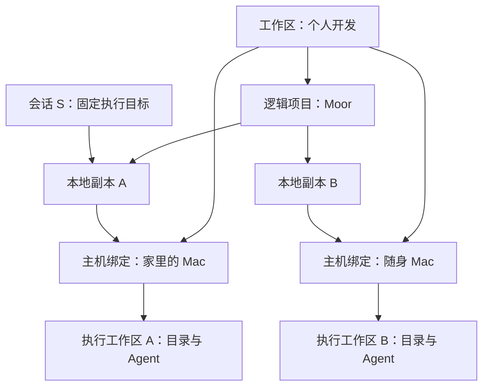

# 概念与身份

假设你有一台家里的 Mac、一台随身 Mac，以及一部手机。两台 Mac 都登记了 Moor 项目，手机用来查看进度。这里有三个不同的问题：哪些东西属于同一组工作、代码具体放在哪里、这一段对话由谁执行。Moor 分别用工作区、项目副本和会话来回答。

## 工作区与执行工作区

界面中的 **Workspace（工作区）**用于组织电脑和项目，属于当前账号。一个工作区可以包含多台执行电脑，也可以包含多个逻辑项目。它没有对应的工作目录。

**RuntimeWorkspace（执行工作区）**属于本机执行主机，描述这台主机的身份、已登记的目录和 Agent 配置。当前一个主机数据库持有一个这样的执行工作区。它的 `userId` 是 Moor 本机身份，不是中转账号的用户编号。

**HostBinding（主机绑定）**把执行工作区接入产品工作区。配对建立的是中转侧的设备授权；绑定再记录该设备提供的执行工作区归到哪里。本机模式有自己的组织目录，与各中转服务上的设置分别保存。



把一台主机移到另一个工作区，移动的是组织关系。它登记的项目副本一起移动，已有会话和代码仍在原电脑。目标工作区会为移入的项目建立新的逻辑项目；原项目若还有其他电脑的副本，它们继续留在原工作区。

## 项目与副本

**Project（逻辑项目）**保存名称和代码来源。**ProjectReplica（本地副本）**指向一台主机上已经登记的项目目录。同一个逻辑项目可以有多个副本，各自在不同电脑上执行。

```text
逻辑项目 Moor
  副本 A → 家里的 Mac → 本地项目 A → /Users/demo/work/moor
  副本 B → 随身 Mac   → 本地项目 B → /Users/demo/projects/moor
```

路径只在对应电脑上有意义。两台电脑即使都使用 `/Users/demo/work/moor`，也不能据此判断它们是同一项目。本地项目编号同样不能跨主机使用：主机根据规范化后的目录生成编号，同名或同路径不构成跨主机身份。

首次发现副本时，Moor 为每个副本建立独立的逻辑项目。需要汇总时，在“管理工作区 → 项目与本地副本”中手动归组。归组之后，项目筛选会聚合这些副本的会话；目录内容不会因此同步。

代码来源可以声明为本地来源，或不含凭据的 HTTPS Git 仓库地址。Git 来源目前只是描述信息，尚不会触发克隆、拉取、分支切换或 worktree 创建。

## 会话固定在哪里

会话在第一次指令被主机接受时建立，固定使用当时的本地项目和 Agent 配置。后续回合可以调整主机支持的模型、effort 和审批模式，但不能通过发送新指令更换执行电脑、目录或 Agent 配置身份。

```text
会话的执行目标 = 执行工作区 + machineId + localProjectId + agentConfigId
界面中的入口   = 账号 + 工作区 + 项目副本 + sessionId
```

前者决定实际在哪里运行，后者帮助访问端找到并授权访问它。修改逻辑项目的归组可以改变入口中的组织关系，但不会改写会话的执行目标。

会话还有一个主机私有的 Agent 原生编号，用于恢复 Agent 上下文。Moor 的 `sessionId` 用于自身的文档、路由和缓存，两者的职责见[会话与回合](session.md)。

## 请求如何找到正确的电脑

产品界面的请求首先指定工作区和副本。中转依次确认账号拥有工作区、副本属于该工作区、主机设备未撤销，并找到当前在线的执行工作区。主机收到请求后，再核对本地项目、会话和本机身份。

下面省略了传输细节：

```text
route(account, workspace, replica, session):
  replica = catalog.requireReplica(account, workspace, replica)
  host = requireOnlineDevice(replica.host)
  return host.request(
    runtimeWorkspaceId = replica.host.runtimeWorkspaceId,
    localProjectId = replica.localProjectId,
    sessionId = session
  )
```

`workspaceId` 尤其容易混淆：产品 API 路径中的工作区是组织用的 Workspace；Mutation 请求体中的 `workspaceId` 是 RuntimeWorkspace。当前界面的选择记录用 `catalogWorkspaceId` 区分产品工作区。二者通过主机绑定关联，不能直接替换。

设备编号 `deviceId` 是某个中转上的授权记录，`machineId` 是执行主机的身份。重新配对可能产生新的设备记录，不应据此更换已有会话的执行目标。

这些检查也适用于读取、订阅、停止和重试。知道一个 `sessionId`，并不等于拥有访问它的授权。

继续阅读：[核心架构](core.md) · [文档目录](README.md)
