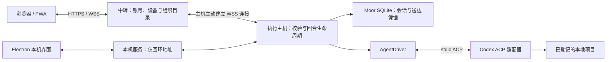

# 核心架构

Moor 的核心是执行主机对会话的所有权：用户操作先经过校验并持久保存，再交给 Agent。浏览器负责表达意图和展示结果，中转负责把请求送到已授权的电脑。

这里的 core 指这组协作边界，仓库目前没有独立的 `core` 包。

接口按 State Plane、Control Plane 与 Execution Plane 划分的语义及现有方法映射，见[接口语义：状态、控制与执行](interface-semantics.md)。这三个职责面可以复用传输与分发器，不要求拆成独立服务。

## 三个运行位置


```mermaid
flowchart LR
  Web["浏览器 / PWA"] <-->|HTTPS / WSS| Relay["中转：账号、设备与组织目录"]
  Desktop["Electron 本机界面"] <--> Local["本机服务：仅回环地址"]
  Relay <-->|主机主动建立 WSS 连接| Host["执行主机：校验与回合生命周期"]
  Local <--> Host
  Host --> Store["Moor SQLite：会话与送达凭据"]
  Host --> Driver["AgentDriver"]
  Driver <-->|stdio ACP| Agent["Codex ACP 适配器"]
  Agent --> Project["已登记的本地项目"]
```

手机访问部署好的 HTTPS 服务，执行电脑主动连接中转，因此无需给电脑开放入站端口。中转不能替离线主机执行任务。

桌面本机界面通过回环服务使用相同的请求处理方式，不依赖远程账号或公网中转。本机服务与执行主机运行在桌面启动的桥接进程里；图中的框表示职责，不都对应独立进程。

## 核心由哪些部分组成

| 边界                   | 负责的事                                       | 交给下一层的内容             |
| ---------------------- | ---------------------------------------------- | ---------------------------- |
| 会话模型               | 定义 Moor 文档结构、元数据和版本增量           | 文档操作与快照               |
| Catalog                | 管理工作区、主机绑定、逻辑项目和副本           | 明确的执行目标               |
| HostWorkspace          | 检查操作、串行接受同一会话的请求、管理活动回合 | 已持久接受的输入             |
| RuntimeStore / Journal | 保存主机状态、会话和操作凭据                   | 原子提交结果                 |
| AgentDriver            | 打开、恢复、配置、运行和停止 Agent 会话        | 输出更新、审批请求和结束结果 |

模块之间有明确的类型入口，具体职责也各有边界。HostWorkspace 不需要知道某个 Agent 包怎样启动；AgentDriver 不负责判断某个网页账号是否拥有项目副本。远程入口只开放列举会话、读取、提交操作、停止和刷新 Agent 选项等确定的方法。

当前请求主要来自 Web/PWA 和 Electron 共用界面。以后增加客户端，也应通过这个主机边界表达操作，不能直接修改主机数据库。

## 正文、元数据与执行状态

会话正文使用 **Loro** 保存。它提供 CRDT 文档：不同副本可以交换增量，并根据操作之间的关系合并变化。**Mirror** 把这份文档映射成带 schema 的对象，方便按 `history`、`items` 等字段读写。

**Flock** 保存键值形式的元数据。会话标题和执行目标放在一份 Flock 中，本机项目、Agent 配置和能力放在另一份中。前者帮助列举会话，后者用于主机本地配置；它们不会因为使用同一种存储结构，就获得相同的同步权限。

活动回合还需要内存状态：当前 AgentSession、停止标记和等待审批的回调。这些状态不能仅靠读取文档重建。例如，历史里有一个未回应的审批，并不能证明某个 Agent 进程此刻还在等待它。

**Journal** 保存已经接受的操作及其结果，供重试查询。它没有后台消费队列；重启时不会从中找出请求重新派发。

已提交的任务意图与公开执行状态保存在版本化 Loro TaskDoc 中，由执行主机的 `@moor/sync` 状态存储管理；主机内的独立协调器维护私有执行账本，并原子发布文档状态。只有明确授权的任务进入队列；未开始的排队任务可在恢复后继续，已经派发或结果不确定的任务不自动重放。它不把普通 Journal 变成自动重试队列。

## 数据放在哪里

| 数据                          | 执行电脑           | 中转服务               | 访问端                                   |
| ----------------------------- | ------------------ | ---------------------- | ---------------------------------------- |
| 项目文件、完整 Agent 启动配置 | 本机保存           | 不持久保存             | 不获得启动配置；在线时可见目录和能力摘要 |
| Moor 会话正文与会话索引       | 持久保存           | 只在请求转发中经过内存 | 按需缓存                                 |
| 操作送达凭据                  | 与会话一起提交     | 只转发结果             | 保存待确认的原始请求                     |
| Agent 原生会话编号            | 主机私有保存       | 不同步                 | 不同步                                   |
| 账号、设备授权、组织关系      | 本机模式有独立目录 | 持久保存               | 缓存可见的目录信息                       |
| 尚未发送的草稿                | 不进入执行存储     | 不保存                 | 当前浏览器保存                           |

主机的 SQLite 中，`session` 与 `session_delta` 保存 Loro 检查点及其后的输出增量；`runtime_state` 保存主机身份、机器配置和 Flock 元数据；`operation` 保存请求指纹与结果；`agent_session` 保存 Moor 会话到原生会话编号的映射。列表使用同事务维护的私有可重建元数据投影，默认分页不扫描全部 Flock 或会话正文。

这些内容使用同一个主机数据库连接。接受用户指令时，会话快照、元数据和送达凭据放在同一事务里，避免出现“显示送达，但会话未保存”的状态。原生 Agent 的执行和外部文件修改不在这个数据库事务里。

中转不保存会话索引或正文，因此备份中转只能恢复账号、设备与组织关系。完整历史仍要向执行电脑读取，浏览器缓存也不能作为完整备份。HTTPS/WSS 保护传输，当前没有端到端加密；中转进程可以看到经过它的内容。

所有未提交草稿仅保存在当前访问端的 UI 缓存中，不进入共享文档、执行主机或中转。只有明确提交后冻结的任务输入才参与同步；后续编辑不会改变已授权任务。

## 一次修改在哪里被接受

新的普通指令与审批提交[窄业务意图](session-intents.md)，由 Host 构造允许的文档修改；客户端不能填写执行状态。旧 Mutation 继续经过隔离导入与完整差分校验。两种输入共用会话串行接受、原操作凭据和同一事务，旧请求不转换为新请求。

```text
acceptSessionCommand(request):
  串行进入该 session
  核对执行工作区、项目与已有会话归属
  如果同编号、同内容已有接受凭据：返回原结果
  新意图由 Host 构造用户回合或精确审批修改
  旧 Mutation 导入副本并证明没有额外修改
  校验当前回合、Agent 与运行选项
  事务提交：会话 + 元数据 + 操作凭据
  启动 Agent，或把审批结果交给活动请求
```

CRDT 负责保存和同步文档操作；主机校验及持久接受决定输入是否能产生执行效果。完整的校验与失败语义见[同步、送达与重试](sync.md)。

## 有限命令契约与传输适配

普通 Host 命令的名称来自[请求 schema](../packages/protocol/src/host-command.ts)。[静态契约](../packages/protocol/src/host-command-contract.ts) 必须为每个名称声明固定 HTTP 方法与路径、请求和响应大小、能力以及结果不确定时的错误边界。客户端和 Relay 使用同一份路径描述；添加命令而漏掉 HTTP 契约会导致类型检查失败。没有接收任意方法名的 `/command` 代理，也没有运行时插件登记。

[Relay 项目处理器](../packages/gateway/src/replica-command.ts) 只接收已认证路由解析出的上下文，其中 `catalogWorkspaceId` 表示产品分组、`runtimeWorkspaceId` 表示执行主机工作区。它核对请求范围，在读取请求体后、Host 返回成功或错误后以及响应验证结束后复核原账号、设备、连接、目录映射和执行身份。能力检查不能代替这些授权检查。

[Host 分发](../packages/host/src/commands/host-command.ts) 和[成功响应验证](../packages/protocol/src/host-response.ts) 都有编译期穷举检查。执行实现留在 Host，响应验证留在协议边界；协议包不导入执行服务。Agent 设置、退场功能和请求相关能力仍通过明确的业务函数判断，不用配置规则推断。Attention 的参与者上下文与旧设备级路由继续保留各自的入口。

契约中的操作和恢复分类只用于维护送达证据：请求已经派发后的断线、错误或迟到响应不证明未执行，核查失败也不能把原请求改成已拒绝。连接失效可以立即结束等待，但不会取消已经派发的副作用或自动重试。新增命令需要同时通过 Host 分发、响应验证和真实 Relay 固定路由回归；测试使用合成 Host，不调用真实 Agent、GitHub 或用户账号。

## Agent 接入的边界

AgentDriver 的主要接口可以简化为：

```ts
type AgentDriver = {
  open(localConfig, cwd, nativeId, callbacks): Promise<AgentSession>;
};

type AgentSession = {
  id: string;
  capabilities: RunCapabilities;
  prompt(input): Promise<void>;
  cancel(): Promise<void>;
  close(): void | Promise<void>;
};
```

`callbacks` 接收输出与审批。主机把这些更新写成 Moor 的会话内容；界面不依赖某个 Agent 的私有历史格式。

当前实现通过 stdio ACP 启动锁定的 Codex 适配器，并连接用户已安装的本机 Codex CLI，使用已登记目录作为 `cwd`。Moor 安装包不内置 Codex runtime，也不会自动安装；可执行路径由执行主机从明确环境变量和本机路径中发现，登录由 Codex 自身管理。远程输入只能选择已报告的模型与运行选项，不能携带命令、环境变量或 MCP 连接参数。Moor 逐回合额外 MCP 的配置和注入已退场；Agent 自己的本机配置由用户管理，见[退场边界](mcp.md)。Moor 当前不向 ACP 声明文件系统或终端代理能力；Codex 仍可在自身权限范围内操作本地项目。

这里的 [ACP](acp.md) 是 Agent Client Protocol，用来约定客户端与 Agent 的会话、输出和权限交互。`stdio` 表示双方通过子进程的标准输入输出通信。它与浏览器到 Moor 主机的桥接协议是两层不同的协议。

继续阅读：[会话与回合](session.md) · [文档目录](README.md)
