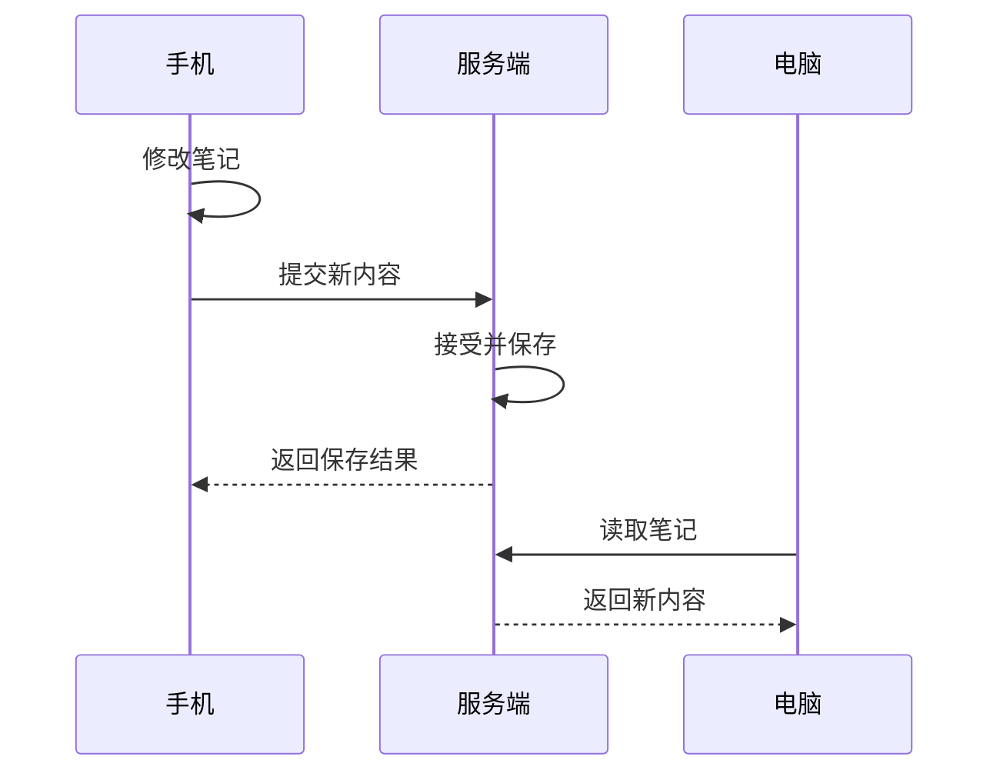

# 分布式数据同步入门：问题、原理与常见方案

你在手机上改了一条笔记，打开电脑后也能看到修改。这就是数据同步最直观的例子。

当数据存在于多个设备或服务中，它们需要交换变化、处理同时发生的修改，并在断线后恢复，这就涉及**分布式数据同步**。它既出现在手机与电脑之间，也出现在数据库、搜索服务和后台系统之间，不一定需要很多台服务器。

本文从零开始，不要求了解数据库复制、分布式算法或 CRDT，也不需要安装软件。例子使用虚构笔记和手工时间线。读完后，你应该能解释“为什么同步困难”，辨认常见解决办法，并理解 Moor 为什么同时使用 CRDT 和主机校验。

建议按顺序阅读；想先了解有哪些方案，可以先看第 9 节对照表，再回来补基础。资料核对日期：2026-09-14。

## 1. 从一条笔记开始

假设你在手机和电脑上都打开了一条笔记：

```text
笔记编号：note-1
标题：周末计划
正文：去公园
```

笔记编号告诉系统“这是同一条笔记”。标题只是内容，不能用来识别笔记，因为标题可能修改，也可能重名。

现在手机将正文改成“去公园散步”。最简单的同步流程是：



这里已经存在几份数据：手机正在显示的内容、服务端保存的内容、电脑正在显示的内容。它们在某些时刻可能不同。

先认识四个词：

| 术语        | 可以怎样理解                                         |
| ----------- | ---------------------------------------------------- |
| 节点        | 参与处理或保存数据的设备、进程或服务                 |
| 副本        | 同一份逻辑数据在某个节点上的拷贝，可以只包含部分数据 |
| 同步 / 复制 | 让变化传播到其他副本的过程                           |
| 一致性      | 约定各个副本在什么条件下应该呈现什么结果             |

**同步不等于备份。** 同步会传播正常修改，也可能传播误删除；备份还需要保留可以恢复的历史。**同步也不等于实时。** 打开页面时刷新一次、每隔一段时间拉取、编辑后立即推送，都可以属于同步。

## 2. 为什么不能“谁最后上传，就保存谁”

### 2.1 两个人可能同时基于旧内容修改

手机和电脑都看到了“去公园”，随后分别编辑：

```text
共同旧内容：去公园
手机修改后：去公园散步
电脑修改后：去公园野餐
```

如果手机先上传、电脑后上传，简单覆盖就会使“散步”消失。这通常叫**丢失更新**。

这里的“同时”不要求同一毫秒。只要两边编辑时都没见过对方的新修改，就是**并发修改**。

### 2.2 网络超时不等于保存失败

一次超时至少可能对应两种情况：

```text
情况 A：手机发出请求 → 请求没有到达服务端
情况 B：手机发出请求 → 服务端已保存 → 返回结果丢失
```

手机仅凭“没有收到结果”无法区分这两种情况。若直接重发“再增加一个条目”，情况 B 就可能出现重复条目。保存结果与客户端得知结果，是两个不同的事件。

### 2.3 旧消息可能晚到

手机先改成“散步”，再改成“野餐”。如果两次独立请求经过重试、重连或不同处理路径，服务端可能先处理新请求、后处理旧请求。按到达顺序覆盖，就可能让旧内容重新出现。

这不表示同一条正常 TCP 连接会把字节顺序打乱；问题出在整个应用的请求、处理与恢复过程。

### 2.4 删除也需要传播

电脑删除了笔记，离线手机还保留旧副本。重连时，如果系统只知道“电脑上没有这条笔记”，就可能把手机上的旧笔记重新上传。

因此，很多同步协议会记录“这条笔记已经删除”，这种删除标记常叫 **tombstone**。清理标记时还要考虑长期离线的旧副本，不能删除完记录就认为问题结束。

这些情况说明：同步协议必须记录足够的信息，才能分辨新旧、并发、重复和删除。只有内容本身通常不够。

## 3. 先把问题拆成四层

常见名词很多，但它们回答的问题不同：

| 层次     | 需要回答的问题                           | 常见办法                               |
| -------- | ---------------------------------------- | -------------------------------------- |
| 写入权威 | 谁能决定一条修改正式生效？               | 统一服务端、领导者复制、多端写入       |
| 变化传播 | 传什么，什么时候传，断线后从哪里补？     | 全量快照、增量日志、拉取、推送、CDC    |
| 并发处理 | 两边都改了怎么办？                       | 版本检查、覆盖规则、三方合并、OT、CRDT |
| 结果确认 | 请求是否保存、能否重试、会不会重复执行？ | 持久回执、操作编号、去重、事务         |

它们经常组合使用。例如，一个系统可以由服务端决定接受写入，通过 WebSocket 提醒客户端更新，以增量传输正文，再用 CRDT 合并文档编辑。

WebSocket 提供通信通道；CRDT 提供数据合并规则。单独选择其中一个，都还没有回答完整的同步问题。

## 4. 第一层：由谁决定修改生效

### 4.1 统一服务端接受写入

所有客户端向一个逻辑上的服务提交修改，由服务端校验、排序和保存。客户端可以提前展示编辑结果，但应区分“本地已修改”和“服务端已接受”。

这是普通业务应用很常见的起点：服务端容易统一检查权限、状态和业务约束。代价是无法访问服务端时，新修改不能获得正式确认；此时可以保存本地草稿，等恢复连接后再按产品规则提交。

“一个逻辑上的服务”不一定是一台机器，背后可以有负载均衡、多个应用进程和数据库集群。多个请求最终仍要在存储处受到正确的并发控制。

### 4.2 一个领导者写入，其他副本跟随

如果还希望一台服务器故障后数据可用，可以给服务端本身做复制。常见结构是：领导者负责写入，跟随者复制已经发生的变化。

```text
客户端 → 领导者 → 跟随者 A
               → 跟随者 B
```

如果领导者不等其他副本确认就返回成功，通常能更快响应，但跟随者可能暂时落后；故障时也要考虑尚未复制的写入。如果等待指定副本达到某个持久化阶段再确认，就增加了等待成本。读取哪个副本，也会影响用户能否立即看到新结果。

当多个节点需要对已提交日志和领导者切换达成一致时，可以使用 **Raft、Paxos 等共识算法**。例如，一个通常配置的三节点 Raft 集群在多数派仍能通信时可以继续推进；只剩一个节点可通信时，不能继续确认新写入。共识不是简单地统计“几个节点内容相同”，还包括日志和任期等规则。见 [Raft 官方介绍](https://raft.github.io/)。

这解决的是服务端集群如何可靠作出共同决定，不会自动合并两个用户写出的不同句子。数据库复制也不一定都采用 Raft，需要看具体产品与配置。

### 4.3 多个端都能独立写入

另一条路线是允许手机、电脑或多个站点各自接受本地修改，稍后交换数据。它适合需要离线工作的应用，但必须处理分叉历史、冲突、删除和恢复。

这里还可细分为多个可写站点的“多主复制”，以及请求联系多个副本、没有固定写入领导者的“无主复制”。它们不是同一种协议；共同点是不能只依靠一个写入入口排除所有竞争。

CouchDB 展示了多副本复制与冲突保留的一种实现：复制可以带来多个冲突版本，系统的确定性可见版本选择，并不代替应用完成有业务意义的合并。见 [CouchDB 复制与冲突模型](https://docs.couchdb.org/en/stable/replication/conflicts.html)。

本地优先（local-first）软件通常重视本地读写与离线可用，但它是一组产品和数据所有权原则，不是某个具体算法。见 [Ink & Switch 的 Local-first software](https://www.inkandswitch.com/essay/local-first/)。

## 5. 第二层：怎样把变化传过去

### 5.1 全量同步：给对方一份完整状态

全量同步就像发送整份笔记。它容易理解，适合首次加载、小数据集和重新初始化。

问题是只修改几个字也可能要传很多内容；而且“收到全量状态”仍然需要定义如何处理本地未同步的编辑。直接覆盖与合并导入的结果并不一样，不能只看“快照”两个字推断行为。

### 5.2 增量同步：只传对方缺少的变化

增量同步先约定一个可恢复的进度。例如，服务端有一条有序变更记录：

```text
第 101 条：创建 note-1
第 102 条：修改 note-1 的标题
第 103 条：删除 note-2

客户端：我已经处理到 101，请给我后面的变化。
服务端：返回 102、103，以及新的读取进度。
```

这种读取进度叫**游标**或**检查点**。客户端应在相应数据可靠保存后再推进进度，否则可能记着“读过了”，本地却没有数据。

单个权威日志可以用一个位置表示进度；多端独立写入时，一个整数往往不够，需要版本向量等额外信息。后者可以在 [Loro 与 CRDT 学习文档](loro-crdt.md) 中继续学习。

增量还可以有两种内容：

| 传递内容         | 例子                 | 需要注意什么                             |
| ---------------- | -------------------- | ---------------------------------------- |
| 新状态或字段变化 | “标题现在是周末旅行” | 要判断这个值是否过期、是否与本地修改冲突 |
| 具体操作         | “向列表追加条目 q1”  | 要处理操作身份、顺序、依赖与重复         |

增量不等于“随便传一小段 JSON”。它必须有明确的解释规则。如果服务端已清理客户端所需的旧日志，就需要完整重建或其他恢复路径。

### 5.3 拉取和推送：什么时候知道有变化

| 方式        | 工作方式                     | 主要取舍                     |
| ----------- | ---------------------------- | ---------------------------- |
| 按需拉取    | 打开页面或手动刷新时读取     | 简单，但不主动展示远端新变化 |
| 定期轮询    | 客户端周期性询问是否有变化   | 容易实现，存在延迟和空请求   |
| 推送 / 订阅 | 服务端主动发送事件或变更通知 | 响应及时，需要处理断线和恢复 |

HTTP 请求、SSE、WebSocket 都可以参与这些流程。推送消息可以携带数据，也可以只说“有变化，请来读取”。可靠系统仍需要补读能力，不能只依赖某一次通知正好送达。

例如，etcd 的 watch 支持从已知版本恢复订阅，但这个能力受可用历史窗口限制；事件订阅本身也不等于所有读写都有相同的一致性保证。见 [etcd API guarantees](https://etcd.io/docs/v3.6/learning/api_guarantees/)。

### 5.4 数据库复制与 CDC

后台系统往往需要把数据库变化传给其他数据库、搜索索引或分析系统。**CDC** 是 Change Data Capture，意思是“捕获数据变更”；常见做法是从数据库日志获取已经发生的插入、更新和删除，再传给下游。

例如 PostgreSQL 的逻辑复制通常先复制初始数据，再持续传递后续变化。Debezium 则提供 CDC 连接器，可接入变更传播管道。见 [PostgreSQL 逻辑复制](https://www.postgresql.org/docs/current/logical-replication.html) 和 [Debezium 架构](https://debezium.io/documentation/reference/stable/architecture.html)。

它们很适合“数据库发生变化后，让其他系统跟上”，但不会自动决定手机和电脑谁的离线笔记应该获胜。消息队列或消息日志负责承接和传递变化，也需要下游正确处理重复、顺序与失败。

## 6. 第三层：同时修改时，主要怎么处理

### 6.1 版本检查：发现旧版本就拒绝

最容易起步的办法是给数据附带版本号。客户端保存时说：“我基于版本 7 修改，只有现在仍是版本 7 才接受。”

```text
手机读到 v7                    电脑读到 v7
手机提交：基于 v7 → 成功，变成 v8
                               电脑提交：基于 v7 → 拒绝
                               重新读取 v8，保留草稿供处理
```

这叫**乐观并发控制**：编辑期间先不锁住数据，提交时再检查。版本比较和写入必须作为一个不可被其他写入插入的整体完成，不能“先查版本，过一会儿再写”。

HTTP 的 `ETag` 与 `If-Match` 是一种实现入口。客户端带上曾读到的版本标识，服务端验证前提；不匹配时可返回 `412 Precondition Failed`。它主要防止无意覆盖，不替用户合并内容。见 [RFC 9110：If-Match](https://www.rfc-editor.org/rfc/rfc9110.html#name-if-match)。

另一种是先锁定再修改，常叫悲观并发控制。数据库里的短事务锁很常见，但让用户打开编辑页面后一直持锁，会遇到离线和锁释放问题。多设备编辑通常需要更明确的编辑与提交协议。

### 6.2 后写覆盖：按统一规则选一个值

**LWW**（Last-Write-Wins）通常译为“最后写入获胜”。例如两台设备改了主题设置，系统按定义好的顺序只保留一个主题值。

关键在于“最后”怎样定义：可以使用统一服务端分配的顺序，也可以使用带确定性决胜规则的逻辑时钟等。直接比较两台设备的本地时间，会遇到时钟偏差；按各副本各自的到达顺序决定，也可能让副本选出不同结果。

这种办法简单，但会舍弃某些修改。它适合业务明确接受覆盖的字段。注意，LWW 也可以是某种 CRDT 的组成部分，因此它与 CRDT 并不是完全排斥的分类。Loro Map 的例子见 [Map 文档](https://www.loro.dev/docs/tutorial/map)。

### 6.3 三方合并：拿共同旧版本作参照

三方合并比较三份内容：共同旧版本、我的版本、你的版本。

```text
共同旧版本：标题=周末计划，正文=去公园
手机版本：  标题=周末旅行，正文=去公园
电脑版本：  标题=周末计划，正文=去公园散步

合并结果：  标题=周末旅行，正文=去公园散步
```

在这个例子中，两边改了不同字段，可以同时保留。如果两边都把同一句话改成不同内容，则需要更具体的规则，或让人选择。

Git 中常见的分支合并会使用两边版本和共同祖先；无法自动处理的内容需要解决冲突。见 [Pro Git：基本分支与合并](https://git-scm.com/book/en/v2/Git-Branching-Basic-Branching-and-Merging)。

这种思路适合文件和低频编辑。保留冲突副本、人工选择也是正式方案之一。自动合并没有报错，仍不保证最终内容在业务上正确。

### 6.4 OT：根据其他编辑调整操作

**OT** 是 Operational Transformation，通常译为“操作转换”。它常用于协同编辑，核心是：一个编辑改变了位置之后，调整另一个编辑的位置或作用范围。

例如两边从 `cat` 开始：

```text
A：在开头插入 X → Xcat
B：删除原来的 t → ca
```

若 A 的编辑先应用，原来的 `t` 已从第 3 个字符变成第 4 个字符。B 的删除操作需要相应调整，才能得到 `Xca`，而不是误删 `a`。反过来先删 `t`、再插入 `X`，也应得到 `Xca`。

这只是帮助理解的一个场景；完整 OT 还要正确处理不同编辑组合和转换顺序。可参考 [ot.js 作者的介绍](https://github.com/Operational-Transformation/operational-transformation.github.com/blob/source/ot-for-javascript.markdown)。

常见 OT 实现由协作服务管理版本和操作顺序。它并不必然禁止离线编辑：例如 ShareDB 支持重连后同步离线修改。具体能力取决于实现与协议，不能把 OT 简化为“只能在线”。见 [ShareDB](https://github.com/share/sharedb)。

### 6.5 CRDT：让数据结构自带合并规则

**CRDT** 是 Conflict-free Replicated Data Type，通常译为“无冲突复制数据类型”。它通过操作身份、因果信息和确定性的规则，让持有相同更新集合的副本收敛到相同状态。

例如两边向一个适当设计的集合分别加入不同条目，合并后都能看到这两个条目；文本 CRDT 则记录足够的信息，合并字符的插入和删除。它不要求每次本地编辑都先与其他设备协调，但仍需要同步协议最终交换数据。见 [Loro：What are CRDTs](https://loro.dev/docs/concepts/crdt)。

CRDT 适合需要离线编辑、多副本合并的场景。代价包括额外的身份与历史信息，以及必须认真选择字段的合并语义。“无冲突”表示不需要靠人工决定副本如何收敛，不表示所有人的意图都保留，也不表示任意业务约束都自动成立。

例如两边都添加一个“正在运行”的任务，列表可以成功合并，但可能违反“只能运行一个任务”的要求。这样的执行约束仍需要业务层处理。

Loro 是实现这些能力的具体库。更详细的原理和可运行实验，见 [Loro 与 CRDT 学习文档](loro-crdt.md)。

## 7. 第四层：怎样确认结果，怎样安全重试

### 7.1 为一次请求保留同一个编号

假设提交“新增条目 q1”时附带 `operationId=op-42`：

```text
第一次：op-42 → 服务端接受并保存 → 回执丢失
重试：  op-42 → 服务端找到原结果 → 返回原结果
```

这叫请求去重。若重试时生成 `op-43`，服务端就可能把它当成另一件事。去重还必须绑定原内容、目标和权限范围，不能让同一个编号携带不同操作。

**幂等**指重复应用某个操作，不会比应用一次产生更多效果。把值设成 3 通常可以设计成幂等；“再加 1”直接执行两次会得到不同结果，通常需要原操作编号或专门的数据结构。

### 7.2 数据与确认记录要一起可靠保存

如果服务端先记录“已接受”，却没保存正文就崩溃，客户端会得到虚假的确认。常见办法是用同一个数据库事务保存业务数据和接受记录：要么一起成功，要么一起失败。

若还要可靠通知另一个服务，可以在这个事务里写一条“待发送事件”，再由后台投递。这通常叫 **transactional outbox**，即事务发件箱。消息仍可能重复到达，接收方仍需去重；它不是让数据库和任意外部系统天然共享一个事务。见 [Debezium Outbox Event Router](https://debezium.io/documentation/reference/transformations/outbox-event-router.html)。

这个模式是通用架构选项。Moor 的原操作 Journal 用来保存接受凭据，并不在重启时作为任务队列自动重放。

### 7.3 同步文档与执行动作要分别判断

“让手机看到已经存在的聊天记录”通常可以在重连后自动补读；“让电脑再运行一次修改文件的任务”需要确认执行意图和原操作结果。

所以重试策略要看操作类型。文档合并安全，不足以证明发送邮件、调用 Agent 或修改项目文件可以随意重放。客户端也应能表达“尚未发送”“等待确认”“已接受”“执行完成”等不同状态。

## 8. 强一致与最终一致，分别承诺什么

**最终一致性**允许副本暂时不同。在更新停止、相关变化能够最终传播并被正确处理的条件下，副本会到达一致结果。它没有单凭名称就承诺“几毫秒内完成”，也没有替你指定冲突时保留哪个值。

“强一致性”常被笼统使用。这里用一种明确保证——**线性一致性**——帮助理解：读写看起来在调用与返回之间的某个时刻生效，而且尊重现实中的先后顺序。某次写入已经确认完成，随后开始的读取应看到它或更晚的结果；与读取同时发生的写入则按允许的顺序解释。etcd 的文档介绍了这种保证及其成本，见 [API guarantees](https://etcd.io/docs/v3.6/learning/api_guarantees/)。

它不要求所有屏幕每一瞬间显示完全相同。即使底层数据库的读写有明确一致性保证，客户端缓存和界面更新也可能延迟。

可以用断网想清楚取舍：手机与电脑完全无法通信，却都被允许直接确认同一条数据的独立修改，它们就不可能同时保证自己知道对方刚确认了什么。系统需要在受影响的操作上选择等待、拒绝，或允许暂时分歧并稍后协调。

因此，一个产品经常同时使用多种保证：协作笔记允许离线修改，独占任务的启动必须经过权威端确认；搜索索引可以稍晚更新，权限检查则按服务端当前规则执行。

## 9. 主要解决办法对照表

下表总结常见的**组合方案**。它们不互相排斥，也不存在一套适合所有数据的统一排名；“适合”是根据前述性质作出的设计判断。

| 方案                        | 核心做法                                     | 适合优先考虑的场景                   | 主要代价或边界                     |
| --------------------------- | -------------------------------------------- | ------------------------------------ | ---------------------------------- |
| 服务端权威 + 版本检查       | 统一接受写入，旧版本提交被拒绝               | 普通表单、配置、状态变更             | 需要连接服务端确认，冲突要重新处理 |
| 服务端权威 + 增量订阅       | 主机保存事实，客户端按进度补读               | 消息记录、任务状态、跨设备历史       | 需管理游标、缓存、断线与回执       |
| 领导者复制 + 故障恢复       | 一个写入领导者，其他节点跟随，必要时使用共识 | 服务端数据库、需要可靠共同决定的集群 | 复制延迟、确认成本、故障切换复杂度 |
| 多端复制 + LWW              | 各端可写，按确定顺序选择一个值               | 可接受覆盖的简单字段                 | 可能丢失一方的修改意图             |
| 多端复制 + 三方 / 人工合并  | 保留共同基线和两边变化                       | 文件、低频编辑、需要审阅的内容       | 保存历史，用户可能需要解决冲突     |
| OT 协作                     | 调整并发操作，使不同执行路径得到一致结果     | 实时文本或结构化文档协作             | 转换规则和协作协议复杂             |
| CRDT 协作                   | 用可合并的数据结构保存变化                   | 离线编辑、多设备协作、本地优先应用   | 元数据成本、类型选择、额外业务校验 |
| 数据库复制 / CDC + 下游消费 | 传播数据库已发生的变化                       | 搜索索引、分析系统、数据副本         | 下游延迟、去重、顺序与结构兼容     |

三个容易落地的判断例子：

1. **只做一个设备列表管理页**：可以从服务端 API、版本检查和刷新开始，没有多人离线协作需求时，不必先引入 CRDT。
2. **做可离线共同编辑的长文档**：重点比较 OT/CRDT 的具体实现、恢复协议和编辑器集成，不能只比较同步速度。
3. **把业务数据库内容送到搜索引擎**：重点考虑 CDC、重建索引和消费进度；通常不需要用文本协作算法解决这个问题。

进一步选型前，先写下五个答案：谁能写、是否必须离线写、能否舍弃并发修改、哪些动作不能重复、什么时刻可以显示成功。

## 10. 放回 Moor，分别对应什么

Moor 把上面的多种办法组合起来：

| Moor 中的设计                        | 对应的同步问题                 |
| ------------------------------------ | ------------------------------ |
| 执行主机校验并持久接受用户操作       | 谁决定写入和执行生效           |
| Loro 保存正文和可交换的操作历史      | 怎样表达和合并会话数据变化     |
| 客户端提供版本，主机返回缺少的更新   | 怎样增量补读                   |
| `changed` 通知提醒重新读取           | 怎样及时得知远端变化           |
| `expectedTurnId` 与活动回合校验      | 怎样拒绝基于旧上下文的执行     |
| 原 `operationId`、完整请求与持久凭据 | 怎样确认未知结果并避免重复接受 |
| 正文、元数据、凭据在同一事务保存     | 怎样保证“已接受”对应可靠数据   |

客户端可以持有副本和草稿，但只有执行主机能把用户提交的 CRDT 操作正式接受进主机持久状态。中转负责路由与相关鉴权，不保存会话正文；所有请求仍需绑定账号、设备、工作区、项目与会话范围。

重连后可以补读已经存在的历史；离线草稿和结果待确认的执行请求不会自动发送，重试由用户手动触发并保留原编号。这些事实由[核心架构](core.md)和[同步、送达与重试](sync.md)进一步说明。

因此，看到“用了 CRDT”时，还应继续问：什么操作允许合并、谁有权接受、什么时候保存、什么时候执行、失败后怎么确认。

## 11. 六道不用写代码的自测

| 问题                                            | 参考答案                                                 |
| ----------------------------------------------- | -------------------------------------------------------- |
| WebSocket 已经连上，是否说明两边数据一样？      | 没有，还需交换缺失内容并确认处理进度。                   |
| 两边分别在上午和下午编辑，为什么仍可能并发？    | 下午编辑的一方可能一直离线，没有见过上午的修改。         |
| v7 的提交被拒绝，是否应静默覆盖 v8？            | 不应把拒绝变成覆盖；应保留编辑、读取新状态并按规则处理。 |
| 请求超时后换个编号再发，为什么可能重复？        | 原请求可能已经生效，新编号会被识别为另一个请求。         |
| 最终一致是否表示所有修改都会保留？              | 不表示，合并规则可能选择一个值；一致性与意图保留不同。   |
| CRDT 合并出两条待执行任务，为什么主机还能拒绝？ | 文档可合并不等于满足“当前只能执行一个任务”等业务约束。   |

下一步建议阅读 [Loro 与 CRDT 学习文档](loro-crdt.md) 的第 1–6 节，用三个小实验观察合并、重复导入和依赖补齐。若更关心 Moor 的完整工作过程，再读[系统学习指南](learning-guide.md)。

返回[文档目录](README.md)。
