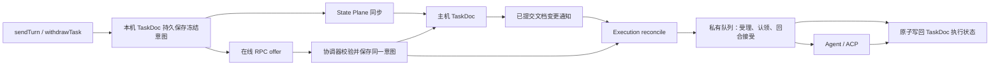

# 接口语义：状态、控制与执行

Moor 将协作状态、控制请求与执行协调分成三个职责面。共享状态使用 Moor 自己的版本化 Loro 文档；在线控制通过 RPC 加速；执行主机的协调器统一处理文档意图和 RPC 输入，并保留唯一的执行去重边界。

执行主机仍是共享数据的持久汇合点。主机离线时，各访问端独立保存已授权任务；恢复连接后汇合。未提交草稿仅保存在本地 UI 缓存，不参与同步。中转只维护账号、访问关系和路由，不保存会话、草稿或任务输入。因此，主机离线时 B 的新提交不会立即出现在 C 上。

## 三个 Plane

| 层次            | 负责                                                           | 不承担                                              |
| --------------- | -------------------------------------------------------------- | --------------------------------------------------- |
| State Plane     | 本地文档、持久化、增量同步、订阅、离线恢复与文档字段权限校验   | 队列受理、撤回判定、恢复 Agent、启动执行            |
| Control Plane   | 发布执行意图、撤回、开启共享，以及在线 RPC 快速请求            | 用 RPC 回执代替共享执行状态，或绕过持久意图直接派发 |
| Execution Plane | 观察已提交意图，统一校验、去重、排队、认领与派发，写回执行状态 | 依赖页面读取来启动，或从普通草稿推断执行授权        |

```text
Moor
├── State Plane
│   ├── SessionDoc                 主机确认的会话历史
│   ├── TaskDoc                    已提交意图、接受顺序、执行状态
│   ├── subscribe                  文档变更通知
│   ├── sync                       文档编辑提交与 Loro 版本向量补读
│   └── recover                    恢复本机文档和原意图
├── Control Plane
│   ├── sendTurn                   本地持久发布意图，再尝试 RPC offer
│   ├── withdrawTask               发布撤回意图，再尝试 RPC offer
│   ├── enableSharing              所有者明确开启共享
│   ├── cancelTurn / approve       精确活动回合与请求的在线控制
│   └── readFile / readDiff        范围受限的资源查询
└── Execution Plane
    ├── reconcile                  消费已接受的文档意图
    ├── validate                   当前权限、期限、固定执行目标
    ├── accept / claim             持久队列和回合接受
    ├── dispatch                   唯一的 Agent 派发路径
    └── Agent / ACP                输出、审批与终态
```

## 文档是共享状态，SQL 账本是执行内部记录

`SessionDoc` 继续保存 Moor 会话格式 v1 的执行历史。新的 `TaskDoc` 格式 v2 是实际的 Loro 文档，包含不可变任务意图、主机接受顺序和主机发布的执行状态。客户端读取和展示这些文档；不再把 SQL 操作页与另一份任务状态数组拼接成共享状态。

| 数据         | 写入规则                                                             |
| ------------ | -------------------------------------------------------------------- |
| 本地草稿     | 仅保存于 UI 缓存；不进入 TaskDoc，不上传或跨设备合并                 |
| 已提交意图   | 执行者明确授权后冻结输入、目标、编号与截止时间；后续草稿编辑不改变它 |
| 主机接受顺序 | 主机写入；客户端时间戳不决定全局队列顺序                             |
| 执行状态     | 执行协调器发布；客户端同步接口不接受调用方编写的状态                 |
| 私有执行账本 | 保存认领、原执行命令和恢复依据；不作为另一套客户端状态接口           |

客户端的私有缓存保存 Loro 快照、版本向量和待确认编号。客户端上行使用范围受限的类型化文档编辑，主机验证作者、字段权限、不可变性和依赖后写入 Loro；下行使用 Loro 增量。这样保留了类型化主机边界，也避免开放任意修改主机执行状态的 CRDT 导入端口。

主机的执行账本和 `TaskDoc` 执行状态投影在同一 SQLite 事务中更新。投影保存失败时，认领和队列转换一并回滚。已经持久保存的用户意图仍保留，协调器可以再次检查；同步模块不会因此自行补执行。

私有队列对状态中的 phase 建立 SQLite 表达式索引，与范围和接受顺序一起用于查找活动任务及下一条 queued 任务。终态记录继续保留原编号与执行依据，但认领和重启不再读取、反序列化整个终态历史；索引由 SQLite 随原 state 更新，没有增加另一份可独立修改的执行状态。过期或撤权任务仍按顺序标为 blocked，公开投影失败时整次认领回滚。

## 同步与 RPC 汇入同一个协调器



`sendTurn` 首先在本地可靠保存意图。只有保存成功，才允许尝试 RPC；RPC 不可达、响应丢失或输入过大时，原意图继续由同步通道送达。RPC 的失败不能把已经保存的意图变回未提交草稿。

RPC 携带同一个意图编号、冻结输入及尚未送达的前置记录。即使后发的 RPC 先到，也先保存该客户端此前发布的记录，避免跳过本端已经提交的任务。超过单批数量或字节预算时使用正常同步路径。

RPC 先到时，协调器先将相同意图持久保存到主机文档，再处理队列；后续文档同步只是重复送达。文档先到时，RPC 同样命中已有编号。同编号不同内容拒绝。同编号重复请求不会再次启动 Agent。

**同步本身不决定执行，但已授权意图的到达会由独立协调器处理。** 这与“任何同步都绝不能带来执行”不同：后者会破坏已经约定的离线明确提交、重连自动入队语义。普通草稿始终不构成执行授权。

## 读取保持只读

`collaboration-read` 只检查范围、读取会话与共享登记信息。它不创建工作区、不登记共享会话、不实例化执行器、不恢复认领、不唤醒队列。尚未开启共享时，所有者收到 `enabled: false`，通过独立的 `collaboration-enable` 命令开启。

共享工作区列举也不隐式创建默认工作区。旧会话中缺失的文档身份在主机启动迁移时修复；会话读取不再修复或保存文档。已有错误身份不会被迁移替换。

执行器由主机连接生命周期及明确的开启共享操作建立。恢复私有执行记录属于启动流程；文档变更和主机空闲信号驱动协调与派发，页面是否打开不决定工作是否运行。

## 各种确认的含义

| 确认                      | 可以证明                       | 不能证明                       |
| ------------------------- | ------------------------------ | ------------------------------ |
| 本机保存完成              | 当前设备可靠保存了原意图       | 主机已经收到                   |
| 同步 `storedOperationIds` | 主机持久保存了这些文档编辑     | 已启动 Agent                   |
| RPC `stored: true`        | 同一份意图已经持久保存         | 已授权受理、实际执行或任务完成 |
| TaskDoc `queued`          | 协调器已将意图纳入队列         | 后续权限和期限检查一定通过     |
| `claimed` / `dispatching` | 已认领或原执行命令已保存       | Host 已确认接受回合            |
| `accepted`                | 原命令已有 Host 接受凭据       | 模型完成或代码正确             |
| `completed`               | 对应助手回合正常结束且已保存   | 用户验收通过                   |
| `blocked` / `interrupted` | 条件不满足或原执行结果需要核查 | 可以换编号自动重做             |

共享界面的执行状态只从文档读取。RPC 回执不会直接把任务画成正在运行。撤回意图也不等于已经停止：协调器只撤回尚未开始派发的任务；正在运行的回合需要精确的停止命令。

## 离线、多人与恢复规则

- 草稿不参与同步，也不会在重连时执行。明确提交的任务可以在重连后自动同步入队；授权在受理、认领和派发前重新检查。
- 主机按持久接受顺序处理同一会话的任务。`after-previous` 允许在此前工作之后继续，不依赖发送端过时的历史头。
- 普通立即发送仍保留原有 `expectedTurnId` 校验与人工核查流程；旧的未知 Mutation 不会迁移为自动执行意图。
- 主机重启后，尚未认领的任务可继续；已认领、已派发或结果不确定的任务标为中断，不自动重放。
- 主机离线时，各访问端独立保存已提交任务，主机恢复后汇合；不增加跨主机接管或中转正文存储。
- 成员权限界面提供查看与执行；旧编辑者角色保留读取权限和本地编辑能力，不获得执行授权。账号邀请本身不授予工作区访问权限。

## 协议与旧数据迁移

协作传输协议为 v3，能力标识为 `collaboration-doc-v3`，`TaskDoc` 为 v2。同步与 RPC 仅接受提交、撤回操作，拒绝旧草稿操作；提交直接冻结完整输入，不再引用草稿版本。旧客户端需刷新或升级后使用共享队列。

旧客户端缓存和主机 TaskDoc v1 在升级时重建，移除草稿及其 CRDT 历史，防止增量再次传出旧正文。本地输入框已有文本继续保留在浏览器缓存。旧已提交任务保留原编号、输入、授权、接受顺序与执行状态，仅移除无效的草稿引用；本机待同步记录过滤掉草稿，重置同步版本向量。缓存恢复不会补发 RPC，也不会将旧草稿转换成任务。

主机迁移仅在启动或明确开启共享时执行，原执行命令和去重依据保留。旧 SQL 表中未提交草稿不导入新文档；保留的历史数据库和备份不会被自动物理擦除。迁移不在 GET 中发生，也不会把已有中断或完成记录重新排队。

HTTP 路径为 `/api/collaboration/:workspaceId/:replicaId/:sessionId/`：

| 路径     | 方法 | 语义                           |
| -------- | ---- | ------------------------------ |
| `read`   | GET  | 只读查询                       |
| `sync`   | POST | 类型化文档编辑与 Loro 增量同步 |
| `enable` | POST | 所有者明确开启共享             |
| `offer`  | POST | 同一持久意图的 RPC 快速入口    |
| `member` | POST | 所有者管理成员权限             |

`readFile`、`readDiff`、精确审批和停止继续使用既有受限协议。旧 `mutate` 保留为兼容的业务命令入口，不作为新的文档同步接口。共享页面提供本地输入框与共享任务队列，原生桌面以及共享页内审批、停止、文件操作仍需继续整合。

## 实现入口与验证

| 代码                                                                              | 职责                                   |
| --------------------------------------------------------------------------------- | -------------------------------------- |
| [协作协议](../packages/protocol/src/collaboration-protocol.ts)                    | 文档同步、意图与 RPC 送达契约          |
| [Loro TaskDoc](../packages/session/src/collaboration-replica.ts)                  | 版本化文档、快照、版本向量与状态物化   |
| [客户端](../packages/client/src/collaboration-client.ts)                          | 离线文档、显式控制、RPC 加速和同步恢复 |
| [State 存储](../packages/sync/src/store.ts)                                       | 字段授权、文档持久化与增量读取         |
| [执行协调器](../packages/host/src/sessions/collaboration-coordinator.ts)          | Doc/RPC 汇合、提交与撤回规则           |
| [私有执行账本](../packages/host/src/persistence/collaboration-execution-store.ts) | 队列、认领、原命令与原子状态投影       |
| [执行器](../packages/host/src/sessions/collaboration.ts)                          | Host 接受、Agent 调用和结果确认        |
| [主机组合入口](../packages/host/src/sessions/collaboration-service.ts)            | 只读、控制与生命周期分离               |

[边界测试](../tests/integration/collaboration-boundaries.test.ts)验证读取无写入/恢复副作用、同步不自行操作队列、Loro 增量收敛、RPC 先到与 Doc 先到均只派发一次、回执丢失、同端请求乱序、事务回滚及旧数据不重放。原有离线、成员权限与 Host 接受测试继续保留。

参考 [Lody 的派发模块说明](https://github.com/LodyAI/Lody/tree/main/apps/cli/src/session)，借鉴文档持久状态与 RPC 快速操作汇合到执行器的分工。Moor 使用自己的格式与主机校验，不依赖其源码 checkout、私有数据库或云服务。所有自动验证使用合成账号和 Agent；真实 Agent、双 Mac 和 iPhone/PWA 生命周期仍需专项验收。
