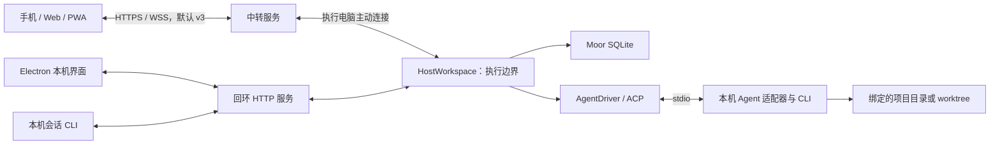
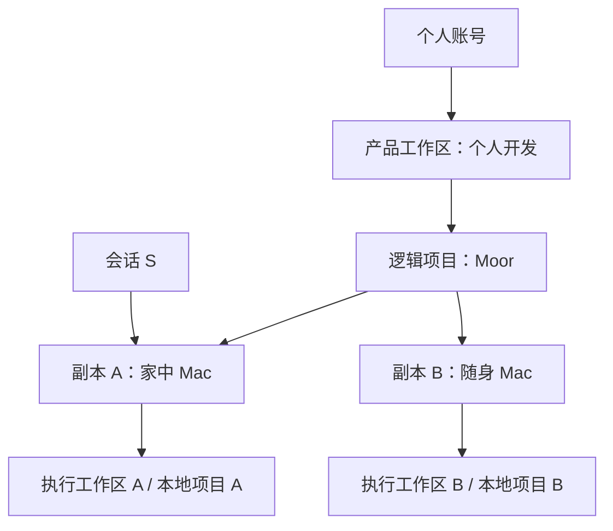
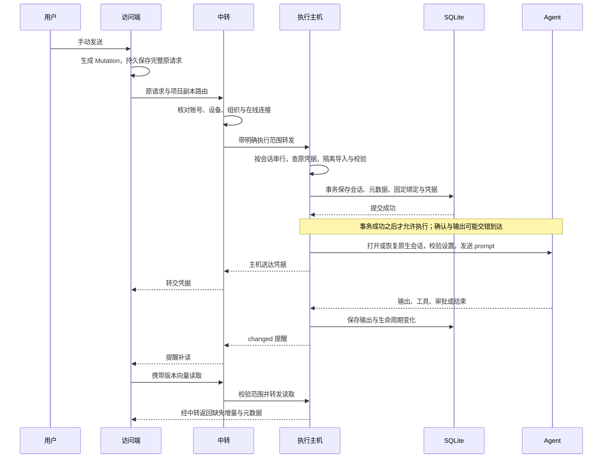

# Moor 系统学习指南

这份指南面向准备理解、维护和向开发者介绍 Moor 的读者。目标是把产品行为、数据模型、源码与验证证据连起来：遇到一个操作，你能够说明请求到哪里、谁有权接受、何时保存、失败后如何判断，以及测试证明到了哪一步。

现有专题文档继续承担接口、配置与具体限制的说明。本指南提供学习顺序与跨模块解释，配套的[实验与自测手册](learning-lab.md)用于验证理解。

## 1. 阅读路线与完成标准

建议分四轮阅读。时间只是学习安排参考，可以按熟悉程度调整。

| 轮次               | 内容                  | 建议投入    | 完成时应能做到                                                     |
| ------------------ | --------------------- | ----------- | ------------------------------------------------------------------ |
| 第一轮：产品与身份 | 第 2–4 章             | 30–45 分钟  | 画出两台电脑、一部手机、一个逻辑项目和两个副本，标出会话的执行位置 |
| 第二轮：执行与故障 | 第 5–9 章             | 60–90 分钟  | 解释发送、审批、停止与重启，以及每一步出错时会留下什么             |
| 第三轮：功能与信任 | 第 10–12 章           | 45–60 分钟  | 把文件、Git、MCP 等功能放回核心流程，并说清当前安全边界            |
| 第四轮：源码与验证 | 第 13–15 章及配套手册 | 90–120 分钟 | 从一个行为找到实现与测试，独立讲完一次丢回执恢复案例               |

阅读每章时先回答三个问题：这里的事实由谁拥有？哪一个动作会产生执行效果？客户端没有收到响应时还能确定什么？

### 版本与证据范围

本文以 0.2 开发预览版的现有文档及核心实现为依据，主线解释默认桌面/Web/PWA 的 v3 路径。Moor 会话格式为 v1。显式 v4 加密主机与 `secure` CLI 单独在第 11 章说明，不能把一条加密链路的能力套用到所有客户端。

阅读时按“具体入口、具体版本、具体证据”判断状态。旧架构文档中笼统的“当前没有端到端加密”应理解为默认 v3 路径；显式加密入口的进展以[加密专题](end-to-end-encryption.md)为准。工作区中的新代码、路线图中的目标和已有验收记录也不能相互替代。尤其是加密产品目录映射仍在演进，本文不把进行中的接线作为已发布承诺。

## 2. Moor 解决的使用问题

假设家里的 Mac 正在运行一个修改登录页的 Agent 会话。你离开电脑后，希望用手机看到进度，处理当前权限请求，检查已产生的变更，并给同一个会话补充下一条要求。另有一台 Mac 也在做其他工作，你希望集中看到哪些结果需要检查。

Moor 提供访问界面与本地执行主机，通过 ACP 连接本机的 Codex、Claude 或已配置的自定义 Agent。远程访问通过可自托管中转建立。代码目录和执行位置由本机主机管理，会话历史使用 Moor 自己的格式保存。

可以用这段话向同事介绍：

> Moor 让自己的多台设备访问本地编程 Agent。电脑上的执行主机负责项目、会话与运行，手机或另一台电脑负责查看和发出操作。每次操作都要回到原执行主机校验和确认，因此换访问设备不会改变任务的执行位置。

“本地优先”主要描述数据与执行所有权。本机工作区可以不经远程账号和中转运行；模型服务是否需要网络，仍取决于 Agent。执行电脑休眠或关机时，手机和中转无法接管它的任务。

“代码留在电脑”也不表示任何代码字节都不会传出：用户可读取项目文件、diff 和附件，Agent 还可能把上下文发送给其模型服务。介绍产品时，应把执行位置、数据持久化位置和网络传输范围分开解释。

**理解检查：** 手机关闭页面后谁继续工作？执行电脑休眠后谁还能执行？为什么这两种情况不同？

继续阅读：[项目首页](../README.md)、[运行与恢复](runtime.md)。

## 3. 部署结构、进程与责任

### 3.1 默认远程路径与本机路径



图中的框表示职责，并非每个框都是一个进程。本机服务与执行主机由桌面启动的桥接进程承载；Agent 通过子进程协议接入。浏览器不会直接打开主机 SQLite。

| 部分                   | 拥有的责任                                   | 不能据此推断的能力                      |
| ---------------------- | -------------------------------------------- | --------------------------------------- |
| Web/PWA                | 收集输入、保存本机草稿与原请求、渲染已读内容 | 页面显示输入不证明主机接受了指令        |
| Electron 桌面壳        | 本机配置、执行组件生命周期、系统集成         | 关闭窗口不等于退出执行组件              |
| Relay 中转             | 账号、设备授权、产品组织关系、在线转发       | 中转在线不证明目标主机或 Agent 可用     |
| HostWorkspace          | 校验执行范围、接受操作、管理活动回合         | 主机接受不证明模型已完成工作            |
| RuntimeStore / Journal | 持久化会话、私有状态及操作凭据               | 数据库事务不能回滚 Agent 已修改的文件   |
| AgentDriver            | 启动、恢复、配置、输出回调、取消与关闭       | 协议能力不证明 Agent 会正确完成用户目标 |

远程主机主动连接中转，因而不要求在执行电脑开放入站端口。桌面本机模式通过回环服务进入相同的主机执行边界，远程中转故障不必导致本机功能不可用。

### 3.2 技术栈怎样服务这些责任

仓库以 TypeScript 为主，Web 使用 React，桌面使用 Electron，Node 承载中转和执行服务。SQLite 保存主机数据；Loro、Mirror 和 Flock 表达会话与元数据；Zod 校验协议结构；WebSocket 承担在线通信；ACP 适配器连接 Agent。

依赖版本固定在 [package.json](../package.json) 和锁文件中。理解模块职责比背版本号更有用，介绍实际兼容范围时再查看锁定版本和验收记录。

**理解检查：** 新增一个平板客户端，应该复用哪一层？为什么它不能直接写主机数据库？

源码入口：[中转 HTTP](../src/relay/http.ts)、[主机启动](../src/bridge/host-main.ts)、[HostWorkspace](../src/bridge/host-workspace.ts)、[AgentDriver](../src/runtime/agent.ts)。专题：[核心架构](core.md)。

## 4. 身份模型：组织位置与执行位置

这是理解后续代码的前提。路径、项目名、账号 ID 和工作区 ID 都只在各自范围中有意义。

| 概念                 | 回答的问题                                 | 示例                      |
| -------------------- | ------------------------------------------ | ------------------------- |
| Account              | 谁通过这个中转访问？                       | 个人账号 A                |
| Device / HostBinding | 哪个获授权设备提供哪个执行工作区？         | 家中 Mac 的配对记录与绑定 |
| Workspace            | 哪些电脑和项目属于同一组工作？             | “个人开发”                |
| Project              | 用户认为这是哪个逻辑项目？                 | “Moor”                    |
| ProjectReplica       | 这个项目在某台电脑上的哪个登记副本？       | 家中 Mac 的 Moor 副本     |
| RuntimeWorkspace     | 这份主机数据库拥有哪些身份、项目和 Agent？ | 主机 A 的执行工作区       |
| localProjectId       | 该主机登记的哪个本地项目？                 | 项目 A                    |
| Session              | 哪一段持续的工作上下文？                   | 修改登录页的会话 S        |
| Turn                 | 哪条用户输入或助手响应？                   | 用户 U1、助手 A1          |



将两个副本归到同一个逻辑项目，只改变组织与筛选关系，不同步目录内容。即使路径、项目名或本地编号相同，也不能自动判定是同一个跨主机项目。

已有会话固定执行主机、本地项目及 Agent 配置版本。运行目录可以是原项目目录，也可以是为该会话明确创建的 worktree；固定目录后不能通过后续 prompt 偷换。切换“我的电脑”会影响新工作的目标，不迁移已有会话。

### 4.1 最容易看错的字段

- 产品 API 路径中的 `workspaceId` 表示产品 Workspace；`Mutation.workspaceId` 表示 RuntimeWorkspace。界面使用 `catalogWorkspaceId` 帮助区分。
- 中转账号身份与主机 `userId` 不同。本机身份独立，不能直接用远程登录 ID 替换。
- `deviceId` 是中转设备授权记录，`machineId` 是执行主机身份。重新配对可能改变前者。
- `sessionId` 是 Moor 的会话编号，`nativeSessionId` 是 Agent 的原生上下文编号，后者只在主机私有保存。

请求范围贯穿“账号、设备、工作区、项目、会话”，但不意味着所有协议对象都机械地重复全部字段。中转根据已认证连接和目录解析访问范围，主机再用类型化目标核验本地归属；不能信任客户端随意填写的身份。

**理解检查：** 两台 Mac 有相同目录名，能否互相处理同一个会话的重试？把主机移入另一工作区后，哪些关系改变、哪些保持不变？

源码入口：[产品目录类型](../src/catalog.ts)、[中转目录](../src/relay/catalog.ts)、[运行协议](../src/protocol.ts)。专题：[概念与身份](concepts.md)。

## 5. 数据模型：历史、元数据与活动状态

### 5.1 一条用户指令通常对应两个历史条目

```text
Session S
  U1：role=user，finished=true，保存用户输入
  A1：role=assistant，userTurnId=U1，finished=false，接收输出
  U2：下一次手动输入
  A2：对应 U2 的助手响应
```

用户条目的 `finished=true` 只表示输入记录完整。Agent 是否还在执行，需要看助手回合的生命周期。助手正常返回标为 `handled`，失败为 `failed`，用户停止为 `canceled`。`handled` 不证明代码正确或用户目标达成。

普通 Web 新会话在首次指令被接受时持久建立；会话 CLI 的显式创建、Fork 和协作子任务还存在先建立空会话的路径。学习时不要把“点新会话”与“数据库已有会话”视为同一个时刻，也不要把普通 Web 的流程推广到全部入口。

### 5.2 四种状态为何分开保存

| 结构          | 存什么                                      | 为什么需要它                                           |
| ------------- | ------------------------------------------- | ------------------------------------------------------ |
| Loro 文档     | `session`、有序 `history`、内容项和回合字段 | 保存正文及可交换的文档增量                             |
| Mirror schema | 文档与类型化状态的映射                      | 按 Moor v1 字段读写，而非依赖某个 Agent 的私有历史格式 |
| Flock 元数据  | 标题、执行目标、最近用户回合、列表状态等    | 列举会话时无需逐份打开正文；本机注册另有私有 Flock     |
| 主机活动状态  | 当前 AgentSession、等待审批回调、停止标记等 | 表示此刻仍存在的执行资源，不能从历史记录猜测           |

Loro 的版本向量表达访问端已知哪些文档操作，主机据此返回增量。`expectedTurnId` 则表达用户基于哪条输入继续会话，用于业务并发判断。二者解决不同问题。

CRDT 可以使文档副本合并，但不会判断一条指令是否应该运行。Moor 仍要求主机在隔离副本上导入用户变更，验证只包含合法追加或当前审批回应。客户端能构造一个可导入的 CRDT 增量，并不代表它有权改写历史。

### 5.3 数据在哪里，以及备份能恢复什么

| 位置       | 主要持久数据                                           | 缺失的东西                                             |
| ---------- | ------------------------------------------------------ | ------------------------------------------------------ |
| 执行主机   | 完整会话、元数据、原操作凭据、私有原生映射、文件基线等 | Moor 数据库不是项目工作目录或 Agent 原生存储的完整备份 |
| 中转       | 账号、设备、工作区和副本组织关系                       | 不保存完整会话、会话索引或主机路径                     |
| 浏览器/PWA | 已读缓存、本机文本与附件草稿、待确认请求               | 未读历史可能不存在；缓存不是完整备份                   |

主机主要表可从 `session`、`runtime_state`、`operation`、`agent_session` 开始认识，扩展功能还有独立记录。不要只导出一张正文表便宣称可以完整恢复。

备份前应理解三份材料：Moor 主机状态、项目及 worktree 文件、Agent 自己的原生状态。中转和其他私有配置还需按各自规则保存。具体停机与恢复步骤以[运行文档](runtime.md#主机停机备份与恢复)为准。

**理解检查：** 历史里仍有审批卡片，为什么重启后不能直接批准？只备份中转，能恢复哪些东西？

源码入口：[会话 schema](../src/session-schema.ts)、[文档操作](../src/model.ts)、[RuntimeStore](../src/runtime/store.ts)。专题：[会话与回合](session.md)、[核心架构](core.md)。

## 6. 一条指令的完整路径

本章先只考虑默认 v3 的普通文本发送，不展开附件、MCP 和任务授权。



### 6.1 客户端：先保存原请求，再发送

浏览器在自己读过的会话副本中追加用户条目，生成增量与元数据变化。一个简化的请求如下，编号均为虚构：

```text
operationId: op-1
workspaceId: runtime-a
sessionId: session-s
kind: turn
expectedTurnId: user-before，首次发送为 null
update: 本次 Loro 增量
metaBundle: 本次允许的 Flock 变化
```

发送前保存完整原请求，是为了刷新或回执丢失后仍知道自己发过什么。只记一句 prompt 不够：重建增量、更换模型或执行目标都会改变原操作。

保存失败就不能发网络请求。已保存且结果未知时，界面保留原请求并限制修改本次输入与运行配置。只有匹配 `operationId` 的有效主机确认才能完成这次送达确认。

### 6.2 中转：解析并持续检查授权范围

中转查账号所属工作区、副本对应主机和当前连接，把产品目标转换为执行目标。读取或写入等待期间，账号可能退出、设备可能撤销、主机连接可能替换，因此部分响应返回前也要重新核验范围。单次入口检查不能覆盖所有异步竞争。

中转收到 HTTP 请求、写出 WebSocket 帧或发出 `changed` 都不是持久接受证据。只有主机事务产生的回执能说明送达。

### 6.3 主机：先确定合法性，再提交事务

沿 `HostWorkspace.mutate` 和 `mutateAccepted` 阅读，可以看到以下关键顺序。这里是教学概括，不是可直接调用的 API：

1. 按会话串行进入，检查执行身份、项目、会话与相关执行锁。
2. 查原操作编号及指纹。已接受的同一操作返回原结果；同编号不同内容拒绝。
3. 在副本文档和元数据中导入增量，比较前后状态，检查最近用户回合、活动状态和固定 Agent。
4. 新指令只允许追加一个合法用户回合。不得夹带历史修改、其他会话元数据或远程启动参数。
5. 主机添加助手回合，并在同一 SQLite 事务中保存会话、元数据、固定绑定与操作凭据。使用附件或授权时，相应记录也参与事务。
6. 事务完成后，才调用执行流程或把审批结果交给等待中的 Agent。

`RuntimeStore.transaction` 使用 SQLite 事务；`Journal` 记录请求指纹和结果。代码虽然有 `stage` 名称，也不能把它理解成一个开机自动消费的任务队列。

### 6.4 读取与执行分开

Agent 回调进入主机，由主机将内容写入 Moor 历史。`changed` 是“请读取最新状态”的提醒，访问端按版本补读，因此不要求中转保存所有消息历史。提醒本身不携带完整历史，也不证明某一操作送达。

**理解检查：** 应该在写数据库之前还是之后启动 Agent？若反过来，写入失败会造成什么不可解释的状态？

源码入口：[Web 的 `sendTurn`、`prepareTurnMutation`、`submit`](../src/web/app.ts)、[共享会话构造器](../src/session-client.ts)、[HTTP](../src/relay/http.ts)、[HostWorkspace](../src/bridge/host-workspace.ts)、[变更校验](../src/bridge/validate-mutation.ts)、[Journal](../src/bridge/journal.ts)。专题：[同步、送达与重试](sync.md)。

## 7. 断线、重试与一致性

### 7.1 回执丢失为什么不能报“发送失败”

考虑三个时刻：

```text
T1：手机保存 op-1，准备提交
T2：主机提交 op-1，会话与凭据已保存
T3：主机的确认回到手机
```

手机在 T1 之后发生超时，无法只凭超时判断 T2 是否发生。若马上生成 op-2 重发同一句话，就把“核查原操作”变成了“新执行请求”。

Moor 把这种状态显示为结果待确认。手动重试继续使用 op-1 和完整原请求：

| 主机实际状态                 | 原请求手动重试时的行为           |
| ---------------------------- | -------------------------------- |
| 已有同编号、同内容的接受凭据 | 返回原凭据，不再次派发           |
| 没有凭据，且原请求依然有效   | 这次可能首次接受并开始执行       |
| 没有凭据，但会话已变化       | 拒绝过期操作，保留输入供用户处理 |
| 同编号对应不同内容           | 报编号冲突                       |

因此，“重试确认”可能产生首次执行效果，必须由用户明确触发。重新连接、刷新页面、恢复服务都不构成发送授权。

### 7.2 三个编号不要混淆

| 编号             | 生命周期                       | 用途                       |
| ---------------- | ------------------------------ | -------------------------- |
| `operationId`    | 跨确认重试、刷新和主机重启保留 | 标识原业务操作与去重凭据   |
| 传输 `requestId` | 一次在线转发往返               | 匹配网络请求与响应         |
| 审批 `requestId` | 一个实际待回应权限请求         | 确定用户回应的是哪一次审批 |

不能用“重新建立了连接”推断原操作不存在，也不能因为传输编号变化就生成新的业务操作。

### 7.3 并发发送为什么不自动排队

手机与电脑都基于用户回合 U1 提交后续指令。主机先接受其中一个，最近用户回合就发生变化，并产生新的活动助手回合。另一份新请求要重新核验当前状态，不能仅因文档可以合并就排队运行。

这是一项产品取舍：保持用户意图与所见上下文一致，代价是冲突需要用户看过新状态后再决定。Moor 没有把离线草稿当作可在未来自动执行的队列。

### 7.4 去重保证到哪一层

数据库事务覆盖 Moor 接受操作的事实，Agent 执行、文件写入、Git 和外部 API 不在同一事务中。不能据此宣称所有副作用都“恰好执行一次”。

例如，文件已修改而结果未写回，重启后可能看到中断回合。已接受的原请求不会自动重放，用户仍需检查工作目录，决定如何继续。第 10 章的 GitHub 写入更需要专门的结果核查，不能直接套普通 prompt 的重试流程。

**理解检查：** 主机事务已成功、但 Agent 尚未启动时断电，重试会不会补跑？为什么“有凭据”与“完成工作”不能合并成一个状态？

行为证据：[host 测试](../tests/host.test.ts)中的原子送达、保存失败、并发提交、重启保留凭据用例。专题：[同步文档](sync.md)。

## 8. 审批、停止与 Agent 上下文

### 8.1 审批既依赖记录，也依赖活动请求

Agent 提出权限请求后，主机把请求内容和选项写入工具记录，同时在活动回合的内存表中保存等待回调。接受决定时需同时满足：

- 执行范围与会话匹配。
- `expectedTurnId` 对应当前最近用户回合。
- 审批 `requestId` 属于当前未结束的助手回合。
- 内存中仍有 Agent 等待该请求。
- 选择属于原始选项或明确取消，文档没有夹带其他修改。

主机先持久保存审批结果与凭据，再调用等待回调。两台设备竞争回应时，先被接受的结果消耗该请求；另一份新决定失效。原操作重试仍只返回原凭据。

问题表单与工具权限审批也要区分：回答“你希望哪种实现”并不授权工具操作，具体接口见[Agent 交互](agent-interactions.md)。

### 8.2 停止绑定的是助手回合

停止需要精确 `sessionId` 和活动助手 `turnId`。这与 Mutation 的 `expectedTurnId` 指向最近用户条目不同。旧页面发出的停止不能误停后来开始的回合。

停止会使等待审批取消，并取消、关闭所拥有的 Agent 执行。已经产生的文件修改不会自动撤销。停止请求或进程状态未知时，也不能把“点击过停止”当作已经完成停止的证据。

### 8.3 Moor 历史与 Agent 上下文各自负责什么

Moor 主机保存 `sessionId` 到原生 `nativeSessionId` 的私有映射。每次手动发送打开本轮 AgentSession：首次通过 ACP 新建，后续通过加载原生会话恢复，再应用本轮能力允许的设置并发送 prompt。结束后关闭本轮进程，保留映射。

加载可能回放历史，Moor 在本轮 prompt 开始前不把这些回放追加成新回复，避免重复内容。原生映射只是恢复入口，不含 Agent 自己的完整状态；原生数据丢失或加载能力缺失时，Moor 历史仍可读，但不能保证 Agent 上下文可继续。

Agent 配置固定的是本机登记的版本。它不冻结可执行文件字节、Agent 账号或整个运行环境。刷新能力可能启动临时 Agent 进程，但不发送 prompt；真正执行仍重新校验本次能力。

**理解检查：** 为什么不能从 Moor 历史复制文本就宣称恢复了原生上下文？为什么改变审批模式不能回应旧审批？

源码入口：[AgentDriver](../src/runtime/agent.ts)、[ACP](../src/runtime/acp.ts)、[固定 Agent 绑定](../src/runtime/session-agent.ts)。证据：[runtime 测试](../tests/runtime.test.ts)、[ACP 测试](../tests/acp.test.ts)。

## 9. 进程恢复与任务恢复

主机用独占锁保护同一数据目录，避免两份执行主机同时管理相同会话。锁由进程持有，进程死亡后由操作系统释放；恢复不能靠删除锁或终止未知的已有实例。

桌面壳对意外退出进行有限恢复。重新加载数据库时，主机把未完成助手回合收束为失败/中断，会话重新可读；它不遍历旧输入重新发 prompt。

| 事件                     | 应如何理解                                                       |
| ------------------------ | ---------------------------------------------------------------- |
| 关闭手机网页或 Mac 窗口  | 访问界面关闭，执行主机仍可继续普通会话                           |
| 退出拥有主机的桌面客户端 | 停止其执行组件，活动回合与审批结束                               |
| 中转断线                 | 普通会话不因浏览器断线自动停止，可用时从本机操作，远端重连后补读 |
| 执行主机重启             | 恢复服务与历史，不恢复旧 prompt 执行                             |
| 电脑休眠或关机           | 该电脑无法继续执行                                               |

带 MCP 或协作任务授权的回合还绑定原执行连接。连接或授权失效可以触发工具撤销与精确子回合停止，因此“断线后继续”必须说明是浏览器页面连接、主机中转连接，还是执行进程退出，不能一概而论。

理解恢复时分别问：服务能否访问？原操作是否接受？本轮是否结束？文件是什么状态？不要用一个“已恢复”覆盖所有答案。

源码入口：[主机存储恢复](../src/runtime/store.ts)、[所有权锁](../src/runtime/lock.ts)、[桌面恢复控制](../src/desktop/recovery.cjs)。专题：[运行与恢复](runtime.md)。

## 10. 扩展功能怎样接回核心流程

这些功能围绕“准备输入、执行、检查结果、继续工作”展开。学习它们时先辨认读取、草稿保存、主机接受和外部副作用的分界。

### 10.1 文件、附件、搜索与待办

| 能力      | 需要掌握的机制                                                  | 常见误解                                     | 深入阅读                            |
| --------- | --------------------------------------------------------------- | -------------------------------------------- | ----------------------------------- |
| 项目文件  | 主机按已登记目录、会话范围与内容版本读取                        | 只读入口等于任意本机文件访问                 | [内容协议](content.md)              |
| 附件      | 本机保存草稿，主机确认上传与引用后随指令发送，能力由 Agent 报告 | 选择了附件就已交给 Agent                     | [附件与内容](content.md#图片与附件) |
| 历史 diff | 主机保存回合开始和结束基线，后续读取已保存版本                  | 今天的文件能重建任何历史 diff                | [文件与变更](file-changes.md)       |
| 正文搜索  | 主机保存可重建索引，离线只查本浏览器缓存                        | 搜不到就是所有历史中不存在                   | [搜索](search.md)                   |
| 待我处理  | 聚合主机执行事实，同账号同步处理记录，本机草稿独立              | 已查看、检查完成、审批通过是同一个状态       | [工作台](attention-workbench.md)    |
| 通知      | 提醒用户回到当前会话读取事实                                    | 旧通知可以直接批准权限，通知到达证明任务成功 | [通知](notifications.md)            |

这里有两个需要单独记住的边界。首先，Agent 返回的工具 diff 与主机前后文件扫描不同，扫描期间的外部编辑也可能进入历史差异，不能把所有变化都归因于该 Agent。其次，部分枚举、截断或离线缓存都必须说明覆盖范围，不能把缺失内容当作没有发生。

工作台把执行事实、查看状态、处理状态、操作送达状态分开。标记“需要继续”后，其他设备可以看到共享处理状态，但看不到本机尚未发送的后续草稿。带原事项引用的继续操作，将新回合接受与原事项处置一起提交，避免只执行一半。

### 10.2 Git、Fork 与发布

**Worktree 解决代码目录隔离。** 它从明确的分支与提交创建新目录，不复制原目录未提交修改。清理是另一项明确操作，需要目录干净、归属匹配且无人使用；共享引用或结果未知时不能直接删除。worktree 不提供操作系统权限沙箱。

**Fork 解决原生上下文分支。** 上下文截止点与代码基线分别选择；选择某个旧回合，并不让文件自动回到那个时刻。Moor 的子会话从空历史开始并记录来源，Agent 通过原生 Fork 获得上下文，支持范围依赖适配器实际能力。Fork 本身不发 prompt，也不跨电脑迁移上下文。

**GitHub 阅读、加入草稿与写入分别授权。** 读取 PR 不自动交给 Agent；明确加入草稿后，内容才按草稿/会话规则保存。外部写入默认关闭，最终确认绑定具体正文、目标、分支或提交。token 留在执行主机私有配置中。

Git 和 GitHub 副作用不能与 Moor SQLite 构成同一个事务，因此主机保存原计划，并在响应丢失后核查原操作。评论/PR 创建的外部标记不等于 GitHub 提供幂等执行。“核查原操作结果”是只读动作，不像普通 Mutation 手动重试那样可能首次发送。不能复制 prompt 的重试逻辑来重发评论或 PR。

专题：[Git 工作目录](git-workspaces.md)、[原生 Fork](session-fork.md)、[GitHub 上下文](github.md)、[审阅与发布](github-writes.md)。

### 10.3 预览、Skills、角色与 MCP

| 能力     | 接入方式                                                         | 执行边界                                                                        |
| -------- | ---------------------------------------------------------------- | ------------------------------------------------------------------------------- |
| 网页预览 | 执行电脑登记回环开发服务，独立 Electron 渲染并返回画面与受限交互 | 不自动启动开发服务，不提供任意 URL/端口代理；页面交互本身可能修改应用数据       |
| Skills   | 发现已授权文件，用户将选中版本的说明加入草稿                     | 阅读不执行；加入后冻结的文本按普通发送进入历史，不代表原生 Agent 自动激活 Skill |
| 项目角色 | 固定 Agent 版本与默认选项，用户明确应用说明                      | 应用修改草稿；角色不自动运行，也不把其他设备变成执行主机                        |
| 额外 MCP | 本机登记私有连接，远端只选择固定版本，随当前回合授权             | 共享输入不携带凭据；授权到期或失效后撤销，已发生外部动作不会自动回滚            |

MCP 的空选择只表示没有添加 Moor 管理的服务。原生 Agent 可能有自己的 MCP 配置，不能据此宣传全部 MCP 都已禁用。

专题：[网页预览](preview.md)、[Skills](skills.md)、[Agent 与角色](agent-roles.md)、[MCP](mcp.md)。

### 10.4 有限多 Agent 协作

用户先审查有限任务计划，随父指令手动发送，主机在接受事务中保存任务授权与预留槽位。父 Agent 经当轮私有 HTTP MCP 使用 `moor_task_create/send/read/wait/cancel` 五个工具。创建子目录与空会话不等于执行，发送子指令是后续独立动作。

子任务限同一电脑、同一项目、单层，使用独立 worktree，并受任务数、并行数、回合数和授权时限约束。父回合结束或授权失效时撤销工具，并请求停止它发出的精确子回合；撤销完成不能替代进程停止确认。目录和历史保留，代码不会自动合并。

这些预算限制工具派发，不是 token 或模型费用硬上限。正常完成状态也不验证用户目标，结果仍需人工检查。

专题：[有限协作](session-tasks.md)。实现：[任务管理](../src/runtime/session-tasks.ts)、[私有任务 MCP](../src/runtime/task-mcp.ts)。

**理解检查：** 用“读取、草稿、接受、执行、核查”描述一个扩展功能。哪些步骤可以安全重读，哪些步骤可能首次产生副作用？

## 11. 信任、加密与能力限制

### 11.1 五个不同层面的保证

| 层面     | 回答的问题                         | Moor 当前解释                                                                 |
| -------- | ---------------------------------- | ----------------------------------------------------------------------------- |
| 登录身份 | 谁在访问？                         | 个人账号与可选 Google 登录提供账号会话，不自动建立加密设备信任                |
| 授权范围 | 可以访问哪台主机、哪个项目和会话？ | 中转与执行主机各自核验范围，异步期间身份变化也可能使操作失效                  |
| 传输保护 | 谁能看到链路内容？                 | 默认 v3 使用 HTTPS/WSS，中转进程可见转发正文；显式 v4 路径在端点加密          |
| 本机凭据 | 凭据是否进入共享文档？             | 启动参数、token 和 MCP 连接私下配置；文件权限保护不能等同 Keychain 或磁盘加密 |
| 执行权限 | Agent 能操作什么？                 | Moor 限制类型化远程入口，Agent 自身原生工具和权限仍由其运行环境约束           |

项目路径检查、worktree、配置私有化各有用途，但都不能合并宣称为“完整系统沙箱”。同样，“中转不持久保存会话”只描述落盘策略，不能推出中转进程看不到经过的明文。

### 11.2 显式 v4 加密链路

现有加密实现包含设备密钥、根签名设备清单、配对与恢复、公开信任版本分发，以及显式加密主机与 `secure` CLI。端点核验对端身份和范围，解密响应后继续进行 schema、版本与原操作匹配检查；加密不会绕过原主机接受边界。

理解这条链路，先掌握三个问题：用户如何核对信任根？如何拒绝旧设备或重放消息？如何保证运行解密逻辑的客户端代码可信？具体密码算法和数值限制放到[加密专题](end-to-end-encryption.md)深入阅读，不需要先背参数。

即便内容加密，中转仍能看到部分路由标识、大小和时序。如果网页代码完全由中转提供，中转对代码的替换能力也会影响端点可信性，因此可信桌面入口与独立来源 PWA 是完整方案的一部分。

默认桌面/PWA、加密事件与通知、设备界面仍需接线与验收。加密目录映射实现正在演进，具体命令以当前 [CLI 文档](cli.md)为准，完整产品状态仍要结合[加密专题](end-to-end-encryption.md)和[验收记录](validation.md)核对。

**理解检查：** 为什么 Google 登录不能替代设备根指纹核对？为什么 HTTPS、中转不落盘和端到端加密是三个不同结论？

继续阅读：[个人 Google 登录](google-login.md)、[设备安全命令](device-security.md)、[加密进展](end-to-end-encryption.md)。

## 12. 当前能力、实现取舍与尚未完成的部分

介绍功能时用下面三种状态表达：已接通的实现、已经完成的验证、后续计划。它们各自需要证据。

| 范围                 | 当前可解释的事实                                              | 介绍时保留的边界                                    |
| -------------------- | ------------------------------------------------------------- | --------------------------------------------------- |
| 产品平台             | 0.2 开发预览，macOS Apple Silicon 与 Web/PWA                  | 不能宣称 Windows、团队权限、公司 SSO 已可用         |
| 多设备工作流         | 会话管理、审批、结果阅读和工作台已有实现                      | 真实双 Mac、iPhone 与 Agent 专项仍需按记录核验      |
| 扩展执行             | Git/Fork、发布、预览、Skills、MCP、有限协作已有接线与合成证据 | 不表示所有真实账号、适配器行为和设备组合已通过      |
| 加密                 | 显式 v4 Host/secure CLI 已有链路                              | 默认界面没有因此自动变成端到端加密                  |
| 发布                 | 预览打包与签名公证工具已有实现                                | 正式 Developer ID、公证及干净设备验收尚不能宣称完成 |
| 跨主机迁移与长期任务 | 路线图包含后续方向                                            | 切换设备、项目归组和恢复进程不提供这些能力          |

可以进一步用“选择、收益、代价”评价设计。这是依据现有行为的工程解读，不是所有技术选择都有专门的历史决策记录：

| 选择                    | 获得的性质                       | 付出的代价                       |
| ----------------------- | -------------------------------- | -------------------------------- |
| 执行主机拥有会话        | 接受与执行在明确边界内校验       | 主机离线时远端只能读已有缓存     |
| 持久原请求与手动恢复    | 断线后保留用户意图，避免自动重放 | 用户需处理未知结果与冲突         |
| Moor 独立历史加原生映射 | 界面与持久格式由项目控制         | Agent 原生上下文仍有独立恢复条件 |
| 固定 Agent 配置版本     | 旧会话与原请求不被新配置悄悄替换 | 要保留版本并处理旧环境失效       |
| 中转不保存会话正文      | 中转备份与分发不承载完整工作历史 | 远端读取依赖主机，备份需分层安排 |
| worktree 隔离子任务     | 减少目录内的直接修改干扰         | 增加目录、引用、分支与清理管理   |

学习时可以提出替代设计，但要明确新增了什么承诺。例如，离线自动执行需要过期意图、授权续期与队列消费规则；跨主机迁移需要原生上下文、文件、身份和唯一执行所有权的交接。仅增加一个按钮并不能解决这些问题。

证据入口：[路线图](roadmap.md)、[验收记录](validation.md)、[正式分发](mac-release.md)。

## 13. 源码阅读路线

先读短的数据定义，再跟一条请求，最后读专题模块。不要一开始顺序通读大型 UI 文件。

| 顺序 | 入口                                                                               | 本轮只找什么                                                    |
| ---- | ---------------------------------------------------------------------------------- | --------------------------------------------------------------- |
| 1    | [session-schema.ts](../src/session-schema.ts)、[model.ts](../src/model.ts)         | `history`、用户/助手关联、版本向量与增量                        |
| 2    | [protocol.ts](../src/protocol.ts)、[catalog.ts](../src/catalog.ts)                 | RuntimeWorkspace、Mutation、产品目标与本地目标的区别            |
| 3    | [validate-mutation.ts](../src/bridge/validate-mutation.ts)                         | 导入前后比较、允许字段、`expectedTurnId`、历史不可改            |
| 4    | [journal.ts](../src/bridge/journal.ts)、[store.ts](../src/runtime/store.ts)        | `fingerprint`、`lookup`、`stage`、`accept`、`transaction`       |
| 5    | [host-workspace.ts](../src/bridge/host-workspace.ts)                               | `mutate`、`mutateAccepted`、事务之后的 `execute`、审批与停止    |
| 6    | [agent.ts](../src/runtime/agent.ts)、[acp.ts](../src/runtime/acp.ts)               | `open/prompt/cancel/close`，new/load、能力与回调                |
| 7    | [app.ts](../src/web/app.ts)、[cache.ts](../src/web/cache.ts)                       | `sendTurn`、`prepareTurnMutation`、`submit`，先存原请求再发网络 |
| 8    | [http.ts](../src/relay/http.ts)、[host-command.ts](../src/bridge/host-command.ts)  | 路由与响应范围、共同方法校验和分发                              |
| 9    | [host.test.ts](../tests/host.test.ts)、[runtime.test.ts](../tests/runtime.test.ts) | 用断言核验自己对顺序与恢复的解释                                |
| 10   | [开发文档](development.md#从行为找到实现)                                          | 按感兴趣的功能查专门实现及测试                                  |

可在仓库根目录使用以下只读搜索。文件以符号定位，比记住容易变化的行号更可靠。

```sh
rg -n 'mutateAccepted|transaction\(|journal\.accept|run.done = this.execute' src/bridge/host-workspace.ts
rg -n 'expectedTurnId|仅允许追加|原执行|不允许远程' src/bridge/validate-mutation.ts
rg -n 'async function (submit|sendTurn|prepareTurnMutation)' src/web/app.ts
rg -n 'fingerprint|lookup\(|stage\(|accept\(' src/bridge/journal.ts
```

源码名称不等于行为保证。每次阅读写出“前置条件、持久变化、外部效果、失败出口”，再到测试中找相应断言。

## 14. 验证如何支撑理解

### 14.1 分层证据

| 验证层                     | 可以证明的内容                         | 不能替代的内容                 |
| -------------------------- | -------------------------------------- | ------------------------------ |
| Schema 与纯逻辑            | 字段、范围、状态转换和非法输入拒绝     | 网络与真实进程行为             |
| 合成 AgentDriver           | 接受顺序、派发次数、审批竞争、注入故障 | 特定真实 Agent 的协议实现      |
| 真实 stdio 加合成 ACP      | 握手、流式输出、权限与原生加载协议路径 | 模型质量、真实登录和服务可用性 |
| 实际 HTTP/WS 与 CLI 子进程 | 传输、进程边界、原请求持久恢复         | Safari/PWA 后台和设备休眠行为  |
| 图形及最终构建专项         | 指定构建与渲染入口兼容                 | 其他设备、正式签名与生产部署   |
| 专项真机验收               | 记录中明确列出的设备与操作             | 未测试的组合和后续版本         |

合成 Agent 通过确定性信号控制“何时发审批、何时结束”，测试不靠真实账号或 `sleep` 猜时序。存储失败可以用测试触发器注入，回执丢失可以在测试传输层精确丢弃。

### 14.2 开发与交付的检查

仓库要求提交前运行 `pnpm check`、`pnpm test`、`pnpm build`、`pnpm format:check`。行为学习则先跑配套手册中的定向用例，理解通过的断言，再考虑完整回归。

打包与部署同样是数据边界：中转归档和 Docker 上下文只带允许的程序文件，重建不能删除或打包操作者数据。源码仓库不提交会话、凭据、数据库、生成包或内部运行记录。部署步骤见[部署与迁移](../deploy/README.md)，不要把重新打包等同数据迁移。

**理解检查：** 一条测试使用真实 WebSocket 与合成 Agent，它“真实”的是哪部分？它通过后，还不能对外声称什么？

实践入口：[实验与自测手册](learning-lab.md)。

## 15. 把理解转化为内部分享

先完成下列输出，再制作 PPT，能够减少只记住页面文案却答不上追问的情况：

1. 用 60 秒解释产品场景，包含执行电脑离线时的限制。
2. 不看文档画出默认远程路径与本机路径，标出各处数据。
3. 用 op-1 的例子讲清主机事务成功、回执丢失与手动重试。
4. 举一个旧审批或旧停止请求必须失效的例子。
5. 找出相应源码与两条测试，说明证据和未测范围。
6. 说明一个设计取舍，并解释替代方案需要新增哪些机制。

与 10 页分享的对应关系如下：

| 分享页         | 学习章节       | 应准备的材料                     |
| -------------- | -------------- | -------------------------------- |
| 1–2 定位与动机 | 第 2 章        | 自己的实际动机、一个连贯场景     |
| 3 使用过程     | 第 6、8、10 章 | 专用项目演示或标明合成场景的录屏 |
| 4 系统结构     | 第 3、5 章     | 架构与数据所有权图               |
| 5 会话执行位置 | 第 4 章        | 两台 Mac 的副本与会话关系        |
| 6 发送生命周期 | 第 5–6 章      | 事务边界与送达语义               |
| 7 断线与重试   | 第 7、9 章     | 丢回执案例与测试断言             |
| 8 审批边界     | 第 8、11 章    | 精确回合和请求的例子             |
| 9 验证方法     | 第 14 章       | 一条合成故障测试与真实设备限制   |
| 10 进展与讨论  | 第 12 章       | 当前能力、待验收和后续计划       |

模拟同事提问并完成闭卷回答，见[自测与参考答案](learning-lab.md#三闭卷自测与参考答案)。

返回[文档目录](README.md)。
