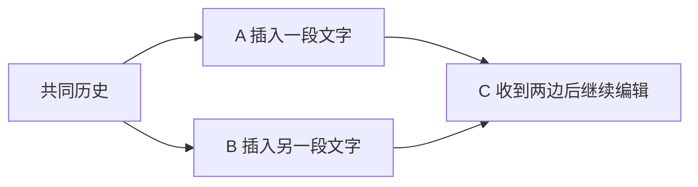
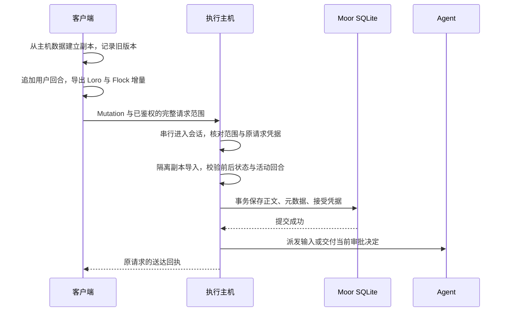

# Loro 与 CRDT 学习文档

CRDT 解决多个副本怎样合并修改；Loro 把这些规则实现成可读写、可同步的文档。在 Moor 中，它们负责表达会话数据的变化，执行主机负责判断变化能否被接受并触发 Agent。

本文适合了解 JavaScript/TypeScript、准备学习 CRDT 的读者。如果此前没有接触过分布式数据同步，建议先读[分布式数据同步入门](distributed-sync.md)，了解常见问题和主要方案。本文再从 CRDT 原理进入可运行实验，最后沿 Moor 的源码理解一次真实发送。

核对日期：2026-09-14。示例对应仓库锁定的 `loro-crdt 1.15.1`、`loro-mirror 2.3.1`、`@loro-dev/flock-wasm 0.4.3`，会话格式为 Moor v1，见 [package.json](../package.json) 和 [session-schema.ts](../src/session-schema.ts)。上游在线文档可能包含较新接口；本文实验使用这些已安装版本验证。

阅读路线：

- **理解原理**：第 1–3 节，认识收敛、因果关系和数据类型。
- **掌握 API**：第 4–6 节，认识版本、增量、快照并运行实验。
- **读懂 Moor**：第 7–9 节，理解 Mirror、Flock、主机接受和失败恢复。
- **巩固与扩展**：第 10–12 节，按源码路线验证并完成自测。

## 1. 为什么需要 CRDT

### 1.1 同步整份 JSON 会遇到什么问题

假设手机和电脑都读到了：

```json
{ "title": "学习笔记", "body": "今天学习" }
```

手机离线把标题改成“CRDT 笔记”，电脑把正文改成“今天学习 Loro”。如果重连时用最后上传的整份 JSON 覆盖旧值，其中一项修改就可能消失。即使改成逐字段覆盖，两个人同时编辑 `body` 仍有同样的问题。

真正需要约定的是：修改的单位是什么？哪些修改互相依赖？并发改动怎样处理？重复收到消息怎么办？这些约定构成复制数据类型的语义。

**CRDT** 是 Conflict-free Replicated Data Type，通常译为“无冲突复制数据类型”。它通过预先定义的更新与合并规则，使接收了相同更新集合的副本确定性地得到相同状态。这个性质称为强收敛；再结合最终传播等条件，得到强最终一致性。它不要求每个时刻所有副本都一样，也不能使永远收不到的更新自动出现。理论定义见 [Shapiro 等人的 CRDT 研究报告](https://perso.lip6.fr/Marc.Shapiro/papers/Comprehensive-CRDTs-RR7506-2011-01.pdf)。

### 1.2 用一个只增计数器理解合并

下面是教学用的 G-Counter，**不是 Loro 版本向量或 Moor 的实现**。

每个写入者只增加自己的格子，总数是所有格子的和：

```text
初始：       { A: 0, B: 0 } → 0
A 本地加 2：{ A: 2, B: 0 } → 2
B 本地加 3：{ A: 0, B: 3 } → 3
合并：逐格取 max
             { A: 2, B: 3 } → 5
```

合并时不能把收到的总数反复相加，否则重传一次就多算一次。逐格取最大值具有三条性质：

| 性质   | 表达式                                          | 对消息传输的意义       |
| ------ | ----------------------------------------------- | ---------------------- |
| 交换律 | `merge(a, b) = merge(b, a)`                     | 交换合并顺序不改变结果 |
| 结合律 | `merge(merge(a, b), c) = merge(a, merge(b, c))` | 分批合并不改变结果     |
| 幂等性 | `merge(a, a) = a`                               | 重复合并不多算         |

这个例子之所以成立，还依赖“每个副本只增加自己的格子”。如果允许任意清零，就破坏了原来的前提。

### 1.3 状态型与操作型

状态型 CRDT（CvRDT）交换状态，通常利用半格上的合并：本地状态沿偏序增长，合并取最小上界。上面的逐格 `max` 就是一个例子。

操作型 CRDT（CmRDT）传播操作，要求并发操作可交换，并满足相应的投递前提，例如因果顺序与去重。不能把“状态合并具有幂等性”直接推广成“任意操作执行两遍都安全”。这些是两类经典构造方式，见同一份[研究报告第 2 节](https://perso.lip6.fr/Marc.Shapiro/papers/Comprehensive-CRDTs-RR7506-2011-01.pdf)。

Loro 记录带因果关系的操作历史，并提供封装好的导入与导出能力。应用不需要自己设计字符位置算法。它既能导出更新，也能导出快照；这两种文件格式不等于上述两种理论分类。

## 2. 因果关系：先后与并发怎样区分

如果 B 读到 A 的修改之后才写入，B 的新修改就因果依赖 A。若 A、B 都只看过同一份旧状态便分别修改，两个修改就是并发的；不必发生在同一毫秒。



从图上能判断：A 和 B 并发，C 在二者之后。电脑显示的时间更晚，不能证明它见过手机的修改。

Loro 为内部操作分配 `(peerId, counter)` 身份，并记录依赖关系。`peerId` 标识一个写入者，`counter` 是该写入者的操作计数。一次 API 调用可能覆盖多个内部操作，例如插入多个字符；不要把 counter 当成函数调用次数或 commit 次数。多个连续操作可以组成带元数据的 Change，内部还可能合并 Change。见 [Operations and Changes](https://www.loro.dev/docs/concepts/operations_changes)。

生产代码一般使用 `new LoroDoc()` 自动产生的 peer ID。不要让两个独立写入的浏览器标签页共享同一个 peer ID 和计数起点，也不要直接把账号 ID 当 peer ID。下面实验使用固定数字，只为让孤立的合成文档容易观察。见 [PeerID Management](https://www.loro.dev/docs/concepts/peerid_management)。

## 3. Loro 的数据类型决定合并粒度

### 3.1 从 LoroDoc 到容器

`LoroDoc` 是一个文档的入口，容器是文档中的数据结构。`getMap('meta')`、`getText('body')` 等方法访问命名的根容器；容器还可以嵌套。可用类型包括 Map、Text、List、MovableList 和 Tree。见 [Getting Started](https://www.loro.dev/docs/tutorial/get_started)。

```text
LoroDoc
  ├─ meta: LoroMap
  │    └─ title: 普通字符串
  ├─ body: LoroText
  └─ comments: LoroList
       └─ 每个元素可以是普通值或子容器
```

### 3.2 普通字符串与 LoroText 有什么不同

下面两种写法看起来都在保存字符串，合并语义却不同：

```ts
// 普通值：每次设置整个 title。
doc.getMap('meta').set('title', '学习 Loro');

// 文本容器：记录对文本序列的插入。
doc.getText('body').insert(0, '学习 Loro');
```

| 数据结构               | 并发时的基本行为                 | 适合表达的内容             |
| ---------------------- | -------------------------------- | -------------------------- |
| Map 中不同的键         | 各键的更新可以共同保留           | 标题、状态等独立字段       |
| Map 同一个键中的普通值 | 按 LWW 规则选出一个可见值        | 单个状态、链接或整段配置值 |
| LoroText               | 合并字符序列的插入与删除         | 需要多人编辑的正文         |
| LoroList               | 按元素身份与顺序关系合并序列编辑 | 有序历史、评论列表         |

LWW 是 Last-Write-Wins。Loro Map 使用 Lamport 逻辑时间，并在需要时用 peer ID 等规则确定顺序；这里的“最后”不能理解成最后到达服务器或电脑时钟最大。选出一个值可以保证一致，但不保证两个人的意图都保留。见 [Map](https://www.loro.dev/docs/tutorial/map)。

选择 Text 会保留并发插入，选择普通字符串则可能让一方的整次赋值成为最终值。两者都有合理场景：段落适合细粒度编辑，网址往往更适合作为一个值替换。见 [How to Choose the Right CRDT Types](https://www.loro.dev/docs/concepts/choose_crdt_type)。

### 3.3 可合并不代表业务约束成立

假设列表要求“任意时刻最多有一个正在执行的任务”。A、B 同时在各自副本追加任务，列表 CRDT 可以合并成两个元素，但这违反了业务要求。CRDT 解决的收敛性质不会自动维护这个约束。

这也解释了 Moor 为什么使用 CRDT 后仍需要按会话串行接受、校验活动回合和拒绝旧上下文发送。

## 4. 版本向量与 Frontiers

### 4.1 为什么一个整数版本号不够

两台设备各自把 `version=10` 改成 `version=11`，仍无法知道“11”包含谁的修改。Loro 的版本向量记录每个 peer 已包含的操作前缀。

```text
V1 = { A: 3, B: 1 }
含 A 的 counter 0、1、2，B 的 counter 0

V2 = { A: 2, B: 2 }
含 A 的 counter 0、1，B 的 counter 0、1
```

上限是**不包含的末端**。`A: 3` 不包含 A 的 counter 3。未列出的 peer 可按 0 比较。V1 多知道 A 的操作，V2 多知道 B 的操作，因此二者不可按单一“新旧”排序。

逐项比较时，如果 V1 的每个分量都不大于 V2，V1 所含操作就是 V2 的子集；若两边各有更大分量，就是并发版本。这里的 A、B 是教学符号，实际 Loro peer ID 是数字标识。见 [Version Vector](https://loro.dev/docs/concepts/version_vector)。

### 4.2 增量的 from 应该传谁的版本

```ts
// A 给 B 补数据：from 表示 B 已经拥有的操作。
const bytes = a.export({ mode: 'update', from: b.version() });
b.import(bytes);

// 如果 B 也有 A 缺少的操作，再反向补一次。
a.import(b.export({ mode: 'update', from: a.version() }));
```

单向补读只会让接收者获得发送者已有的内容，不会把接收者独有的修改自动上传。

生成“本次本地编辑”的增量时，则先保存本地编辑前的版本，再编辑，最后以这个旧版本为 `from`。**在编辑之后才读取 from，会把刚才的修改排除掉。**

### 4.3 Frontiers 是操作图的边界

Frontiers 记录某个版本的末端操作集合。第 2 节的图中，合并前的边界可以是 `[A, B]`，C 创建后的边界可以是 `[C]`；沿依赖向前追溯，就能找回该版本包含的操作。

| 表示           | 主要内容                 | 常见用途                 |
| -------------- | ------------------------ | ------------------------ |
| Version Vector | 每个 peer 的操作前缀上限 | 跨副本比较、计算缺失更新 |
| Frontiers      | 因果图末端操作的 ID      | 历史检查点、切换文档版本 |

Frontiers 往往较短，但不是固定只有一个元素；理解它覆盖的完整历史需要相应操作图。已有所需历史时，Loro 可通过 `frontiersToVV` 和 `vvToFrontiers` 转换。见 [Versioning Deep Dive](https://loro.dev/docs/advanced/version_deep_dive)。

## 5. 更新、快照、JSON 和 commit

### 5.1 不同表示各自保存什么

| API                                    | 得到什么                   | 用途与限制                               |
| -------------------------------------- | -------------------------- | ---------------------------------------- |
| `doc.toJSON()`                         | 当前可见业务值             | 展示、调试；没有完整 CRDT 身份与因果历史 |
| `doc.export({ mode: 'update', from })` | 基线之后的操作编码         | 同步增量；可能依赖接收者已有的操作       |
| `doc.export({ mode: 'snapshot' })`     | 完整快照的二进制编码       | 保存状态与操作历史，恢复文档             |
| `doc.import(bytes)`                    | 将编码中的操作并入当前文档 | 接受更新或快照；合并已有历史             |

普通 `toJSON()` 结果与 Loro 专用的 JSON 操作导出格式也不同。把可见 JSON 装进一个新文档，会生成新的操作身份，不能据此恢复原来的同步关系。

完整快照并不是“自动清除历史”的压缩包。Loro 另有 shallow snapshot，可截断较老历史，但会限制与更早版本或并发旧历史的同步。Moor 当前 `RuntimeStore.persist()` 使用完整快照。编码语义见 [Export Mode](https://www.loro.dev/docs/tutorial/encoding)，实际保存入口见 [store.ts](../src/runtime/store.ts)。

还有一个重要区别：把主机快照导入已有客户端文档，通常不能消除客户端独有、已被主机拒绝的操作。需要恢复到纯主机状态时，应在新文档实例加载可信数据，并由业务层处理待确认请求与草稿。

### 5.2 commit 不负责落盘或执行

`doc.commit()` 结束当前文档事务，使本地操作成为已提交的文档变更。`export()` 等 API 也可能隐式提交，所以学习实验显式调用 `commit()` 来标出边界。

应区分三个时刻：

```text
Loro commit       → 文档中的操作提交
SQLite COMMIT     → Moor 数据库事务成功
主机送达回执      → 对特定原请求的持久接受确认
```

只有第一步完成时，数据可能仍只在内存中。数据库提交也不能让外部 Agent 调用或文件修改自动变成同一个事务。Loro 的操作提交机制见 [Operations and Changes](https://www.loro.dev/docs/concepts/operations_changes)；Moor 的事务与送达行为由 [RuntimeStore](../src/runtime/store.ts) 和 [HostWorkspace](../src/bridge/host-workspace.ts) 实现。

### 5.3 收到更新，不一定已经应用完

后面的操作可能先到，但依赖的前面操作还没到。Loro 的 `import()` 返回 `ImportStatus`；在本仓库版本中，`success` 是已导入范围的 Map，`pending` 是待补依赖的范围 Map 或 `null`。仅仅没有抛错，不能证明所有收到的操作都已反映在可见状态中。见 [Import Status](https://www.loro.dev/docs/concepts/import_status)。

下面实验会直接复现这一点。它是 Loro 的通用行为示范，不表示 Moor 的 Mutation 接口允许客户端提交任意乱序操作来等待后续执行。

## 6. 三个可运行实验

在仓库根目录使用 Node.js 24+ 执行。未安装依赖时先运行 `corepack pnpm install --frozen-lockfile`。实验全部使用内存中的合成文档，没有网络、真实 Agent、数据库或延时等待；每段命令都可以独立运行。

### 实验一：文本合并、重复导入与 Map 冲突

先预测：两边在 `X` 后分别插入 `A`、`B`，合并后会有几个字符？同一个更新导入两次，会出现两个 `B` 吗？同一个 Map 键会同时显示两个值吗？

```sh
node --input-type=module <<'JS'
import assert from 'node:assert/strict';
import { LoroDoc } from 'loro-crdt';

const a = new LoroDoc();
const b = new LoroDoc();
try {
  a.setPeerId('1');
  b.setPeerId('2');
  a.getText('body').insert(0, 'X');
  a.getMap('meta').set('title', '原题');
  a.commit();
  b.import(a.export({ mode: 'snapshot' }));
  const base = a.version();

  a.getText('body').insert(1, 'A');
  a.getMap('meta').set('title', 'A 的题目');
  a.commit();
  b.getText('body').insert(1, 'B');
  b.getMap('meta').set('title', 'B 的题目');
  b.commit();

  const updateA = a.export({ mode: 'update', from: base });
  const updateB = b.export({ mode: 'update', from: base });
  a.import(updateB);
  b.import(updateA);
  assert.deepEqual(a.toJSON(), b.toJSON());
  assert.equal(a.getText('body').toString().length, 3);
  assert.ok(a.getText('body').toString().includes('A'));
  assert.ok(a.getText('body').toString().includes('B'));
  assert.ok(['A 的题目', 'B 的题目'].includes(a.getMap('meta').get('title')));

  const once = a.toJSON();
  a.import(updateB);
  assert.deepEqual(a.toJSON(), once);
  console.log('两个副本已收敛：', a.toJSON());
  console.log('重复导入没有产生第二次编辑。');
} finally {
  a.free();
  b.free();
}
JS
```

观察：两边正文相同且保留 A、B 两次插入，标题只显示一个值。不要依靠“我的内容一定排前面”编写业务规则。去重成立是因为重传保留了原操作身份；再次调用 `insert()` 会生成新的编辑。

### 实验二：后续增量先到，依赖稍后到

先预测：只给空文档发送第二次插入的增量，Loro 会立即得到完整文本吗？

```sh
node --input-type=module <<'JS'
import assert from 'node:assert/strict';
import { LoroDoc } from 'loro-crdt';

const source = new LoroDoc();
const receiver = new LoroDoc();
try {
  source.setPeerId('3');
  source.getText('body').insert(0, 'X');
  source.commit();
  const first = source.export({ mode: 'update' });
  const afterFirst = source.version();

  source.getText('body').insert(1, 'Y');
  source.commit();
  const second = source.export({ mode: 'update', from: afterFirst });

  const status = receiver.import(second);
  assert.ok(status.pending && status.pending.size > 0);
  assert.equal(receiver.getText('body').toString(), '');
  console.log('先收到后续操作：', status.pending);

  receiver.import(first);
  assert.equal(receiver.getText('body').toString(), 'XY');
  assert.deepEqual(receiver.version().toJSON(), source.version().toJSON());
  console.log('补齐依赖后：', receiver.toJSON());
} finally {
  source.free();
  receiver.free();
}
JS
```

观察：第二个增量先进入待补依赖状态；第一个更新到达后，最终文本才成为 `XY`。这里用导入顺序制造乱序，不用计时器猜测网络行为。

### 实验三：导入快照为什么不能撤销本地修改

先预测：客户端自己插入了 `!`，随后再次导入主机的旧快照，`!` 会消失吗？

```sh
node --input-type=module <<'JS'
import assert from 'node:assert/strict';
import { LoroDoc } from 'loro-crdt';

const host = new LoroDoc();
const client = new LoroDoc();
const fresh = new LoroDoc();
try {
  host.setPeerId('4');
  client.setPeerId('5');
  host.getText('body').insert(0, '主机正文');
  host.commit();
  const confirmed = host.export({ mode: 'snapshot' });

  client.import(confirmed);
  client.getText('body').insert(4, '!');
  client.commit();
  client.import(confirmed);
  assert.equal(client.getText('body').toString(), '主机正文!');

  fresh.import(confirmed);
  assert.equal(fresh.getText('body').toString(), '主机正文');
  console.log('原文档合并快照：', client.toJSON());
  console.log('新实例加载快照：', fresh.toJSON());
} finally {
  host.free();
  client.free();
  fresh.free();
}
JS
```

观察：导入快照仍是合并；创建新实例才得到了仅包含主机历史的文档。恢复 Moor 界面时，还必须同步处理 Flock、缓存和原请求状态，不能只更换一个 `LoroDoc` 就宣称完整恢复。

## 7. Moor 怎样使用 Loro、Mirror 与 Flock

### 7.1 三个库的职责

| 组件   | 在 Moor 中负责什么                       | 阅读入口                                                             |
| ------ | ---------------------------------------- | -------------------------------------------------------------------- |
| Loro   | 正文容器、操作历史、版本与增量           | [model.ts](../src/model.ts)                                          |
| Mirror | 将 Loro 容器映射成可按 schema 读写的对象 | [session-schema.ts](../src/session-schema.ts)                        |
| Flock  | 按键保存会话元数据与独立的本机注册数据   | [model.ts](../src/model.ts)、[RuntimeStore](../src/runtime/store.ts) |

Mirror 的 `view.getState()` 提供对象视图，`view.setState()` 将对象修改转为底层容器操作。它的 schema 决定读写映射，不提供账号授权、跨项目隔离或“是否允许执行”的判断。见 [Loro Mirror 官方说明](https://github.com/loro-dev/loro-mirror/blob/main/packages/core/README.md)。

Flock 是另一套键值复制结构，并不是 `LoroDoc` 中的一个容器。Moor 的 `putMeta()` 将字段写到 `['m', docId, field]`，并用 `['e', docId]` 标记条目存在；`metas()` 通过前缀扫描重建元数据对象。这样列举会话时，不必逐份解析正文。

尤其不要混用两个库的版本：Loro 版本向量是 peer 到操作计数的映射；本仓库 Flock 0.4.3 的 `version()` 是基于键值条目时钟的版本，其分量包含 `physicalTime` 和 `logicalCounter`。Moor 分别调用 `delta(doc, before)` 与 `flock.exportJson(version)`，两者没有可互换的编码。Flock 的定义可在已安装包 `@loro-dev/flock-wasm` 的 README 中核对。

### 7.2 会话结构与一个容易误读的 Any

当前 schema 的主要形状如下；这是结构图，省略了部分可选字段：

```text
session: LoroMap
  id: String
history: LoroList，以 turn.id 供 Mirror 匹配条目
  每个回合: LoroMap
    id、role、timestamp、status: String
    finished: Boolean
    items: LoroList<Any>
    inputConfig: Any
    fileDiff: Any
```

`turn.id` 是 Moor 的业务身份，不能与 Loro 内部的 `(peerId, counter)` 混为一谈。列表的匹配函数也不意味着 CRDT 会替主机保证“只允许追加一个合法用户回合”。

**`schema.Any()` 不等于“所有内容都作为一个原子 JSON 值”。** 在锁定的 Mirror 2.3.1 中，Any 会按运行时值推导容器。对当前 Moor schema 写入合成文本内容项后，实测结构是：

```text
history 中的回合 → LoroMap
回合的 items    → LoroList
{ type, text }  → LoroMap
其中的 text     → 普通 string
```

因此，业务代码可以整项替换内容，但不能据此断言底层所有嵌套字段都是原子值；同时，普通 `text` 字段也不会自动获得 `LoroText` 的字符合并能力。阅读时以实际容器和锁定版本行为为准。相关推导可在已安装包的 `loro-mirror/src/schema/types.ts` 中核对；产品合法性仍由 [validate-mutation.ts](../src/bridge/validate-mutation.ts) 判断。

### 7.3 持久历史与活动进程分开

Loro 保存已发生的回合与内容。当前 Agent 会话、等待审批的回调和停止标记属于执行主机的活动状态。历史里有一张未完成审批卡片，不能证明原 Agent 进程现在还在等待它。

同样，用户回合的 `finished=true` 表示输入记录完整，不表示 Agent 完成任务。助手回合有独立生命周期。详细字段语义见[会话与回合](session.md)。

## 8. 沿一次发送理解增量同步与业务接受

### 8.1 读取路径：告诉主机我缺什么

访问端提供自己持有的 Loro 版本，主机据此返回更新和会话元数据。`model.ts` 中：

- `vv(doc)` 将 Loro 版本向量编码为 base64。
- `delta(doc, version)` 解码基线版本并导出缺少的更新；无基线时使用空版本向量。
- `encode()`、`decode()` 负责字节与 base64 之间转换。

base64 是传输编码，不提供加密或访问控制。收到 `changed` 通知只意味着需要重新读取，不意味着通知携带了正文或原请求的接受回执。完整读取语义见[同步、送达与重试](sync.md)。

### 8.2 发送路径：提交一个候选变更



图中省略了具体传输层。客户端收到回执与 Agent 实际开始运行的时间先后可能受异步调度和网络影响；必须满足的是先持久接受，再允许执行副作用。

在 [buildSessionTurn](../src/session-client.ts) 中，关键步骤是先从主机读取结果建立新文档，然后保存 `before = vv(doc)`，通过 Mirror 追加输入，最后导出 `delta(doc, before)`。同时，它为 Flock 保存单独的基线并导出 `metaBundle`。

Mutation 是业务请求封套，主要字段包括：

| 字段                       | 回答的问题                             |
| -------------------------- | -------------------------------------- |
| `operationId`              | 是否为同一次业务请求及其重试？         |
| `workspaceId`、`sessionId` | 请求针对哪个执行工作区和会话？         |
| `kind`                     | 追加指令，还是回应审批？               |
| `expectedTurnId`           | 用户基于哪条最近用户输入做出这次决定？ |
| `update`                   | 本次候选 Loro 操作是什么？             |
| `metaBundle`               | 是否包含允许的 Flock 元数据变化？      |

这不是完整鉴权封套。账号、设备、项目等上下文还由传输入口和主机范围校验绑定，不能因为 Mutation 没列出全部身份，就省掉这些检查。入口见 [host-command.ts](../src/bridge/host-command.ts)。

### 8.3 为什么主机不能直接 import 到正式文档

客户端能生成可解码的 CRDT 操作，也能生成不符合业务要求的操作。主机在 [validateMutation](../src/bridge/validate-mutation.ts) 中复制原文档和 Flock，在隔离副本导入，比较修改前后的业务状态。

普通发送要求只追加一个用户回合，原历史保持不变，并核对执行目标、内容、Agent 配置和状态。审批只允许改变指定请求的合法决定，并由 HostWorkspace 核对仍存在的活动请求。通过后才持久接受这份候选结果。Mirror 忽略未知属性的映射选项不能当成安全保证。

正文快照、元数据和原操作凭据通过同一个数据库事务保存；校验或保存失败不得开始执行。只有执行主机能把客户端提交的用户操作正式接受进主机持久状态。客户端仍会导入主机返回的数据以显示历史、构造本地候选变更；这两个动作的权限不同。

中转转发请求，不保存会话正文或 CRDT 操作历史。上游 Loro 文档中展示的“保存 OpLog 的通用 relay”是另一种应用架构，不能直接套入 Moor。

## 9. 三种“编号”和三个失败场景

### 9.1 版本、请求与回合不能互相替代

| 标识                           | 所属层       | 能保证什么                       |
| ------------------------------ | ------------ | -------------------------------- |
| Loro `(peerId, counter)`       | CRDT 内部    | 识别同一条底层操作，避免重复导入 |
| Loro Version Vector            | 文档同步     | 描述已包含哪些操作               |
| Moor `operationId`             | 业务请求     | 结合原请求内容与范围查询接受凭据 |
| Moor `expectedTurnId`          | 业务并发控制 | 拒绝基于过期最近用户回合的操作   |
| 审批 `requestId` 与助手回合 ID | 活动执行     | 把决定绑定到准确的活动审批       |

一个发送请求会产生多条 Loro 操作。不能把一条 Loro 操作 ID 当作整个发送的编号，也不能因 CRDT 重复导入安全，就重新生成请求并再次派发 Agent。

### 9.2 两台设备同时发送

两台设备都基于 U1 构造新指令。主机按会话串行接受：第一条合法请求改变最近用户回合并建立活动回合，第二条随后因旧上下文或已有活动任务被拒绝。客户端需要刷新并让用户决定下一步。

文档列表可以合并两个条目，与此刻是否应该执行两条指令，是不同的约束。验证见 [host.test.ts](../tests/host.test.ts) 中的 `concurrent and offline turns never start a second prompt`。

### 9.3 已接受，但回执丢失

客户端不能从超时推断“没有执行”。它保存原请求和原 `operationId`，由用户手动核查或重试。主机若已有同范围、同内容的接受记录，就返回原结果；换编号重发会变成新请求。

这里实现的是业务接受去重，不是对 Agent 外部副作用的全局 exactly-once 承诺。进程可能在事务之后、派发之前退出，也可能在修改文件后、保存最终结果前退出。Moor 重启不自动重放任务，见[运行与恢复](runtime.md)。

### 9.4 离线草稿遇到重连

CRDT 库可以支持离线编辑，但 Moor 的未发送草稿不会因为恢复连接就自动执行。同步已接受历史、保存草稿、手动提交操作必须保留各自的触发条件。

若客户端已生成被拒绝的候选操作，不能靠反复合并主机快照来“洗掉”它们，参见实验三。具体重试与恢复规则见[同步、送达与重试](sync.md)。

## 10. 继续设计时需要考虑什么

**先确定字段的合并单位。** 两个人改同一个值时，应该保留一个值、两段插入，还是明确拒绝其中一次？应先回答这个问题，再选择普通值、Text、Map 或 List。容器嵌套越细，合并粒度越细，也越需要确认组合后的业务状态合理。

**Schema 的变化仍需要兼容设计。** Loro 二进制格式可读取，不代表新旧 Moor 客户端理解相同字段。增加字段、改变字段含义或修改执行动作时，要沿 Moor 的版本化会话格式和 typed host boundary 扩展；不要把凭据、原始启动命令或任意代理能力放进共享字段。

**历史、内存和带宽分别衡量。** 增量字节较少不代表完整历史不增长；越来越多 peer 会增加版本元数据；每次导出完整快照也有成本。先用合成历史测量导入时间、快照大小和界面更新开销，再决定是否需要批处理或历史策略，不从“用了 CRDT”推断固定性能。

**回看历史不撤销外部世界。** Loro 将操作历史 OpLog 与当前可见 DocState 分开。切换旧版本时，`version()` 可以指向旧状态，`oplogVersion()` 仍包含较新的操作；恢复最新视图可使用 `attach()`。这支持文档历史查看，不会回滚已经执行的文件写入、模型调用或审批。见 [OpLog and DocState](https://www.loro.dev/docs/concepts/oplog_docstate)。

## 11. 源码阅读与项目实验

按下面顺序阅读，每读一处回答一个问题：

| 顺序 | 源码                                                                                | 要回答的问题                                 |
| ---- | ----------------------------------------------------------------------------------- | -------------------------------------------- |
| 1    | [session-schema.ts](../src/session-schema.ts)                                       | 哪些字段是明确容器，哪些由运行时推导？       |
| 2    | [model.ts](../src/model.ts)                                                         | `vv`、`delta` 和 Flock 的版本为什么分开？    |
| 3    | [session-client.ts](../src/session-client.ts)                                       | 编辑前版本在哪里保存，原请求怎样构造？       |
| 4    | [validate-mutation.ts](../src/bridge/validate-mutation.ts)                          | 主机如何证明候选变更符合允许的业务范围？     |
| 5    | [host-workspace.ts](../src/bridge/host-workspace.ts)                                | 去重、串行、活动审批和派发分别发生在哪里？   |
| 6    | [runtime/store.ts](../src/runtime/store.ts)、[journal.ts](../src/bridge/journal.ts) | 快照、元数据、原请求凭据如何一起持久化？     |
| 7    | [host.test.ts](../tests/host.test.ts)                                               | 并发、回执丢失和持久化失败怎样被确定性复现？ |

在仓库根目录运行已有的合成测试：

```sh
corepack pnpm exec tsx --test --test-name-pattern='delivery commits document|concurrent and offline turns|failed persistence rolls back|restart retains receipt' tests/host.test.ts
```

预期观察：持久接受后才派发；并发新输入只接受一条；保存失败没有接受凭据也不派发；重启保留原回执但不重放任务。

审批另看：

```sh
corepack pnpm exec tsx --test tests/session-client-permission.test.ts
```

这些实验覆盖真实 Loro/Mirror 和 Moor 逻辑，使用合成 Agent、身份与临时数据。它们不验证两台真实设备的网络、浏览器后台挂起、真实 Agent 行为或发布环境；真机范围见[设备验收](validation.md)。更多故障练习见[学习实验与自测](learning-lab.md)。

## 12. 自测与参考答案

先遮住右栏，用自己的话回答：

| 问题                                               | 参考答案                                                 |
| -------------------------------------------------- | -------------------------------------------------------- |
| CRDT 的“无冲突”是否意味着没有修改被覆盖？          | 不意味着。LWW 可以确定性选择一个值；业务意图仍可能丢失。 |
| 版本向量 `{ A: 4 }` 是否包含 A 的 counter 4？      | 不包含，只包含 0–3；上限是排他的。                       |
| `from` 应该在本地编辑前还是后保存？                | 若要导出本次编辑，必须保存编辑前版本。                   |
| `import()` 没抛错，是否表示新内容已全部应用？      | 不一定，缺少依赖时存在 pending 操作。                    |
| JSON 看起来相同，能否证明两份文档同步历史相同？    | 不能。可见值不包含完整操作身份与因果信息。               |
| `schema.Any()` 是否保证整体原子值？                | 不保证。当前 Mirror 会按值推导容器，需检查实际结构。     |
| 导入主机旧快照能否去掉客户端独有编辑？             | 通常不能，导入是合并；应按业务恢复策略重建文档。         |
| 为什么 Loro 已经去重，Moor 还需要 operationId？    | 前者去重底层文档操作，后者追踪并去重整个业务接受请求。   |
| 为什么不能只凭审批卡片提交允许？                   | 还需匹配准确的活动助手回合、请求、审阅内容与执行范围。   |
| `delivered=true` 是否代表 Agent 已完成且结果正确？ | 只代表主机持久接受该请求；完成和结果正确需要其他证据。   |

继续阅读：[核心架构](core.md) · [系统学习指南](learning-guide.md) · [文档目录](README.md)
