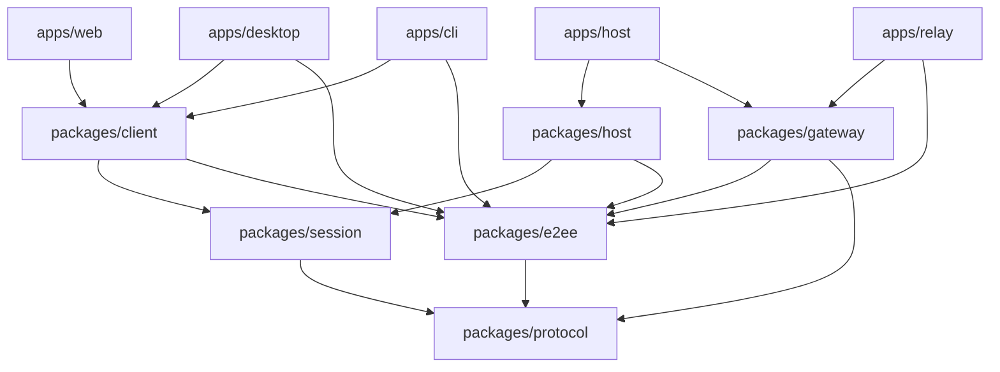

# 目录与分包重构计划

本文规划把 Moor 从单包仓库迁移为 pnpm monorepo，以应用入口、公共契约和数据所有权建立可检查的模块边界。目标结构分为 `apps/` 与 `packages/`，通过 8 个依次合并的 PR 落地；每个 PR 合并后，主分支都应能完整检查、测试、构建和运行。

状态：方案已确定，8 个实施 PR 均待开始。本文中的目标目录、包名和检查规则描述计划，不表示这些能力已迁移或验收完成。

本轮覆盖目录组织、依赖解耦、包级构建与测试、发布路径调整。已有产品行为以[项目首页](../README.md)、[客户端统一计划](client-unification.md)和各功能文档为准；既有客户端统一成果继续保留。大文件内部的深入职责拆分安排在包边界稳定后的功能级 PR 中。

## 一、现状与目标

### 已确认的结构问题

| 现状                                                                                                    | 维护成本                                       | 迁移方向                                       |
| ------------------------------------------------------------------------------------------------------- | ---------------------------------------------- | ---------------------------------------------- |
| [workspace 配置](../pnpm-workspace.yaml) 仅包含根包，运行依赖集中在一个 [package.json](../package.json) | 难以从依赖声明判断模块运行环境和职责           | 各包声明直接依赖，根目录统一调度               |
| [TypeScript 配置](../tsconfig.json) 同时包含浏览器和 Node 环境                                          | 前端与主机代码的环境边界主要依靠人工约定       | 公共、浏览器、Node、Electron 入口分别检查      |
| `src/web/` 混放界面、状态、缓存、传输适配与功能控制器                                                   | 同一功能需要跨多个前缀寻找实现                 | 包内按功能聚合，平台差异由适配层承接           |
| Web 使用 CLI 的操作模型，桌面使用 CLI 的 HTTP 和目标解析实现                                            | 共用能力归属于某个应用，形成应用之间的交叉引用 | 提取公共客户端                                 |
| CLI 使用 Web 的预览数据校验                                                                             | 数据定义与界面实现耦合                         | 把共用数据模型与界面控制分开                   |
| `bridge` 与 `runtime` 共同实现执行主机，并相互引用                                                      | 现有文件夹不能直接作为独立包                   | 合并整理执行职责，再区分启动、命令、业务和存储 |
| 本机主机复用 `relay/http.ts` 与账号/目录存储                                                            | 共用服务能力与远程专用功能混合                 | 提取共用 gateway，分别装配本机与远程入口       |
| `security` 同时包含加密实现、私有存储、桌面客户端和命令入口                                             | 安全能力与具体平台生命周期混合                 | 按 e2ee、客户端和应用入口重新归属              |

当前 `app.ts`、`host-workspace.ts`、`relay/http.ts` 等文件还承担多个功能的协调工作。目录迁移先让这些职责有明确归属；后续再逐项提取功能流程，避免路径变化掩盖执行逻辑变化。

### 完成后应具备的能力

- 维护者能从目录和包定义判断代码运行在哪里、由谁负责、允许依赖什么。
- 应用通过公开契约和构建产物协作，公共包不依赖应用源码。
- 浏览器产物不会因跨目录引用而带入主机存储、Agent 启动或 Electron 实现。
- 修改某项功能时，能在对应目录找到实现、单元测试和局部说明。
- 根命令继续支持完整验证，包级命令支持定位与开发。
- 会话格式、持久化位置、操作身份、审批和送达语义保持兼容。

## 二、目标目录

```text
moor/
├── apps/
│   ├── web/                  # Web/PWA，以及桌面共用的界面
│   ├── desktop/              # Electron 主进程、preload、本机设置
│   ├── cli/                  # 参数解析、命令组织、终端输出
│   ├── host/                 # 执行主机启动、配置与组件装配
│   └── relay/                # 中转启动、远程账号与服务配置
├── packages/
│   ├── protocol/             # 版本化请求、响应、事件与作用域
│   ├── session/              # Moor 会话模型、CRDT 与文档操作
│   ├── client/               # 客户端请求、送达状态与传输适配
│   ├── host/                 # 执行主机业务与持久化
│   ├── gateway/              # 本机/远程共用的 HTTP/WS 入口能力
│   └── e2ee/                 # 加密、信任验证与端点身份管理
├── tests/
│   ├── integration/          # 跨包、跨进程验证
│   ├── e2e/                  # 完整产品流程
│   └── fixtures/             # 跨应用使用的合成数据与 Agent
├── scripts/
│   ├── build/
│   ├── release/
│   └── validation/
├── deploy/
├── docs/
├── assets/brand/
├── package.json
├── pnpm-workspace.yaml
├── pnpm-lock.yaml
└── tsconfig.base.json
```

各 workspace 使用明确名称：公共包为 `@moor/protocol`、`@moor/session`、`@moor/client`、`@moor/host`、`@moor/gateway`、`@moor/e2ee`；应用为 `@moor/app-web`、`@moor/app-desktop`、`@moor/app-cli`、`@moor/app-host`、`@moor/app-relay`，避免应用与库重名。

所有 workspace 初期均为私有包，沿用产品统一版本和根锁文件。工作区依赖使用 `workspace:*`；本轮只因目录与依赖归属调整更新锁文件，不顺带升级第三方依赖。依赖发布、独立版本管理和额外构建编排工具，待实际需求出现后再决定。

每个包拥有自己的 `package.json`、公开入口、类型检查配置、测试及简短职责说明。产物使用各包的 `dist/`，根构建按发行清单装配应用；生成产物继续排除在版本控制之外。

## 三、包边界与依赖方向

### 公共包职责

| 包         | 职责与公开能力                                                                  | 边界                                                                              |
| ---------- | ------------------------------------------------------------------------------- | --------------------------------------------------------------------------------- |
| `protocol` | 版本、功能标识、路由作用域、请求/响应/事件 schema、纯校验和公开错误语义         | 不依赖其他 Moor 包、React、Electron、SQLite 或 CRDT 实现                          |
| `session`  | Moor 会话格式 v1、Loro/Mirror/Flock 操作、快照、增量与纯文档投影                | 可依赖 protocol；不承担授权、送达确认、SQLite 存储或 Agent 执行                   |
| `client`   | 有类型的请求构造、响应验证、原操作记录、送达状态，以及按环境选择的传输/存储适配 | 可依赖 protocol、session 和 e2ee；不依赖 host、gateway 或应用源码                 |
| `host`     | 命令处理、作用域再校验、回合/审批/停止、项目操作、AgentDriver、主机持久化与事务 | Node 环境；可依赖 protocol、session 和 e2ee 的适用入口；不依赖客户端和中转应用    |
| `gateway`  | 共用 HTTP/WS 路由、目录访问与目标派发，接受授权、组织存储和派发接口             | Node 环境；依赖 protocol，按需使用 e2ee 公共验证入口；不依赖 session 或 host 实现 |
| `e2ee`     | 密码学、信任验证、端点身份与私有存储能力                                        | 依赖 protocol；公共验证、端点能力、Node 私有存储分入口，不能反向依赖 host/client  |

`client` 的操作状态模型与传输实现分开。浏览器 HTTP、桌面有限桥接、Node 客户端和加密连接继续保持各自的能力声明、身份校验、超时与恢复语义。只有行为已等价的流程才逐步共享。

`gateway` 来自现有本机服务与中转的真实复用关系。它通过接口接入本机或远程的身份、目录和命令目标；远程账号、Google 登录、推送配置等由 `apps/relay` 装配。组织元数据可以共用 schema 和存储实现，但本机目录与各中转目录仍属于独立权限域和数据库实例。

### 依赖示意

箭头表示源码依赖；图中省略部分直接依赖 protocol 的箭头。



gateway 和 relay 对 e2ee 的依赖仅限所需的公开记录解析与信任验证；端点私钥和解密能力不进入中转装配。桌面打包通过构建清单消费 Web 静态资源、主机程序与所需辅助入口，这属于产物装配，不建立应用源码之间的依赖。

### 自动约束

1. 跨包依赖必须出现在包清单中，并通过 `exports` 使用公开入口，例如 `@moor/protocol/session`。类型引用也遵守相同方向。
2. 检查禁止跨包相对路径、其他包的 `src/` 深层引用、包依赖环和公共包对应用源码的引用。
3. 公共 schema 独立定义；主机实现满足公共接口。不能让协议类型通过 `Pick<HostWorkspace, ...>` 等方式依赖执行实现。
4. 浏览器入口同时通过类型检查和实际打包检查；Node、Electron 主进程、preload 与 renderer 分别检查其环境。
5. 跨环境公共包的 Node 专用实现使用明确子路径入口；浏览器或环境中立入口不能间接加载 SQLite、文件系统、Electron 或 Agent 启动模块。host、gateway 等明确的 Node 包按自身运行环境检查。
6. 小型平台能力按所有者或注入接口组织，不设无限扩张的 `shared`、`common`、`utils` 包。跨所有者的锁或文件访问依赖在提包时显式处理。
7. 包内测试可使用包内实现；跨包集成测试通过公开接口、受限测试入口或真实应用进程验证。

## 四、包内目录与原代码归属

### Web 按功能组织

```text
apps/web/src/
├── app/                      # 启动、顶层布局、依赖装配
├── features/
│   ├── auth/
│   ├── workspace/
│   ├── sessions/
│   ├── composer/
│   ├── approvals/
│   ├── attention/
│   ├── files/
│   ├── git/
│   ├── github/
│   │   ├── components/
│   │   ├── controller.ts
│   │   ├── state.ts
│   │   └── controller.test.ts
│   ├── skills/
│   └── notifications/
├── components/               # 跨功能的基础 UI
├── platform/                 # 浏览器/桌面的界面能力适配
└── styles/
```

每个功能按实际复杂度建立文件，简单模块可以只有几个文件。当前 `github-*`、`secure-github-*`、`workspace-github-*` 先归入同一功能目录，再区分数据、状态、界面和连接适配。桌面共用此界面，原生能力由有限 preload 接口提供。

### 主机与桌面

```text
packages/host/src/
├── sessions/                 # 回合、审批、执行与恢复
├── projects/                 # 文件、快照、Git/worktree
├── agents/
│   ├── driver.ts             # AgentDriver 接口
│   └── acp/                  # ACP 实现、程序发现与能力映射
├── integrations/             # GitHub、Skills、MCP 等主机能力
├── persistence/              # SQLite、Journal、事务
├── commands/                 # 有类型的主机命令处理
└── index.ts

apps/desktop/src/
├── main/                     # 窗口、主机生命周期与原生能力
├── preload/                  # renderer 可调用的有限能力
├── settings/                 # 本机设置页与交互
└── entry.cjs
```

ACP 暂留主机包内部；出现多个宿主复用或独立发布需求时，再考虑单独提包。主机会话、元数据和送达凭据继续在同一个 SQLite 事务中提交，存储模块的拆分不改变事务范围。

### 主要迁移映射

以下路径按制定计划时的源码归属记录，实施 PR 需同步更新实际入口与文档链接。

| 当前代码                                                                                            | 目标归属                       | 处理方式                                                         |
| --------------------------------------------------------------------------------------------------- | ------------------------------ | ---------------------------------------------------------------- |
| `src/*-protocol.ts`、`protocol.ts`、公开响应与身份 schema                                           | `packages/protocol`            | 按 session、content、git、github、catalog 等能力分子模块         |
| `bridge/host-command.ts`                                                                            | protocol + host                | 请求契约归 protocol，dispatcher 和执行依赖归 host                |
| `runtime/session-events.ts`、`desktop/workspace-protocol.ts`、`security/desktop-client-protocol.ts` | protocol + 所属实现            | 共用 schema/type 归 protocol，Agent 归一化及平台行为留在对应实现 |
| `model.ts`、`session-schema.ts`、纯会话投影                                                         | `packages/session`             | 统一 CRDT 入口，解除投影对主机私有类型的依赖                     |
| `session-client.ts`                                                                                 | session + client               | 文档操作归 session，客户端目标/请求构造归 client                 |
| `cli/secure-operation.ts`、`cli/http.ts`、共用目标解析                                              | `packages/client`              | 抽出操作模型与客户端能力，CLI 保留参数和输出                     |
| `security/e2ee-*`、信任与私有端点存储                                                               | `packages/e2ee`                | 分公共与平台入口，解除对 runtime 私有实现的引用                  |
| `security/encrypted-bridge-client.ts`、共用连接实现                                                 | `packages/client`              | 保留显式加密与原请求身份                                         |
| `security/desktop-client.ts`、`desktop/workspace-client.ts`                                         | client + desktop               | 通用连接归 client，桌面账号、IPC 和生命周期归 desktop            |
| `bridge/host-main.ts`                                                                               | `apps/host`                    | 提取配置、启动和组件装配                                         |
| `bridge`、`runtime` 的执行与存储模块                                                                | `packages/host`                | 按会话、项目、Agent、集成、命令与存储组织                        |
| `relay/http.ts`、`relay/accounts.ts`、`relay/catalog.ts`                                            | gateway + relay                | 共用路由/目录能力与远程账号策略分别提取                          |
| `relay/main.ts`、远程认证/推送/恢复入口                                                             | `apps/relay`                   | 保留中转自身配置与组织元数据所有权                               |
| `cli/main.ts`、`security/main.ts`、安全命令                                                         | `apps/cli`                     | 保留现有 CLI 与 security 命令兼容入口                            |
| `src/web`、`src/desktop`                                                                            | 对应 apps                      | 按功能或进程归组，消费公共包                                     |
| `tests/*.test.ts`、`tests/support`                                                                  | 包内测试 + 根集成测试/fixtures | 按被测职责迁移，避免遗漏或重复执行                               |

## 五、必须保持的行为

结构迁移以当前已实现行为为兼容基线，保留普通 v3、显式加密 v4、会话格式 v1 及其功能声明；分包本身不升级协议或补造未实现能力。

- Moor 继续拥有自己的会话 schema、持久化与有类型的主机边界。只使用锁定 ACP 适配器连接本机 Agent，不读取其他应用数据库或依赖外部源码检出。
- 只有执行主机接受、导入并持久保存用户 CRDT 操作；客户端维护副本和草稿，中转不持久保存会话正文或会话索引。
- 每个请求继续绑定账号、设备、工作区、项目和会话，主机再次核对本地项目、执行目录、Agent 与当前回合归属。
- 凭据和原生 Agent 会话映射留在授权端点的私有存储；有限 HTTP/IPC 接口不扩展为任意 shell、文件系统或 socket 代理。
- 会话、元数据和操作凭据的原子提交保持不变。只有主机确认才报告送达，网络层成功不能代替主机回执。
- 离线草稿在重连、刷新和进程恢复时不会自动执行。未知结果保留原 operationId、目标、请求内容及指纹，由用户手动核查或重试。
- 审批匹配精确的活动回合、原权限请求与已审阅内容；旧通知或历史记录不能充当有效审批。
- 传输断开不会静默更换目标、降级加密或重发未知操作。访问客户端断开与执行主机生命周期分别处理。
- 当前数据库路径、表结构、浏览器数据库名称、origin/partition、存储键和私有文件格式继续保持兼容。已移除功能的现存兼容读取与原操作恢复按现行规则保留，不重新启用已移除的产品流程。
- 所有自动测试使用合成身份、数据、Agent 和受控服务；异步行为通过确定性信号或注入时钟验证。

## 六、迁移方式与工程约定

### 增量落地

1. 先提取无运行副作用的契约，再提取公共库，最后迁应用入口。
2. 新包建立时即具备公开入口、依赖声明、类型检查与测试，不能反向依赖尚未迁移的根 `src/`。
3. 原路径如需临时保留，只做明确的旧入口到新包的转导出或薄适配；新实现只保留一份。过渡入口有具体消费者与删除阶段，最迟 PR 8 清理。
4. 边界检查从首个包开始生效，旧代码中暂未迁移的引用使用精确、有限的过渡清单；每个 PR 缩小清单，不用全目录忽略维持通过。
5. 文件移动、命名调整与行为变化分别组织提交。大规模迁移保留 Git 重命名识别；必要的接口提取附上定向验证。
6. 每个 PR 同步迁移受影响的测试、构建、Knip、格式范围、脚本路径与文档，不把可运行性延后到最终 PR。
7. 本轮保留现有根命令及必要发行入口的兼容性，包括 `start`、`bridge`、`cli`、`security`、打包与部署命令。

### 构建与测试

- PR 1 确定包导出和构建方式，并验证干净检出后可以依次运行根检查命令。若检查或测试需要上游声明/产物，由脚本自动调度生成，不依赖旧 `dist/`。
- 根 `check` 调度包级类型与边界检查；根 `test` 收集已迁移的包内测试和仍在根目录的测试，迁移前后逐项核对发现清单。
- 当前测试脚本只扫描根 `tests/` 的直接子文件；首次移动测试时就修正发现与调用规则，维持原有并发限制和超时断言。
- 保留 CRDT 在 Node 测试中的单一运行实例及浏览器专用 WASM 构建，避免重复实例导致类型/对象判断变化。
- Knip 按 workspace 配置真实入口、动态入口与公开导出；生产入口检查继续覆盖 worker、preload、CSS、静态启动脚本和运行时加载的锁定适配器。
- 单元测试随功能放置；跨包业务、进程交互与装配验证留在根集成测试。合成 fixtures 随使用者归属，跨应用的 fixtures 放在根目录。

### 发行与资源

- 各 PR 更新受影响的 `scripts/build.mjs`、`scripts/package.mjs` 等脚本；脚本目录最终整理为 build、release、validation。
- 桌面发行继续包含需要的 Web 资源、主机入口、CLI/安全辅助入口、锁定 ACP 适配器与 native/WASM 依赖。Codex runtime 仍由用户本机提供。
- 路径验证覆盖 CJS/ESM 加载、子进程入口、preload、preview worker、`import.meta.url`、CSS 扫描源、静态资源占位符与服务工作线程缓存清单。
- 第三方许可证收集改为覆盖真实 workspace 依赖和产物，保留已有 notices 与来源信息；不能只扫描迁移后的根包依赖。
- 中转归档和 Docker context 继续按明确程序清单生成。构建可替换生成的程序文件，不能删除或打包运营者放在发行目录旁的数据、凭据或数据库。

## 七、8 个 PR 的交付计划

PR 编号表示合并顺序，不是 GitHub PR 编号。建议顺序为 1 → 2 → 3 → 4 → 5 → 6 → 7 → 8；各阶段使用前序已建立的公开能力。以下标题采用 Conventional Commit 风格，实施时按最终改动校准。

| PR  | 建议标题                                                      | 主要交付                  | 前置 | 状态   |
| --- | ------------------------------------------------------------- | ------------------------- | ---- | ------ |
| 1   | `refactor(protocol): establish workspace contract boundaries` | workspace 基础与 protocol | 无   | 待开始 |
| 2   | `refactor(session): extract versioned session model`          | session                   | 1    | 待开始 |
| 3   | `refactor(e2ee): isolate trust and endpoint capabilities`     | e2ee                      | 1、2 | 待开始 |
| 4   | `refactor(client): extract shared clients and CLI app`        | client、apps/cli          | 1–3  | 待开始 |
| 5   | `refactor(gateway): separate shared ingress and relay app`    | gateway、apps/relay       | 1–4  | 待开始 |
| 6   | `refactor(host): consolidate execution and host app`          | host、apps/host           | 1–5  | 待开始 |
| 7   | `refactor(web): organize the client by feature`               | apps/web                  | 1–6  | 待开始 |
| 8   | `refactor(desktop): complete workspace and release migration` | apps/desktop、迁移收尾    | 1–7  | 待开始 |

下列定向验证均附加在第八节的共同门禁之上。

### PR 1：Workspace 与协议边界

交付：

- 配置工作区发现、包命名、共享 TypeScript 基础配置、根脚本调度与公开导出样板。
- 建立 `packages/protocol`，按能力集中版本、请求、响应、事件、作用域及纯校验。
- 分离 `host-command.ts` 的契约与 dispatcher；把依赖主机实现的公共类型改为独立接口。
- 提取散落在 runtime、desktop、security 中的公共 schema，保留各自的执行和平台实现。
- 建立依赖检查及有限过渡清单，保持现有应用入口运行。

验收：

- protocol 可独立检查、构建，并在浏览器和 Node 消费示例中使用。
- 契约兼容测试覆盖现有版本、未知字段/非法输入、请求作用域和响应对应关系。
- 新包没有对主机、应用或根实现的反向引用；生产构建不引入运行副作用。

### PR 2：会话模型

交付：

- 建立 `packages/session`，迁移会话 schema、CRDT 入口、快照、增量、元数据与纯投影。
- 分离 `session-client.ts` 的文档操作和请求构造，为 PR 4 保留薄调用层。
- 解除搜索文档等纯投影对 runtime 私有类型的依赖，采用公共数据结构。
- 迁移所属测试，并使现有主机、Web、CLI 使用同一个会话实现。

验收：

- 合成 v1 会话在迁移前后可读取，导出/导入及增量往返保留身份、内容和必要元数据。
- Node 与浏览器构建分别通过，CRDT/WASM 实例与加载策略符合现有约束。
- 会话包不获得执行或持久化权限；主机校验及事务继续由原执行路径负责。

### PR 3：加密与信任能力

交付：

- 建立 `packages/e2ee`，分离公共记录/信任验证、端点密码学与 Node 私有存储入口。
- 加密桥接的数据契约归 protocol，连接客户端在 PR 4 迁移；桌面和命令入口暂由原应用调用新能力。
- 解除私有端点文件和信任存储对 `runtime/lock.ts` 等主机内部模块的直接依赖，使用明确的存储适配接口与入口装配，保留原排他锁机制。
- 保留密钥格式、文件权限、记录版本、重放检查和信任更新顺序。

验收：

- 合成密钥下的加解密、篡改拒绝、作用域不匹配、重放与信任版本回退检查通过。
- 私有文件的路径约束、锁竞争、写入失败及恢复测试通过。
- 公共入口不会加载私有存储或主机实现；各平台入口可以独立构建。

### PR 4：公共客户端与 CLI

交付：

- 建立 `packages/client`，提取请求构造、回执验证、操作记录、目标解析及按环境划分的传输/存储适配。
- 把 `secure-operation.ts` 的公共状态与预览数据校验移出 CLI/Web 专属实现。
- 更新桌面和 Web 消费者，消除对 CLI 源码的依赖。
- 迁移 `apps/cli`，保留参数、终端输出和入口装配；现有 CLI 与 security 命令形式和辅助产物继续可用。

验收：

- 普通、加密、本机连接使用合成服务完成 CLI 请求与响应验证；非法目标、过期连接及无效回执被拒绝。
- 丢失响应、离线/重连、刷新后恢复、手动核查与重试保留原请求身份，不自动发送。
- 浏览器入口不包含 Node/桌面专用实现，客户端不依赖 host 或 gateway。

### PR 5：服务入口与中转

交付：

- 建立 `packages/gateway`，从 `createApp()` 提取共用路由、目录访问与请求派发，显式注入授权、目录存储与目标实现。
- 把远程账号、登录、推送、服务配置和恢复入口归入 `apps/relay`。
- 更新仍在原位置的本机主机装配，使其消费 gateway，解除主机对 relay 应用源码的依赖。
- 组织元数据 schema/存储按所有者整理，维持本机和远程权限域隔离。

验收：

- 本机回环入口与远程入口分别覆盖认证、账号/设备/工作区/项目/会话越权及目标撤销。
- 中转不保存会话正文或索引；断开某个访问客户端不会关闭共享执行主机连接。
- 本机可独立运行；中转构建和归档不包含主机执行依赖、运行数据或凭据。

### PR 6：执行主机

交付：

- 建立 `packages/host`，把 bridge 与 runtime 中的执行职责按 sessions、projects、agents、integrations、persistence、commands 归组。
- AgentDriver 与 ACP 实现留在主机包内部，主机用例通过明确接口调用。
- 建立 `apps/host`，负责配置、程序启动、主机实例、gateway 和加密传输装配。
- 保留已有数据库、会话/Agent 映射、操作凭据、锁和生命周期边界；同步更新辅助入口。

验收：

- 合成 Agent 下的接受操作、事务失败、同编号同内容去重、同编号不同内容拒绝、审批与停止测试通过。
- 进程重启、数据库锁竞争、断连、迟到回调和未知结果恢复保持原语义。
- 项目文件、附件、历史 diff、搜索、Git/Fork 和集成操作沿用原作用域检查；主机包不依赖客户端或中转实现。

### PR 7：Web 应用

交付：

- 迁移 `apps/web`，按功能聚合界面、控制器、状态、缓存与局部测试。
- 把普通、桌面桥接和加密相关实现归入对应功能/适配模块，使用公共 client、session 和 protocol。
- 整理启动入口、公共组件、样式与静态资源，保持当前单一桌面主窗口和 Web/PWA 行为。
- 更新 WASM、CSS、worker、资源预加载、服务工作线程清单与桌面资源消费路径。

验收：

- 合成 DOM/浏览器验证覆盖启动、工作区切换、会话读取/发送、审批、附件及核心功能面板。
- 离线草稿、当前缓存和待确认操作在原身份与存储键下可读取；旧回执不能覆盖新目标或草稿。
- 浏览器产物无 Node/主机/Electron 实现；功能声明与连接差异不变，界面与静态资源可被桌面消费。

### PR 8：桌面应用与收尾

交付：

- 迁移 `apps/desktop`，按主进程、preload、本机设置与原生能力组织实现。
- 完成主机、Web、CLI、worker、ACP 适配器和原生依赖的发行装配，保留需要的启动兼容入口。
- 整理 scripts 与根集成测试/fixtures；根依赖仅保留实际的仓库工具依赖。
- 清理旧 `src/`、临时转导出与过渡清单，更新开发、部署、打包和架构文档中的现行路径。

验收：

- 全部 workspace 能从干净检出构建，根命令覆盖所有测试与生产入口。
- 合成桌面检查覆盖窗口/preload、原生能力范围、主机恢复、关闭窗口与退出进程、设置和附件保存。
- 隔离安装包检查覆盖 CJS/ESM、子进程入口、WASM/native 依赖、Web 资源、worker 和许可证。
- 中转归档/Docker context 的程序清单检查及运营数据保留测试通过。
- 记录真实设备与签名公证验证状态，未完成的环境验收不标为通过。

## 八、共同验收与完成标准

### 每个实施 PR 的门禁

按仓库要求执行：

```sh
pnpm check
pnpm test
pnpm build
pnpm format:check
```

继续执行现有 CI 的 `pnpm knip`，以及新增的包边界检查。每个 PR 记录受影响能力的定向测试、失败/跳过项、测试发现清单的变化与原因。纯重命名测试应保留覆盖；新增测试聚焦真实边界和故障语义。

提交与 PR 描述使用 Conventional Commit 风格，说明具体问题、迁移后的职责、兼容处理和验证结果。提交内容仅包括程序、配置、测试与维护文档，不包含对话记录、内部执行记录、凭据、数据库或生成包。

### 重点回归矩阵

| 范围       | 必须覆盖的行为                                                                  |
| ---------- | ------------------------------------------------------------------------------- |
| 身份与路由 | 跨账号、设备、工作区、项目、会话的请求被拒绝；目标/连接改变后的迟到结果不能生效 |
| 会话与送达 | 主机确认、原子事务、原操作去重、响应丢失、同编号不同请求拒绝                    |
| 草稿与恢复 | 离线、重连、刷新与进程恢复不执行草稿；手动重试保持原目标、内容与编号            |
| 审批与回合 | 精确请求、活动回合、停止、审批过期和迟到 Agent 回调                             |
| 数据兼容   | Moor 合成数据库、会话快照、当前客户端缓存/草稿/账本与私有文件继续可读           |
| 加密与授权 | 篡改、重放、信任回退、设备撤销、私有存储权限与连接失败                          |
| 构建与加载 | 浏览器依赖、Node 入口、CJS/ESM、WASM、preload、worker、CSS 与资源缓存           |
| 发行与数据 | 程序清单、运营数据保留、ACP/native 依赖、许可证及来源信息                       |

### 整体完成清单

- [ ] 五个应用与六个公共包均有明确的职责、依赖、入口和检查方式。
- [ ] 应用之间无源码交叉引用，公共包无反向依赖，包级依赖无环。
- [ ] 旧路径与临时过渡清单清理完成，根脚本和文档指向现行入口。
- [ ] 已迁移测试全部被发现，原有行为与关键故障回归通过。
- [ ] 当前会话、草稿、操作、身份与私有存储格式保持兼容。
- [ ] Web、主机、CLI、中转和桌面产物均完成对应构建与装配验证。
- [ ] 中转归档与 Docker context 仅含程序，第三方许可证与来源完整。
- [ ] 真实账号、双 Mac、iPhone/PWA、系统权限、休眠恢复和签名公证的验证状态分别列明。

## 九、回退与后续治理

每个 PR 以已合并前序为基础，保持当前产品功能和命令可用。实现过程中如需改变数据库、存储键、协议或产品流程，应先拆成独立的兼容性变更，重新说明影响与验收，不能藏在文件移动中。

开发阶段的代码回退按依赖倒序处理，避免保留消费者却撤回提供能力的包。已分发程序使用经过验证的上一版本产物和现有停机备份流程处理；替换程序不得清理 Moor 用户数据或重放原操作。Agent 已执行的外部修改不属于代码结构回退。

八个 PR 完成后，再按功能拆解大文件：优先提取 Web 的附件、审批、GitHub 和会话协调流程，以及主机的回合协调、项目内容服务和集成生命周期。gateway 的远程专用职责在 PR 5 分离，其余复杂路由按功能后续治理。每个功能 PR 保持行为可独立评审，重点验证其状态变化和失败路径。

是否进一步提取独立 ACP、UI、存储或平台工具包，依据实际复用、独立发布和依赖隔离需求决定。

## 十、参考与验证范围

分包方式参考 [pi 的 packages 目录](https://github.com/earendil-works/pi/tree/main/packages)及其 [client 包定义](https://github.com/earendil-works/pi/blob/main/packages/client/package.json)：公共能力有自己的依赖、公开导出和测试。Moor 的实际边界按客户端、执行主机、中转和数据所有权设计；本计划不引入 pi 运行时或外部源码检出依赖。

制定本文时完成的是仓库结构与依赖审阅。本文不代表实施 PR、合成运行验收、真实 Agent/GitHub/Google 账号、双 Mac、iPhone/PWA 或签名公证已经通过；相应结果应在实施 PR 和[设备验收](validation.md)中如实记录。

相关文档：[核心架构](core.md) · [同步与送达](sync.md) · [运行与恢复](runtime.md) · [开发与验证](development.md) · [客户端统一计划](client-unification.md) · [文档目录](README.md)。
