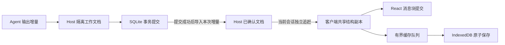

# 流式渲染性能改造

## 目标与边界

目标是长回复持续生成时，输入、滚动和文件预览保持流畅：每次更新的主要工作量与新增或实际变化的内容相关，已完成内容不重复解析或重建。参考 [ClaudeDevs 的 Before / Now 演示](https://x.com/ClaudeDevs/status/2092006814804214163) 所展示的长代码输出体验；视频中的帧率与 CPU 数值不是不同机器之间可以直接套用的验收结果。

既有基础包括活动会话的 Loro 副本、不可变结构共享、检查点加增量缓存、历史 Markdown 缓存和关闭工具组的按需挂载。后续同时约束帧时间与内容显示延迟，不能通过放慢内容更新来改善 FPS 数字。

保留以下正确性约束：

- Host 是用户操作的接受与持久化权威；客户端显示、缓存完成和 Host 确认是不同状态。
- 请求、通知合并、缓存任务和迟到响应绑定完整账号、设备、工作区、项目与会话范围。
- 审批对应精确活动回合与请求；错误、停止及完成事件不能被普通正文限频吞掉。
- 草稿不会因重连或性能优化自动执行；断线追赶保留最终内容、顺序和版本。
- Markdown 保留转义与链接限制；选择复制、中文输入法、历史阅读位置和搜索跳转不回退。

## 分阶段实施

各阶段先保留可重复的基线，再修改、验证并独立提交。临时 trace、截图、合成会话、机器数据和完整测量样本不提交仓库。下面的阶段是工程范围；验收状态须以实际运行结果为准。

| 阶段                    | 实施范围                                                                                                                                               | 退出条件                                                                                                                                  |
| ----------------------- | ------------------------------------------------------------------------------------------------------------------------------------------------------ | ----------------------------------------------------------------------------------------------------------------------------------------- |
| P0 持续流式基线         | 独立生产者回放固定合成输出，不等待消费者提交；补充真实 Controller、通知、缓存及可见 Electron 窗口的覆盖。记录帧间隔、长帧、CPU、内容序号及积压、超时。 | 能区分生产、传输、处理、提交及呈现；超时样本不能从统计中消失；保留既有快速操作计数回归。                                                  |
| P1 输入、工具与右侧隔离 | 文件面板使用稳定不可变快照和独立订阅；输入与正文更新不重复计算未变化的 diff。活动工具拆分状态、摘要与详情，按实际条目变化更新。                        | 输入引起的未变文件复制、diff 与 Markdown 计算为零；正文变化不序列化未变工具；审批和在线状态仍及时更新。                                   |
| P2 消息内部增量渲染     | 已完成段落、列表和代码块保留 DOM；只重新解析未完成尾块。支持跨增量语法与非追加编辑的正确失效；长代码块限制重复转义和节点重建。                         | 已完成块引用与 DOM 稳定；结果与一次性渲染一致；新增小块不重复处理整条回复；复制、选择与安全规则保持一致。                                 |
| P3 更新节奏与缓存       | 当前会话独立追赶，最多一个读请求在途；侧栏低频合并。Host 已确认内容及时发布，本地缓存使用有界顺序任务；压缩绑定捕获版本，避免阻塞显示。                | 慢列表和慢缓存不拖住正文；最后一条增量必达；缓存失败、跨范围切换、多窗口竞争、崩溃恢复不破坏原子性和版本防回退。                          |
| P4 布局、滚动与长历史   | 合并每帧尺寸测量和底部跟随；拖动结束后保存宽度；关闭的信息面板不扫描历史。通过 trace 判断是否需要动态高度窗口化。                                      | 不抢历史阅读位置；搜索和焦点正常；展开、拖动及长历史的布局成本可控。窗口化只有在测量证明必要且完整交互可保留时引入。                      |
| P5 Host 与剩余热点      | 检查高频工具更新的全量检查点、session.read 元数据扫描、通知扇出。优化有证据的路径；根据剩余主线程耗时决定是否使用 Worker。                             | 工具密集流式不逐条全量导出；增量读取不随无关会话数线性增长；原子接受、重启恢复与最终内容一致。Worker 或协议改动须给出收益和传输成本证据。 |

主要代码入口：

- [会话副本](../packages/session/src/client-session-replica.ts)、[控制器](../apps/web/src/features/workspace/workspace-controller.ts)、[增量缓存](../apps/web/src/features/workspace/workspace-session-cache.ts)。
- [时间线](../apps/web/src/features/sessions/session-timeline.tsx)、[Markdown](../apps/web/src/components/content.ts)、[会话与输入](../apps/web/src/app/workspace-app.tsx)。
- [文件面板控制器](../apps/web/src/features/files/project-content-controller.ts)、[文件与 diff 视图](../apps/web/src/features/files/project-content-ui.tsx)、[布局](../apps/web/src/features/files/workspace-content-layout.tsx)。
- [Host 会话](../packages/host/src/sessions/workspace.ts)、[Host 持久化](../packages/host/src/persistence/store.ts)。

## 基准与验收口径

既有 300 个历史回合、30 次输入和增量的快速场景用于证明确定性工作量减少。它逐次等待提交，不能证明持续高频输出不会积压；隐藏窗口和注入 CPU 仅验证功能，不代表真实屏幕或进程负载。

新增回放必须固定种子、总字节、增量频率和最终内容；生产者不根据界面速度降速。正确性测试使用可控事件或注入时间，不使用 sleep 猜测结果。性能录制可以按真实时间调度预先定义的负载，完成条件由生产结束、最终版本可见和缓存完成事件决定；超时只作为截止与失败记录。

| 场景         | 固定负载与操作                                                              | 观察指标                                                           |
| ------------ | --------------------------------------------------------------------------- | ------------------------------------------------------------------ |
| 连续流式     | 60 秒，10 / 30 / 60 次更新每秒；边生成边输入。                              | 帧时间、输入延迟、最新待显示序号、最旧未显示内容年龄、最终一致性。 |
| 突发输出     | 独立生产者集中发送 100 / 500 个小块。                                       | 不丢内容、积压恢复时间、内存峰值、请求与通知数量。                 |
| 长正文与工具 | 活动正文从 4KiB 增长至 64KiB / 256KiB；跨块围栏、列表、长代码及大工具详情。 | 解析字节、DOM 重建、展开延迟、代码复制与选择。                     |
| 长历史       | 300 / 3,000 回合；更大规模单列极限档并限制总字节。                          | 冷启动、每次更新工作量、DOM、堆内存与滚动。                        |
| 文件面板     | 打开 1,000 / 10,000 行 diff，切换文件、拖动宽度，同时输入并流式输出。       | 未变面板计算次数、输入响应、布局与绘制时间。                       |
| 缓存边界     | 实际 IndexedDB 跨第 65 段和 1MiB 压缩门槛，注入慢写、失败和导航。           | 压缩尖峰、提交延迟、缓存排空、重启追赶与隔离。                     |
| 持续运行     | 固定负载运行 10 分钟，含滚动和多轮生成。                                    | 内存是否持续增长、GC、尾部耗时是否恶化。                           |

指标区分如下：

- **帧率**：面板 rAF 频率只是调度估计；真实呈现通过可见窗口、Chromium trace 和同条件录像核验。60Hz / 120Hz 分别对应约 16.7ms / 8.3ms 帧预算。后台区间单列，不能混入前台结果。
- **停顿**：继续统计超过 100ms 的前台帧间隔，并补充长帧与最长响应空窗。独立进程截止监测要能记录 renderer 永久无响应，不能依赖它恢复后自报。
- **延迟与积压**：分开报告生产、客户端收到、应用增量、React 提交与可用呈现信号；提交不是物理屏幕呈现。合并更新必须保留数量和最旧内容年龄。
- **超时**：按输入、输出追赶、工具展开等具体操作设置截止并保留失败记录；模型和网络等待与渲染超时分开。
- **CPU 与内存**：使用真实进程采样，分清 renderer、Host、main 和 GPU。面板开关分别运行，以量化观测本身的开销。

在固定前台可见窗口、同一机器、电源模式、尺寸/DPR、Electron 和刷新率下，每组前后各重复至少 5 次。普通 CI 检查内容、隔离及确定性工作量；性能机器负责时间门槛。初始目标需经 P0 校准：

- 常规负载下，每帧 JS、样式和布局工作 p95：60Hz 约不超过 10ms，120Hz 约不超过 5ms。
- 输入反馈和已到达客户端正文的显示延迟 p95 不超过 50ms；同时检查 p99 和超时，不能只改善中位数。
- 60 秒稳态负载没有超过 100ms 的前台停顿；实际帧率接近对应刷新率，短帧丢失单独报告。
- 压力档单独报告退化和上限，不能把未测试的机器、刷新率、真实 Agent 服务或正式安装包宣称为通过。

参考：[浏览器渲染预算](https://web.dev/articles/rendering-performance)、[Long Animation Frames](https://developer.chrome.com/docs/web-platform/long-animation-frames)。使用长帧归因、React Profiler 与分段时间线共同定位；长帧 API 的阈值不是 120Hz 的帧预算。

## 验证与交付

每阶段运行受影响的合成用户旅程及必要的边界回归。提交前运行 `pnpm check`、`pnpm test`、`pnpm build`、`pnpm format:check`；新增模块检查 `pnpm knip` 和 `pnpm production:check`。保留现有生产构建隔离，性能面板不进入正式包。

验收报告区分已完成的源码与功能验证、同机合成性能观察和仍待真实设备验证的范围。固定场景的操作计数可以进入回归断言；机器耗时不伪装为普适性能保证。

## 运行机制

正文通知触发独立的会话追赶，同一会话最多一个读取请求在途；读取期间的新通知要求再读一次。列表刷新单独按 500ms 合并，不阻塞正文、审批及完成状态。Host 内容应用到副本后即可发布，离线缓存通过有界队列顺序保存。队列保留一个正在提交的操作，常规待写增量以 32 条或 1MiB 为合并预算；单条超过预算但仍符合协议限额的信封可以单独保留。合并跨过缓存原版本时，压缩到捕获的、已经由 Host 确认的版本。缓存失败独立显示，不将它解释为 Host 离线或未接受操作。



工作文档在连续输出期间复用；其他编辑或失败使其失效。图中显示路径与缓存路径独立，读取到未持久化状态时仍按原来的错误与恢复边界处理。

消息按条目和 Markdown 块更新。完成的块和代码片段保留引用及 DOM，未展开的工具详情不序列化，关闭的会话信息不扫描历史。文件面板独立订阅冻结快照；流式正文和草稿变化不复制文件内容或重新计算未变 diff。底部跟随与面板拖动每帧合并，面板宽度只在拖动结束后写入本机偏好。

侧栏在同一个项目、搜索和归档范围内接收后台更新时保留现有列表，不显示加载提示或反复卸载会话行。首次加载、改变查询范围、加载更多和用户手动刷新仍提供等待反馈；同步错误仍可见。安静刷新改变的是展示状态，不省略必要的数据同步。

聊天正文中的代码块随时间线自然增高，保留横向滚动与预览字符上限，避免固定高度的内部纵向滚动把最新代码藏起来。用户上滚阅读时停止自动跟随；返回最新消息后再继续跟随。是否真正看到最新输出，需要检查视口与截图，不能只检查 DOM 文本存在。

普通代码长行可复用已显示前缀；ANSI、未完成的 Markdown 语法和非追加编辑仍使用保守解析，保持分块到达与一次性渲染的语义一致。追加判定仍比较源字符串前缀，初次挂载也需要解析历史。现阶段不声称所有场景都严格只做新增字节的工作，也不凭静态代码判断引入 Worker 或动态高度窗口化。

Host 的单会话读取按元数据前缀取值和原始时钟，身份直接读取文档根字段；不为校验身份构造整份历史 Mirror。普通文本和工具输出保存 CRDT 增量，继续使用相同的事务、持久版本检查和有界检查点。审批、任务接受、attention 与终态仍保留原来的事务处理。

## 关键决策与代价

- **共享不可变视图，保留明确导出边界。** Renderer 消费冻结且共享结构的快照，变化沿受影响条目传播；文件预览不再携带渲染不用的原始字节副本。需要完整 CRDT 数据时仍通过明确的检查点接口导出。代价是所有更新必须产生新引用，不能原地修改已发布对象。
- **显示与本机缓存使用独立状态。** Host 持久化确认可以支持显示与交互，不必等待 IndexedDB；本机缓存失败必须可见。队列有界并允许合并，不能无界积压整个会话快照。压缩通过捕获版本的历史 fork 导出，禁止在队列延后执行时保存已前进到其他版本的 live 文档。历史 fork、编码和校验仍有 CPU 成本，后台任务不等于在 Worker 中执行。
- **热视图容量预算避免分配全文。** 不变对象的大小本已通过 WeakMap 复用，但变化中的长文本仍会为预算核算经过 `JSON.stringify` 和 `TextEncoder`，产生与全文等大的临时对象。LRU 对超过 4,096 个 UTF-16 码元的字符串改用 `2 + 6 × length` 的 JSON UTF-8 字节上界，小值继续精确计算。上界保留热视图 JSON 计量预算的 32MiB 约束，不涵盖当前活动视图、DOM、WASM 或分配器驻留空间，不构成进程 RSS 上限。代价是大文本更早退出热缓存；当前视图和持久缓存仍保存完整内容。热视图预算使用独立缓存，增量队列与协议校验继续采用各自的精确计量。
- **同步任务按会话选择代次隔离。** 当前选择内只允许一个正文读取在途，通知触发后续追赶；切换后，新选择立即独立读取。旧请求即使迟到，也不能占住新选择的调度器或清除其待处理通知。受控请求回归覆盖旧读取阻塞、新会话刷新和尾通知交错，避免用全局读取计数把不同选择重新串行化。
- **底部跟随不能只依据滚动事件发生时的底部距离。** 程序滚动的事件可能晚于下一次正文增高，单纯检查距离会把内容增长误判为用户离开底部。跟随判断需要记录实际滚动位置，保留用户向上阅读、搜索跳转与回到最新的明确行为。长历史压力回放必须检查最后一行进入视口，而不仅是 DOM 中存在该行。
- **输入框测量不能让周围布局临时塌缩。** 60 秒回放发现另一个跟随边界：多行输入先切回 `height: auto` 测量时，时间线视口临时变大，浏览器随即将 scrollTop 向上限制；恢复输入框高度后，这个位移仍会触发滚动事件。诊断记录确认没有用户滚动。测量期间保留外壳尺寸，完成后恢复原样式，避免用更复杂的滚动状态机补偿输入框的布局副作用。
- **检查点校验不再物化历史。** 压缩时仍检查 envelope、bundle、执行范围和 Host 持久确认，并导入 CRDT 验证前置依赖、文档根身份与精确版本。为得到版本而再次构造 Mirror、复制历史及导出整份文档没有必要。首次压力回放发现这一重复路径后补充拒绝损坏、缺前置、错身份和旧版本的回归；去掉重复投影不代表导出和导入本身没有成本。
- **分别测量 Node 与浏览器的二进制编码。** Node 使用 Buffer，不能代表浏览器中逐字符构造 Uint8Array 和二进制字符串的成本。浏览器按能力检测使用原生 Base64 编解码；兼容路径保留并用索引循环填充字节。编码差异通过合成字节、切片、空白、无填充和非法输入对照验证，避免将运行时差异误判为需要 Worker 的业务计算。
- **保留当前 Markdown 语义，逐步缩小重算范围。** 先复用现有安全 inline 规则、稳定完成块和代码片段，覆盖跨块语法、非追加编辑、Unicode、ANSI 与截断。没有为追求速度把未转义的 Agent 输出交给浏览器，也没有一次引入另一套 Markdown 语法。对可能重新解释前文的尾部使用保守路径。
- **缓存的小文本必须拥有与其大小相称的存储。** 十分钟长跑的首次尝试在约 165 秒发生 Renderer OOM。定位实验显示，V8 的子串可能保留完整父字符串：逐段缓存从增长中正文截取的小片段，会间接留住旧正文，形成平方级内存增长。真实解析器处理 500 / 1,000 / 2,000 / 3,000 段后，主动 GC 后仍保留约 8 / 32 / 129 / 290MB；让持久保留的代码片段及当前非代码行独立持有字符，3,000 段降至约 0.8MB，10,000 段约 2.45MB。修复复制新增或保留的片段，不能以每次复制整篇回复代替；未完成的非代码长行仍沿保守路径按当前行处理。UTF-16、组合字符与跨块语义仍须保持一致。
- **审批只缓存稳定内容，不缓存授权结论。** `permissionItemJson` 只有在原来的格式、描述符、深度、大小检查全部成功且输入深冻结后，才缓存对应字符串；可变或浅冻结对象仍重新检查。界面复用相同字符串的展示格式。账号、项目、活动回合、请求唯一性、按钮点击与 Host 接受条件仍按最新状态校验。
- **只将普通输出转为 Host 增量持久化。** 工具与附件引用保持同一个 SQLite 事务；持久版本冲突、写入或压缩失败必须整体回滚，且不发变更通知。任务接受、权限、attention 与终态继续原事务路径。单会话元数据仍实时校验权限；前缀读取不能省略原始时钟和删除标记。
- **持续输出复用隔离工作文档，提交后才发布增量。** 连续回放发现每块先 fork 再追加时，成本主要延后发生在 `LoroText.insert`，而非 fork 调用本身；仅换追加 API 无效。相同持久化负载下，复用文档消除了这段增长。因此普通输出维护工作文档和已确认文档：先在隔离工作文档中修改，数据库成功提交后，再将本次增量导入已确认文档。正常输出从已确认文档读取；发布和重载同时失败时，立即停止执行，将不确定读取标为 `persisted: false`，终态保持失败，恢复保存后再清除失败记录。审批继续匹配最新活动回合与请求。失败、其他编辑替换及回合结束须使工作文档失效并释放。保留原来的版本比较和附件事务边界，不能直接修改已发布文档后再尝试持久化。代价是活动回合常驻一份额外工作文档；用持续运行测量其内存成本，不能把不再逐块 fork 表述为完全没有副本。
- **工具更新直接修改目标条目，并保留相等字段。** 从活动回合定位工具，原有 Loro 容器只改本次提供的字段；旧 JSON 条目按需提升；旧 JSON 列表首次更新时整体提升为 LoroList。嵌套字段按完整替换的语义删除旧值，同时复用相等的 CRDT 值，避免把省掉 Mirror 的 CPU 成本变成重复发送大段 `rawOutput`。兼容性用旧 Mirror 结果核对，包含未知字段、重复工具 ID、省略值、空数组、`null` 和数组中的 `undefined`。
- **优先删除已量化的重复工作。** Worker 会引入消息序列化、生命周期和错误恢复成本；动态高度窗口化会影响搜索、选区、焦点与阅读位置。只有持续回放和 trace 证明剩余成本需要它们，才扩展这两项。Host 通知扇出也保持现有语义，避免在没有收益证据时延迟审批或终态。

## 复现持续回放

以下命令启动可见 Electron 窗口，使用独立进程按固定时间生产合成数据，经过实际 Host、SQLite、HTTP/WebSocket、WorkspaceController、IndexedDB 和 React。不会启动真实 Agent。每次使用独立目录；输出包含环境、源码指纹、原始采样、超时、最终校验和截图。

```sh
env -u ELECTRON_RUN_AS_NODE \
  MOOR_STREAM_DURATION_MS=60000 \
  MOOR_STREAM_RATE=60 \
  MOOR_STREAM_HISTORY=300 \
  MOOR_E2E_DIRECTORY=/private/tmp/moor-stream-run-1 \
  pnpm exec electron tests/e2e/streaming-performance.cjs
```

通过 `MOOR_BENCH_SOURCE_ROOT` 指定冻结源码目录可运行相同负载的基线；该目录需要相同的锁定依赖。`MOOR_STREAM_CHUNK_BYTES` 控制每块的合成代码大小，`MOOR_STREAM_TRACE=1` 保存 Chromium trace。默认短场景主要检查最终序号、DOM、缓存和草稿完整性；时间指标不作为普通 CI 的跨机器硬门槛。

`MOOR_STREAM_DIAGNOSTIC=1` 额外记录滚动、输入框测量和视口变化的时序，用于定位跟随失效。诊断插桩会同步读取布局，只用于故障分析，不混入正式性能比较；失败也保存几何信息和截图。

`MOOR_STREAM_MEMORY_DIAGNOSTIC=1` 在生产、缓存排空和 Renderer 计时结束后，通过 CDP 记录堆与进程内存，再执行两次 GC，两次之间经过一个 Renderer 帧任务。它用于区分 JavaScript 活对象、外部存储与进程驻留内存；不将主动回收后的数字混入正常长跑。第二次 GC 后 JavaScript 活堆仍超过 256MiB 时才额外保存 heap snapshot，该值仅决定是否采集诊断文件。RSS 包含原生、WASM 和分配器保留空间，不能直接作为 JavaScript 泄漏量。

`node scripts/validation/check-markdown-memory.mjs` 单独运行真实 Markdown 解析器，以固定 3,000 段合成输出和显式 GC 检查保留内存上限，不设机器耗时门槛。它用于防止小片段间接保留历史完整正文，不能替代 Electron 长跑。首次长跑 OOM 暴露了失败报告仅在末尾保存的不足；回放工具现会在 `render-process-gone` 时立即保存 main 已有的 CPU、watchdog 和退出原因，并中断等待、保存 Host 记录和关闭生产者。可控崩溃验证单独保留为预期失败，不计入正常性能通过样本。

比较时保留固定生产窗口和后续追赶阶段两组指标。分别观察独立生产到提交、Host 收到到提交、客户端响应到提交，以及 main 发出输入到提交的延迟。不能用客户端最后一段很短的处理时间，掩盖数据在 Host 中的积压。rAF 信号仍不等于物理屏幕呈现；真实 Agent 启动、远程 Relay、正式安装包和其他刷新率需单独验证。

## 本轮实现与验证

已落地上述 P0–P5 的核心改造：连续回放、输入与面板隔离、消息块复用、正文追赶与缓存分离、滚动与布局合并，以及 Host 元数据读取和工具更新热点。Worker、动态高度窗口化与通知协议改造暂未引入；后续只有测量显示剩余瓶颈时才扩展。基准矩阵是可持续扩展的验证范围，不表示每个频率、大小及组合均已测量。

确定性回归覆盖：30 次草稿输入不重新解析已完成消息正文；未变文件和 diff 在输入与流式期间不重新计算；已完成消息与 Markdown 块保持引用和 DOM；128KiB 未变审批详情在输入与正文更新时不重新序列化或格式化，同时断线、请求切换和点击授权仍使用最新状态。慢缓存、缓存失败、压缩版本、跨会话迟到响应与尾通知使用受控事件验证。代码块复制、中文和 Unicode 分块、ANSI、安全链接、非追加编辑、历史阅读、搜索、返回最新、面板拖动及焦点均有功能覆盖。

`a4ddf914` 的源码门禁为 6 个构建后端到端场景、1,784 项测试全部通过；`pnpm check`、`pnpm build`、`pnpm format:check`、`pnpm knip`、`pnpm production:check` 通过。Electron 场景需要本机 GUI 运行权限；沙箱内启动的 `SIGABRT` 不计为页面性能结果。

当前十分钟长跑覆盖单一活动回合的连续输出和同时输入。自动底部跟随不等于主动上滚；主动滚动与多轮生成的组合长跑仍属于待扩展矩阵。

### Host 热点的单独实验

固定 501 个回合，对同一会话执行 30 次读取或工具更新。下表记录元数据前缀读取和工具字段复用阶段的定位实验，早于持续文本工作文档重构；用于验证工作量，不是最终版本五轮持续回放的替代品。

| 指标                             | 改造前    | 改造后 |
| -------------------------------- | --------- | ------ |
| 另有 1,000 个会话时，读取 p95    | 303.17ms  | 0.92ms |
| 工具更新 p95                     | 26.78ms   | 3.10ms |
| 30 次工具更新的 Mirror 构造      | 60        | 0      |
| 30 次工具更新的全量检查点        | 30        | 0      |
| 该组工具更新产生的全量检查点字节 | 5,764,446 | 0      |

30 次工具更新后，相对实验起点版本的累计增量响应大小为 9,078 / 9,079 字节，两组累计响应仅相差 1 字节。优化没有通过把历史投影改成大段重复输出来转移传输成本。另有 100 次工具更新的确定性回归要求全量导出与 Mirror 订阅均为零；附件引用、版本冲突、事务失败及重启恢复沿原 Host 边界验证。

持续 60 秒的后续测量暴露了短实验未覆盖的文本写入问题：界面输入和帧间隔已经平稳，但每块先 fork 再写入，使 Host 更新 p95 按 10 秒窗口从约 3ms 增至 31ms，生产到提交仍积压约 14 秒。单独计时发现增长集中在 fork 后第一次文本插入，改用 `push` 没有改善；复用工作文档后插入成本恢复稳定。这是采用隔离工作文档、持久化后发布增量的依据，不能仅凭 Renderer 流畅判定端到端达标。

该方案的 500 回合候选回放中，3,600 段输出、独立哈希、缓存、草稿和末行可见性均通过；Host 更新 p95 在六个 10 秒窗口内保持 0.945–1.017ms，生产到提交 p95 为 7.80ms，峰值积压 2 段。该轮用于验证改造方向，正式比较仍使用下述 300 回合、冻结源码和五次重复测量。

### 浏览器编解码实验

Electron 44.3.0 / Chromium 152 中，对 4,640,000 字节固定合成输入分别运行 7 次；结果是编解码函数的单独成本，不是整条流式链路的耗时。

| 中位耗时 | 旧浏览器实现 | 索引兼容解码 | 原生 API |
| -------- | ------------ | ------------ | -------- |
| 解码     | 116.8ms      | 5.4ms        | 0.8ms    |
| 编码     | 54.7ms       | —            | 0.4ms    |

浏览器原生解码与原有 `atob` 路径的 5,019 组边界及确定性短串对照，接受或拒绝结果与输出字节一致。最终版本按能力检测原生 API，保留兼容实现；Node Buffer 路径保持原行为。实际缓存压缩仍包含 CRDT fork、导出、导入和 IndexedDB 原子事务，收益须由完整页面回放验证。

### 长历史压力验收

固定 3,000 个历史回合、10 秒、每秒 60 次、每块 64 字节，并开启 Chromium trace。比较对象是收尾修复前的 `823bad21` 与阶段实现 `07fd899e`，不是下述 300 回合正式基线的替代样本。首次压力样本保留为失败：内容及缓存虽完整，自动跟随丢失；仅统计实际 10 秒生产窗口，排除其后的静止等待。

| 指标                      | 收尾修复前 | 收尾修复后 |
| ------------------------- | ---------- | ---------- |
| 最新一行进入时间线视口    | 失败       | 通过       |
| 超过 100ms 的帧间隔       | 4          | 0          |
| 最长帧间隔                | 291.6ms    | 84.0ms     |
| 独立生产到 React 提交 p95 | 265.64ms   | 81.27ms    |
| main 发出输入到提交 p95   | 187.89ms   | 19.21ms    |

该阶段的 600 条输出、独立生产者 SHA、Controller、DOM、缓存版本和未提交草稿全部一致；末行到底部距离为零，内部代码块没有纵向溢出。全过程实际写入 6 个检查点，其中 5 个位于生产窗口内。这个压力档存在明显的帧预算超额，不能据此声称 3,000 回合下稳定达到 120fps；输入响应和大停顿已改善。生产到提交与客户端收到后再提交是不同口径，不能直接用前者判定后者的 50ms 目标。

### 正式持续回放的环境与口径

同一台 macOS arm64、10 逻辑 CPU 机器；Electron 44.3.0、Chromium 152.0.7977.78，窗口 1200×800，内容区 1200×768，DPR 2。基线冻结于 `10186c1c`，最终实现冻结于 `a4ddf914`，共享相同锁定依赖。各轮使用独立本机配置和数据库；正式采样关闭 trace 与额外诊断插桩，不并行运行构建或其他基准。

常规场景固定 300 个历史回合、60 秒、每秒 60 块、每块 64 字节，共 3,600 块；main 每 100ms 发出一个输入字符，生产者不等待 Renderer。帧间隔、输入和 CPU 按固定生产窗口计算；每块内容的延迟仍追踪到真正提交，包含生产结束后的追赶。报告保留超时与失败，不能把未显示的数据排除后再计算低延迟。

窗口保持可见且记录页面可见性，但没有连续记录操作系统焦点、遮挡或物理屏幕呈现。rAF 仅是调度信号，React commit 不是像素呈现。合成生产通过实际 Host、SQLite、HTTP/WebSocket、Controller、IndexedDB 和 React，但绕过真实 Agent 启动与远程 Relay；合成 Agent 的能力探测按设计不可用，正文读取仍在线。CPU 使用进程各自的原始口径，不与参考视频的百分比混算。

### 正式结果的解释

基线的 rAF 频率原本就接近显示调度频率，但生产到提交仍积压十几秒。因此这轮的主要收益是端到端输出及时可见、后台工作受控和输入保持响应，不能只用平均 FPS 描述。五轮比较按各轮固定生产窗口分别求 p95，再报告这些 p95 的中位数与范围；它不是把五轮样本合并后重新求一个 p95。

| 指标：五轮统计的中位数（最小–最大） | 基线 `10186c1c`                    | 最终 `a4ddf914`       |
| ----------------------------------- | ---------------------------------- | --------------------- |
| 生产到提交 p95                      | 16,379.86ms（15,292.67–16,621.37） | 9.76ms（8.56–10.28）  |
| main 输入发出到提交 p95             | 6.95ms（6.42–7.55）                | 2.85ms（2.78–3.02）   |
| 客户端响应到提交 p95                | 13.90ms（13.40–75.70）             | 2.30ms（2.30–2.80）   |
| rAF 帧间隔 p95                      | 9.0ms（9.0–9.8）                   | 9.8ms（9.4–9.8）      |
| 各轮最大帧间隔                      | 33.4ms（25.6–34.3）                | 16.6ms（10.4–17.0）   |
| 各轮峰值未提交片段                  | 548（498–653）                     | 2（2–3）              |
| Host CPU p95，单核百分比            | 144.81%（136.27–149.46）           | 15.92%（15.21–15.97） |
| Renderer CPU p95，Chromium 原始口径 | 12.04%（11.86–12.09）              | 6.30%（6.17–6.72）    |
| 生产结束到 Host 完成                | 10,170.45ms（9,928.31–10,677.55）  | 7.47ms（7.16–10.13）  |

两组各五轮的 3,600 段输出、独立哈希、最终版本、缓存与草稿均通过；固定生产窗口内超过 100ms 的帧均为零。最终组没有超时。基线 rAF 已经平稳，最终 rAF p95 也没有改善；不能把输出延迟和 CPU 的收益误写成帧率倍增。

旧基线的代码块还存在内部纵向滚动：最终 DOM 内容正确不代表末行可见。最终实现同时验证末行进入时间线视口；这种交互差异和已修复的失败样本一并保留说明。

### 长跑故障与内存诊断

短时延迟达标不能替代长跑。首次十分钟尝试在约 165 秒发生 OOM；独立的真实解析器 heap snapshot 确认，缓存子串间接保留历史完整正文是平方级增长的来源，已通过片段独立存储和保留内存回归修复。第二次十分钟已完成全部 36,000 段，正文与缓存一致，但最终草稿多一个空格；用户确认约第 49 秒曾手动输入。该次原始报告继续保留为失败，不能作为输入延迟或完整验收的通过样本。

进一步发现，热视图预算每次编码增长中的全文会产生大量短命字符串与字节数组。以下是同机 180 秒、300 回合、60 段/秒的两次独立诊断；都完整提交 10,800 段，草稿、哈希、缓存和末行可见性一致，没有超过 100ms 的帧。主动 GC 只发生在生产与计时结束后，不能用于美化正常运行期间的内存。

| 指标                       | 片段保留修复后 | 再避免全文预算分配 |
| -------------------------- | -------------- | ------------------ |
| 结束时进程驻留内存         | 1,247.63MiB    | 724.17MiB          |
| 两次 GC 后进程驻留内存     | 1,047.16MiB    | 509.78MiB          |
| 两次 GC 后 JavaScript 活堆 | 28.62MiB       | 28.85MiB           |
| 两次 GC 后 backing storage | 1.73MiB        | 1.73MiB            |
| 两次 GC 后 embedder 活堆   | 41.66MiB       | 41.70MiB           |
| 生产到提交 p95             | 11.17ms        | 11.43ms            |
| 输入发出到提交 p95         | 3.23ms         | 3.20ms             |

活堆基本相同而驻留内存减少，支持降低临时分配压力的判断；两次单独诊断仍不是多轮统计，也没有解释剩余全部原生占用。静态审查发现若干 VersionVector、检查点 LoroMap 和 Mirror 临时容器依赖 WASM finalizer，尚无证据将它们认定为无界泄漏。后续应先记录句柄创建/显式释放/finalizer 释放与 WASM 内存容量，再对单一生命周期改动做反事实测量；WASM 缓冲容量本身也可能只是分配器高水位。

### 最终十分钟稳定性

冻结版本 `a4ddf914` 在不启用 trace、额外布局诊断或主动 GC 的条件下，完成 36,000 段输出；独立哈希、DOM 顺序、最终版本、缓存、5,904 个自动输入字符与末行可见性全部通过，没有超时或 Renderer 崩溃。固定生产窗口内超过 100ms 的帧为零，最大帧间隔 33.5ms，rAF 调度频率约 119.3Hz；它不是物理屏幕 FPS 的证明。

| 指标                    | 全十分钟  | 首分钟    | 末分钟      |
| ----------------------- | --------- | --------- | ----------- |
| 生产到提交 p95          | 13.87ms   | 8.99ms    | 20.70ms     |
| 客户端响应到提交 p95    | 5.20ms    | 2.40ms    | 5.50ms      |
| main 输入发出到提交 p95 | 5.05ms    | 2.87ms    | 6.18ms      |
| 峰值未提交片段          | 5         | 4         | 5           |
| Renderer 驻留内存中位数 | 783.48MiB | 530.58MiB | 1,050.92MiB |
| Host RSS 中位数         | 349.31MiB | 208.19MiB | 523.36MiB   |

最后一分钟延迟上升但没有持续积压，输入与客户端响应后的提交 p95 仍在 50ms 内。Renderer 采样最大驻留内存为 1,159.97MiB（约 1.13GiB），Host 最大 RSS 为 539.42MiB。Chromium 进程记录的历史峰值为 1,265.61MiB，与固定生产窗口的离散采样最大值口径不同；生产完成后的 Host 尾部为 14.28ms，缓存再用 6.62ms 排空。持续增长的正文、CRDT 历史、DOM 和保留测量数组都有内存成本；本轮没有在长跑末尾强制 GC，不能据此断言剩余增长都是泄漏或都合理，也不能宣称已经达到内存平台期。

### 最终长历史压力与后续边界

相同冻结版本在 3,000 回合、10 秒、60 段/秒并开启 trace 的压力档中，600 段输出、哈希、缓存、草稿与末行可见性全部通过；固定生产窗口没有超过 100ms 的帧或超时。

| 指标                          | 最终压力档      |
| ----------------------------- | --------------- |
| rAF 帧间隔 p95 / 最大值       | 24.1 / 90.3ms   |
| 生产到提交 p95                | 82.36ms         |
| 客户端响应到提交 p95          | 19.80ms         |
| main 输入发出到提交 p95 / p99 | 23.46 / 50.37ms |
| 峰值未提交片段                | 9               |
| 生产窗口内缓存检查点提交      | 8               |

该档的输入和客户端响应到提交 p95 满足 50ms 目标，但帧预算明显超额，不能声称长历史稳定达到 60fps 或 120fps。生产到提交 82.36ms 包含上游等待，是另一项端到端指标。压力档仅运行一次且开启 trace，不与五轮无 trace 的常规档合并统计。

该次 trace 将最大 90.3ms 帧的主要耗时定位在一个 65.44ms 的主线程 JavaScript 回调，邻域内没有重叠的顶层 GC 事件。固定生产窗口内单次 Layout / PrePaint 的最大值分别为 4.92 / 7.81ms；阶段可能嵌套，不能直接相加。trace 未采集该回调的函数栈，尚不能把它归因到某一个业务函数；下一轮应补充 CPU 栈后再选择重构边界。

后续优先围绕长历史检查点任务、WASM 生命周期和不断增长的 DOM 做独立测量，再决定是否将 CRDT/检查点放入 Worker 或对历史消息窗口化。当前仍保留必要的 CRDT 导出、容器句柄和保守文本前缀比较；不能将“减少整份数据复制”表述为整个系统只做增量计算。真实 Agent、远程 Relay、正式安装包、中文输入法实机行为及不同刷新率设备仍需单独验收。
