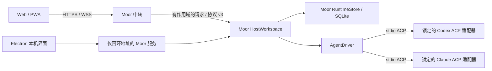

# Moor 独立执行架构

Moor 自己拥有执行主机、会话格式和存储。构建不读取外部源码检出；Agent 通过锁定的标准 ACP 适配器启动。

## 边界与职责

- `src/session-schema.ts` 定义 Moor 会话格式 v1。浏览器与主机共用结构，使用 Loro/Flock；协议数据不导入 Agent 的实现或配置。
- `src/bridge/host-workspace.ts` 校验项目、身份、回合和审批请求，串行处理同一会话的指令，并管理执行生命周期。
- `src/runtime/store.ts` 保存主机身份、本地项目、会话快照、元数据、原生 Agent 会话编号和操作去重记录。主机数据库使用 SQLite 完整同步；文档与送达凭据在同一事务中提交。
- `src/runtime/agent.ts` 定义可替换的 AgentDriver 边界；`acp.ts` 实现 stdio 握手、能力读取、会话加载、配置、输出、审批和取消。Agent 可执行路径只来自本机配置，不能由远程操作覆盖。Moor 不提供文件系统、终端或 socket 代理给远端。
- 中转保存账号、设备授权与工作区组织关系，不保存会话正文或原生 Agent 状态。访问端缓存与草稿只属于访问端。
- Electron 只启动一个 Moor 桥接/执行进程。SQLite 的独占所有权锁阻止另一个进程同时使用该主机数据库，进程死亡时由操作系统释放。不同目录可拥有独立主机身份。

## 指令与故障语义

收到用户操作后，主机在隔离文档中验证改动，只允许追加一个用户回合，或修改当前活动回合中一个待处理审批的结果。完成验证后，在同一事务中提交 CRDT 文档、元数据及操作编号对应的送达凭据，再调用 AgentDriver。

“已送达”表示执行主机已持久接受任务，不表示模型已完成。Agent 启动失败、连接失败或执行错误会写入对应回合。相同操作编号及相同内容返回原凭据；重复编号携带不同内容会被拒绝。事务失败不会启动 Agent，也不会留下送达凭据。

审批还必须匹配内存中的活动 Agent 请求。主机持久化审批结果后才把结果交给 ACP；重试不会再次作出决定。取消会使待处理审批失效，停止 Moor 拥有的 Agent 进程。旧回合的取消不能作用于新回合。

重启时，未完成的助手回合标记为中断。恢复代码不扫描或执行待处理用户指令。只有新的手动发送才会启动后续回合；后续回合使用主机私有存储中的原生会话编号恢复 Agent 上下文。`session/load` 回放的旧历史不会被重复加入新回复。

## 版本与升级

桥接协议 v3 与会话格式 v1 一起发布，拒绝旧版桥接连接。新的 `runtime-v1.sqlite`、`bridge-v3.json` 和 `moor-runtime-v1` 浏览器数据库使新运行时与旧缓存、待确认请求分离。旧文件保留，不自动迁移或执行。升级需要更新服务端和客户端并重新配对；旧历史仍由旧版应用查看。

历史来源及版权署名保留在 `NOTICE`。旧 `.runtime/` 检出只是被忽略的本地遗留目录；源码、锁文件、CI 和发布包均不引用它。

## 验证范围

合成测试覆盖事务回滚、并发与重复请求、重启恢复、作用域隔离、竞争审批和精确取消。真实 stdio 合成 Agent 覆盖完整握手、输出、审批、加载及跨主机进程重启后的连续会话，不调用真实模型或读取真实 Agent 账号。

发布前检查包括无外部运行时目录的冻结安装、类型检查、测试、构建、格式检查，以及包内 Electron/Node 启动隔离主机。真实 Codex/Claude 登录、模型执行和双 Mac + iPhone 的设备行为仍需要实际环境验收。
