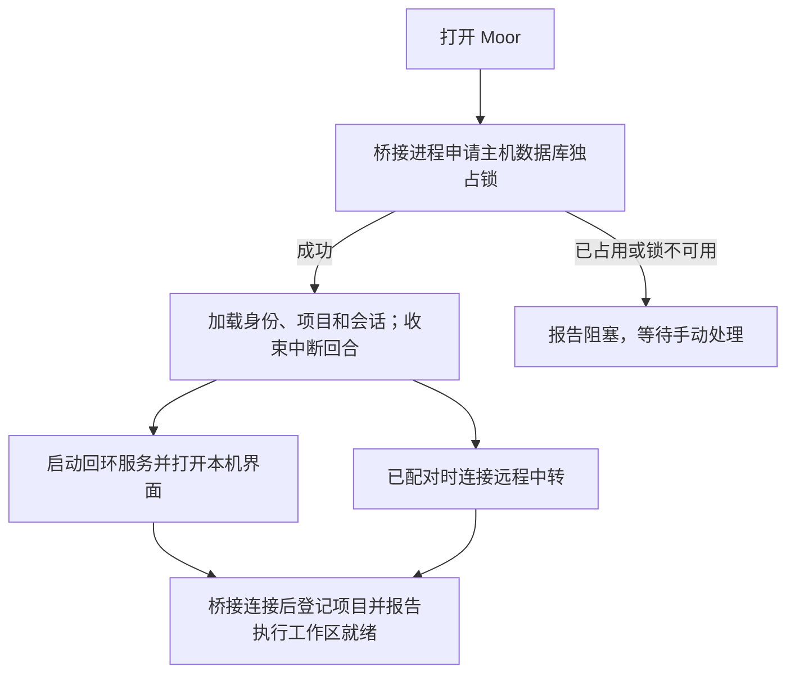

# 运行与恢复

Moor 执行主机持有本地项目、Agent 配置和会话。桌面壳负责启动它、展示连接状态，并在意外退出后有限重试。架构分工见[核心架构](core.md)，请求的事务与重试语义见[同步、送达与重试](sync.md)。

## 本机启动



执行组件、回环服务与远程中转有各自的健康状态。中转连接失败时，本机界面仍能操作本机项目。远程中转的 `/healthz` 只说明中转进程可访问，不能证明执行电脑在线或 Agent 可用。

同一数据目录只允许一个执行主机。进程通过独立的 SQLite 所有权锁保持独占，进程死亡后由操作系统释放；恢复不靠删除锁文件，也不会终止另一个持有数据目录的实例。不同数据目录可以拥有独立的主机身份。

## Agent 从哪里启动

客户端附带 Moor 执行服务和锁定的 ACP 适配器。Codex 可执行程序优先采用本机明确配置：已有 Agent 的显式路径保留；默认发现顺序为 `MOOR_CODEX_PATH`、`/Applications/Codex.app` 附带的 CLI、Homebrew `codex`，再退回锁定适配器附带的 CLI。

这些路径仅由本机设置决定，不接受远程覆盖。Moor 不读取另一个应用的会话数据库，也不依赖其源码检出。Agent 登录凭据继续由 Agent 自身管理。

刷新模型选项时，主机会在已登记项目中打开一个临时 AgentSession，读取它报告的能力后关闭；此过程不发送用户 prompt。真正执行时，会再次根据本次打开的 Agent 能力校验选择，再应用模型、模式和 effort。

## 恢复进程与继续任务

执行组件意外退出后，桌面壳依次等待 1、3、10 秒尝试恢复，连续失败三次后等待手动操作。组件持续就绪至少 60 秒后再次退出，会重置这组重试额度。退出码表明数据目录被占用时，不自动重试。

重启只恢复服务能力。主机加载数据库时，将所有未完成的助手回合标为 `failed`，写入中断说明，并将会话恢复为 `idle`。它不扫描待处理用户输入来启动任务。

```text
恢复执行组件 → 可以读取历史、接受新的手动操作
重试原操作   → 已接受则返回原凭据
手动发新回合 → 尝试加载 Agent 原生会话并继续
```

这三种动作不能互相替代。断电可能发生在主机接受后、Agent 启动前，也可能发生在 Agent 已修改文件后；自动重放无法可靠区分它们。

## 窗口、页面和进程

关闭访问页面或 Mac 窗口不会停止任务。明确退出桌面客户端会停止它拥有的执行组件，活动回合和审批随之结束。电脑休眠、关机时无法继续执行，模型网络不可达也可能导致 Agent 失败。

页面加载失败或超时提供手动重试。界面缓存可以重新生成，草稿、待确认请求与会话缓存则保存在独立的 IndexedDB 中。不要为了修复页面加载而清空全部存储，否则访问端尚未确认的操作信息也会丢失。

## 数据文件与版本

| 内容         | 当前位置或名称                               | 用途                             |
| ------------ | -------------------------------------------- | -------------------------------- |
| 主机数据     | 默认在配对配置同目录的 `runtime-v1.sqlite`   | Moor 身份、会话、项目和操作凭据  |
| 主机锁       | 主机数据库路径追加 `.ownership.sqlite`       | 独占执行主机所有权               |
| 远程配对     | 默认 `bridge-v3.json`                        | 服务地址与设备凭据，属于私有数据 |
| 本机组织目录 | 配对配置路径追加 `.catalog.sqlite`           | 本机模式的账号与组织关系         |
| 浏览器存储   | 当前 origin 下的 `moor-runtime-v1` IndexedDB | 草稿、待确认请求与会话缓存       |

命令行 `--runtime-data` 或环境变量 `MOOR_RUNTIME_DATA` 可以指定主机数据库，前者优先。桌面调试可用 `MOOR_DESKTOP_DATA_DIR` 选择隔离目录。主机数据与配对文件都不应进入仓库或程序包。

Moor 桥接协议当前为 v3，会话格式为 v1；ACP 使用锁定 SDK 的协议版本，两者独立。升级中转和客户端时需保持桥接协议一致，旧协议连接会被拒绝。

从旧 Lody 运行时升级时，需要重新配对电脑、登记项目。旧数据库、配对文件和浏览器数据保留原样，不自动导入历史或执行旧草稿。新版本不使用遗留的 `.runtime/` 源码检出；历史来源与版权署名保留在 [NOTICE](../NOTICE)。

中转迁移只搬迁账号、设备和组织元数据。域名改变后，浏览器的 origin 也改变，旧草稿与缓存不会自动出现；操作步骤见[部署与迁移](../deploy/README.md)。

继续阅读：[开发与验证](development.md) · [文档目录](README.md)
