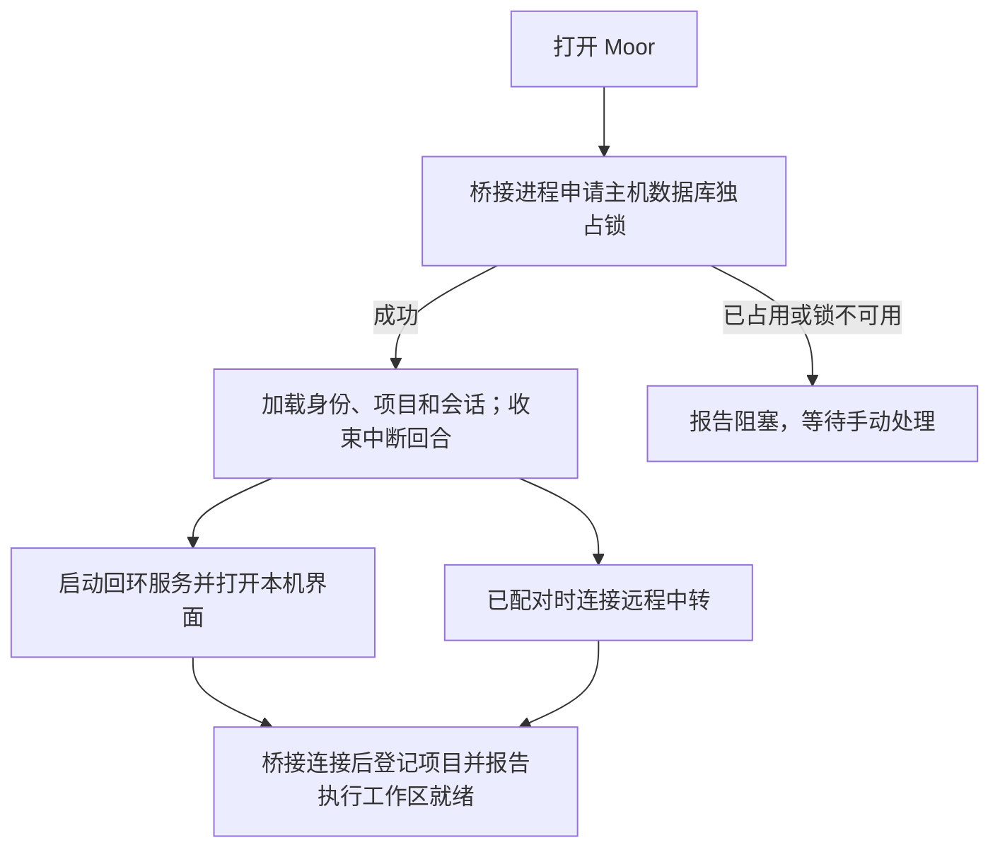

# 运行与恢复

Moor 执行主机持有本地项目、Agent 配置和会话。桌面壳负责启动它、展示连接状态，并在意外退出后有限重试。架构分工见[核心架构](core.md)，请求的事务与重试语义见[同步、送达与重试](sync.md)。

## 本机启动



执行组件、回环服务与远程中转有各自的健康状态。中转连接失败时，本机界面仍能操作本机项目。远程中转的 `/healthz` 只说明中转进程可访问，不能证明执行电脑在线或 Agent 可用。

同一数据目录只允许一个执行主机。进程通过独立的 SQLite 所有权锁保持独占，进程死亡后由操作系统释放；恢复不靠删除锁文件，也不会终止另一个持有数据目录的实例。不同数据目录可以拥有独立的主机身份。

## Agent 从哪里启动

客户端附带 Moor 执行服务和锁定的 ACP 适配器。Codex 可执行程序优先采用本机明确配置：已有 Agent 的显式路径保留；默认发现顺序为 `MOOR_CODEX_PATH`、`/Applications/Codex.app` 附带的 CLI、Homebrew `codex`，再退回锁定适配器附带的 CLI。

这些路径仅由本机设置决定，不接受远程覆盖。Moor 不读取另一个应用的会话数据库，也不依赖其源码检出。Agent 登录凭据继续由 Agent 自身管理。

刷新模型选项时，主机会在已登记项目中打开一个临时 AgentSession，读取它报告的能力后关闭；此过程不发送用户 prompt。真正执行时，会再次根据本次打开的 Agent 能力校验选择，再应用模型、模式和 effort。

## 恢复进程与继续任务

执行组件意外退出后，桌面壳依次等待 1、3、10 秒尝试恢复，连续失败三次后等待手动操作。组件持续就绪至少 60 秒后再次退出，会重置这组重试额度。退出码表明数据目录被占用时，不自动重试。

重启只恢复服务能力。主机加载数据库时，将所有未完成的助手回合标为 `failed`，写入中断说明，并将会话恢复为 `idle`。它不扫描待处理用户输入来启动任务。

```text
恢复执行组件 → 可以读取历史、接受新的手动操作
重试原操作   → 已接受则返回原凭据
手动发新回合 → 尝试加载 Agent 原生会话并继续
```

这三种动作不能互相替代。断电可能发生在主机接受后、Agent 启动前，也可能发生在 Agent 已修改文件后；自动重放无法可靠区分它们。

## 窗口、页面和进程

关闭访问页面或 Mac 窗口不会停止任务。明确退出桌面客户端会停止它拥有的执行组件，活动回合和审批随之结束。电脑休眠、关机时无法继续执行，模型网络不可达也可能导致 Agent 失败。

页面加载失败或超时提供手动重试。界面缓存可以重新生成，草稿、待确认请求与会话缓存则保存在独立的 IndexedDB 中。不要为了修复页面加载而清空全部存储，否则访问端尚未确认的操作信息也会丢失。

## 数据文件与版本

| 内容         | 当前位置或名称                               | 用途                                              |
| ------------ | -------------------------------------------- | ------------------------------------------------- |
| 主机数据     | 默认在配对配置同目录的 `runtime-v1.sqlite`   | Moor 身份、会话、项目和操作凭据                   |
| 主机锁       | 主机数据库路径追加 `.ownership.sqlite`       | 独占执行主机所有权                                |
| GitHub 配置  | 默认在主机数据库同目录的 `github-v1.json`    | 本机 token、项目仓库及验证身份；必须位于项目之外  |
| 预览配置     | 主机数据库同目录的 `preview-v1.json`         | 本机服务、执行目录与启用版本；项目外私有存储      |
| Skills 配置  | 主机数据库同目录的 `skills-v1.json`          | 本机全局 Skill 目录登记及启用版本；项目外私有存储 |
| 远程配对     | 默认 `bridge-v3.json`                        | 服务地址与设备凭据，属于私有数据                  |
| 本机组织目录 | 配对配置路径追加 `.catalog.sqlite`           | 本机模式的账号与组织关系                          |
| 浏览器存储   | 当前 origin 下的 `moor-runtime-v1` IndexedDB | 草稿、待确认请求与会话缓存                        |

命令行 `--runtime-data` 或环境变量 `MOOR_RUNTIME_DATA` 可以指定主机数据库，前者优先。桌面调试可用 `MOOR_DESKTOP_DATA_DIR` 选择隔离目录。主机数据与配对文件都不应进入仓库或程序包。

GitHub 配置目录可单独用 `--github-config-dir` 指定，后续启动时需沿用同一目录。文件使用 `0600` 权限和原子替换，当前为本机私有 JSON，没有 Keychain 或额外文件加密。该目录必须在所有登记项目之外；项目文件接口也拒绝保留的配置文件名。桌面配置经私有 IPC 处理，CLI 需先停止主机，通过 stdin 提交，不能把 token 放进参数。具体步骤见[GitHub 本机配置](github.md)。

网页预览的服务登记另存于 `preview-v1.json`，跟随主机数据库目录，权限为 `0600`。实际渲染与 Cookie 是临时的；数据库只保留操作指纹和最小回执，不持久保存画面或输入文字。主机重启不会恢复预览连接。显式保存的标注与截图属于访问端草稿，只有普通发送才进入会话历史。详见[预览范围与关闭](preview.md)。

Skills 全局目录另存于同目录的 `skills-v1.json`；只读发现不启动 Agent，也不持久保存正文。明确加入指令后才进入普通草稿与发送流程。来源目录由本机操作者授权，登记名称可在远端显示，绝对目录保留在执行电脑。详见 [Skills 发现与引用](skills.md)。

Moor 桥接协议当前为 v3，会话格式为 v1；ACP 使用锁定 SDK 的协议版本，两者独立。升级中转和客户端时需保持桥接协议一致，旧协议连接会被拒绝。

会话整理在主机报告对应能力后才开放。新主机为旧会话补用未置顶、元数据版本为零的默认值，不需要导入或重建历史；客户端提交时带预期元数据版本，主机在同一事务中保存新状态和操作凭据。重命名、置顶、归档与恢复的凭据也属于主机备份范围。新界面连接未报告能力的旧主机时不能使用这些整理操作。

从旧 Lody 运行时升级时，需要重新配对电脑、登记项目。旧数据库、配对文件和浏览器数据保留原样，不自动导入历史或执行旧草稿。新版本不使用遗留的 `.runtime/` 源码检出；历史来源与版权署名保留在 [NOTICE](../NOTICE)。

中转迁移只搬迁账号、设备和组织元数据。域名改变后，浏览器的 origin 也改变，旧草稿与缓存不会自动出现；操作步骤见[部署与迁移](../deploy/README.md)。

## 主机停机备份与恢复

主机的 `runtime-v1.sqlite` 同时保存主机身份、项目和 Agent 配置、会话正文与元数据、operation 去重记录、GitHub 最小会话关联，以及 Moor 会话到 Agent 原生会话 ID 的映射。GitHub token 和项目仓库配置另存于 `github-v1.json`。完整复制数据库及仍存在的 WAL/SHM 文件，才能保留同一次备份中的这些关系。不要只导出会话正文，也不要在主机运行时分别复制几个表。

备份前明确退出 Moor，或停止命令行启动的桥接进程，并确认该数据目录已没有写入者；关闭窗口不等于退出。不要为备份删除所有权锁，也不要终止无关进程。下列路径均为占位符，必须改为操作者已确认的 Moor 数据路径；命令只复制明确列出的 Moor 文件，不扫描 Agent 或其他应用的数据目录。

### 备份

桌面数据位置可能沿用旧版 Moor 的目录，不能仅根据应用名猜测。默认主机数据库与 `bridge-v3.json` 同目录；命令行使用了 `--runtime-data`、`MOOR_RUNTIME_DATA` 或 `--config` 时，应分别填写实际路径。备份目标必须是源码与发布目录之外的新目录。

```sh
umask 077
moor_host_db='/absolute/path/to/moor-host-data/runtime-v1.sqlite'
moor_bridge_config='/absolute/path/to/moor-host-data/bridge-v3.json'
moor_settings_file='/absolute/path/to/moor-host-data/settings.json'
moor_github_config='/absolute/path/to/private-github-data/github-v1.json'
moor_preview_config='/absolute/path/to/moor-host-data/preview-v1.json'
moor_skills_config='/absolute/path/to/moor-host-data/skills-v1.json'
moor_backup_dir='/absolute/path/to/private-backups/moor-host-backup-unique'
test -f "$moor_host_db" || exit 1
mkdir "$moor_backup_dir" || exit 1
cp "$moor_host_db" "$moor_backup_dir/runtime-v1.sqlite" || exit 1
for moor_suffix in -wal -shm; do
  if test -f "$moor_host_db$moor_suffix"; then
    cp "$moor_host_db$moor_suffix" "$moor_backup_dir/runtime-v1.sqlite$moor_suffix" || exit 1
  fi
done
for moor_suffix in '' .catalog.sqlite .catalog.sqlite-wal .catalog.sqlite-shm .local-port; do
  if test -f "$moor_bridge_config$moor_suffix"; then
    cp "$moor_bridge_config$moor_suffix" "$moor_backup_dir/bridge-v3.json$moor_suffix" || exit 1
  fi
done
if test -f "$moor_settings_file"; then
  cp "$moor_settings_file" "$moor_backup_dir/settings.json" || exit 1
fi
if test -f "$moor_github_config"; then
  cp "$moor_github_config" "$moor_backup_dir/github-v1.json" || exit 1
fi
if test -f "$moor_preview_config"; then
  cp "$moor_preview_config" "$moor_backup_dir/preview-v1.json" || exit 1
fi
if test -f "$moor_skills_config"; then
  cp "$moor_skills_config" "$moor_backup_dir/skills-v1.json" || exit 1
fi
```

本机未配对或纯 CLI 使用时，部分配置文件可能不存在。保留配对配置、组织目录、桌面设置和本机端口记录，可保留原服务关系、项目设置及本机页面 origin；这些文件可能含设备凭据，只保存在私有备份中。主机所有权锁是运行时互斥设施，无需备份或复制到目标目录。

GitHub 配置备份含完整 token，不是可分发的程序文件；没有使用 GitHub 时可以省略。配置曾指定其他目录时填写实际路径，不能据数据库路径猜测。私有备份也须保存在项目和发布目录之外，不把配置或临时写入文件放进程序包。

项目文件与 Agent 自己持有的上下文/登录状态不在这份数据库备份中。项目文件应由操作者另行备份；Git 历史不包含未提交修改。Moor 保存原生会话 ID，并不保存 Agent 的原生会话内容。恢复到另一台机器时，仅凭 Moor 数据库不能保证原生上下文可继续，需由操作者通过 Agent 自己支持的方式处理其状态和登录；Moor 不读取其他应用数据库。

使用独立 worktree 的会话还需保存原项目仓库、共享 Git 元数据及各工作目录中的未提交文件。上述命令只备份 Moor 状态，不备份这些代码。执行绑定包含原目录路径、文件系统身份和 Git 指针，复制或迁移 worktree 后不会自动接受新目录；历史可以保留，但代码执行须维持原绑定可验证，不能只复制数据库后继续。详见[Git 与会话工作目录](git-workspaces.md#备份与验收范围)。

原生 Fork 的阶段记录、私有回合锚点、子会话映射和共享目录引用也在主机数据库中。重启不会再次 Fork；手动重试只处理原操作和已经保存的子会话编号。Agent 原生内容不在 Moor 数据库中，备份数据库不能替代 Agent 自己支持的恢复方式。详见[原生会话 Fork](session-fork.md)。

### 恢复

先停原主机，保留当前数据和所用程序版本，再恢复到一个尚不存在的新目录。以下示例接续上述备份变量，不覆盖现有数据，也不自动启动主机：

```sh
moor_restore_dir='/absolute/path/to/moor-restored-host-unique'
test -f "$moor_backup_dir/runtime-v1.sqlite" || exit 1
mkdir "$moor_restore_dir" || exit 1
cp "$moor_backup_dir/runtime-v1.sqlite" "$moor_restore_dir/runtime-v1.sqlite" || exit 1
for moor_name in runtime-v1.sqlite-wal runtime-v1.sqlite-shm bridge-v3.json bridge-v3.json.catalog.sqlite bridge-v3.json.catalog.sqlite-wal bridge-v3.json.catalog.sqlite-shm bridge-v3.json.local-port settings.json github-v1.json preview-v1.json skills-v1.json; do
  if test -f "$moor_backup_dir/$moor_name"; then
    cp "$moor_backup_dir/$moor_name" "$moor_restore_dir/$moor_name" || exit 1
  fi
done
```

先使用与备份兼容的 Moor 版本启动；当前数据格式是 v1。桌面通过 `MOOR_DESKTOP_DATA_DIR` 指定恢复目录，CLI 分别通过 `--runtime-data` 和 `--config` 指定恢复后的文件。恢复后的数据库保留原主机身份；源目录与恢复目录不能同时启动为两个相同身份的主机，目录锁只保护各自的数据库路径，无法阻止这种身份复制。

恢复目录必须位于项目之外。上例将 GitHub 配置恢复到数据库旁；若另行存放，CLI 需用 `--github-config-dir` 指向实际目录。项目目录身份发生变化时应在本机设置重新确认仓库，不能用复制配置绕过绑定校验。恢复文件不保证 token 仍有效，账号和仓库访问需手动验证。

预览登记也绑定目录身份。恢复私有 JSON 后需手动核对服务和原目录/worktree；路径或 inode 变化时重新登记，不自动连接或启动开发服务。

恢复后先核对原主机/项目身份、标题、置顶与归档状态及历史可读性。首次加载会收束备份内未完成的回合，不自动执行。使用合成项目和合成 Agent 验证原 operationId 重试返回原凭据、不增加回合；只有明确手动发送新指令才尝试继续 Agent 原生会话。实际项目路径、Agent 可执行文件与原生上下文也必须仍可用；恢复失败时保留恢复目录排查，不用旧备份直接覆盖新产生的数据。

手机和浏览器的草稿、待确认请求仍属于相应访问端，主机备份不会把它们迁到另一浏览器。浏览器缓存可能不完整或被清理，不能用作历史备份。升级时保留现有 IndexedDB，发送结果不明时先在原访问端核对并手动重试同一个请求。中转账号、设备撤销和组织映射另按[中转停机备份](../deploy/README.md#停机备份)保存。

上述是操作者的恢复步骤，不表示已经完成真实数据恢复验收。合成恢复与真机验收分别按[设备验收](validation.md)记录结果。

继续阅读：[开发与验证](development.md) · [文档目录](README.md)
