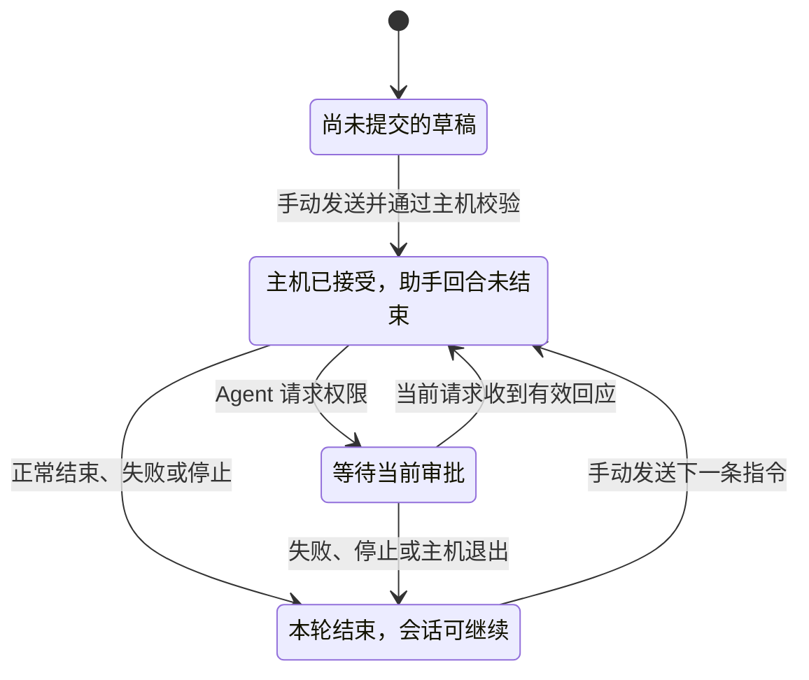

# 会话与回合

会话（Session）是一段持续的工作上下文。它可以跨越多次打开页面、多次发送指令，甚至执行主机重启。回合（Turn）是其中的一次用户输入或一次助手响应；正在执行的是某个助手回合。

## 会话里保存什么

Moor 会话格式 v1 由会话编号和有序历史组成。下面省略了时间、运行设置和展示字段：

```text
session: { id: "session-demo" }
history:
  - { id: "user-1", role: "user", finished: true, items: [文本] }
  - { id: "assistant-1", role: "assistant", userTurnId: "user-1",
      finished: true, status: "handled", items: [文本, 工具调用] }
  - { id: "user-2", role: "user", finished: true, items: [文本] }
  - { id: "assistant-2", role: "assistant", userTurnId: "user-2",
      finished: false, items: [正在生成的内容] }
```

一条指令会产生两个历史条目：用户回合和对应的助手回合。助手通过 `userTurnId` 指回输入。用户回合的 `finished: true` 表示这条输入已写完整，不能用它判断 Agent 是否结束。

标题、执行目标、最近用户回合编号和会话列表状态等信息保存在独立的 Flock 元数据里。会话列表不必逐个打开正文，就能按项目筛选和最近活动排序。

正文中的 `items` 保存文本、思考、工具调用、审批信息和系统通知。内容项作为整体值更新；回合身份与生命周期使用单独的 CRDT 字段。界面只渲染支持的内容，Agent 输出中的 HTML 不执行，也不自动加载远程图片。

## 从第一条指令开始

点击“新会话”时，界面先提供输入位置。浏览器在手动发送时生成会话编号、用户回合和请求；主机接受这条操作后，才持久建立会话并创建助手回合。



图中的“等待审批”是执行中的一种情形，不是单独的会话元数据状态。网络上的发送确认另有状态，见[同步、送达与重试](sync.md)。

主机接受时，会把用户回合标为已读、`processing`，追加 `finished: false` 的助手回合，并将会话元数据设为 `working`。运行完成后，助手回合标为已结束，会话回到 `idle`。

| 助手回合结果 | 含义                                                           |
| ------------ | -------------------------------------------------------------- |
| `handled`    | Agent 的本次调用正常返回                                       |
| `failed`     | 启动或执行失败，或主机停止、重启导致中断；错误说明写入系统通知 |
| `canceled`   | 用户停止了精确匹配的活动助手回合                               |

`handled` 只描述调用结束，不保证生成的代码正确。读取结果应看助手回合的 `finished`、`status` 和内容，不应把用户回合的 `processing` 当作当前运行状态。

同一会话同时只能运行一条指令。主机按会话串行处理提交，但不会把后来的指令排成自动执行队列：已有活动回合或客户端状态过期时，提交会被拒绝。

## 输出如何进入历史

Agent 的文本增量追加到当前助手回合，相邻同类文本合并。工具调用以 `toolCallId` 定位，后续更新补充状态、内容、输入或输出。主机持久保存这些更新，再通知访问端读取增量。

关闭网页会结束页面订阅，助手回合仍由主机管理。重新打开后，页面从主机补齐内容；若主机不可达，就只能阅读当前访问端已有的缓存。

## 审批只对当前请求有效

Agent 请求权限时，主机生成新的 `requestId`，把选项写入对应工具记录，并在内存中保留等待结果的活动请求。页面提交的只是对这次请求的一个选择。

```text
接受审批需要同时满足：
  会话与项目匹配
  expectedTurnId 等于当前最近用户回合
  requestId 属于当前未结束的助手回合
  活动 Agent 仍在等待这个请求
  回应选择原始选项之一或明确取消，且文档没有其他改动

先保存审批结果与凭据，再回应 Agent
```

两台设备同时回应时，第一个有效结果会消耗待处理请求，另一份新决定被拒绝。用原操作编号重试已接受的决定，只返回原凭据，不会再次回应 Agent。重启后即使历史里还看得到审批卡片，原来的内存请求也已不存在，不能继续批准。

运行设置里的审批模式影响下一条指令；它不会替用户回应已经出现的审批，也不会绕过主机对请求身份的检查。

## 停止绑定助手回合

停止请求携带 `sessionId` 和当前助手的 `turnId`。这个 `turnId` 与 Mutation 中用于并发校验的 `expectedTurnId` 不同：后者指最近的用户回合。

主机只停止精确匹配的活动助手回合，使等待中的审批返回取消，并取消、关闭自己启动的 Agent 进程。旧页面发来的停止请求不能影响后来开始的回合。停止不会撤销 Agent 已经完成的文件修改。

## Moor 会话与 Agent 原生会话

Moor 保存自己的历史；Agent 则可能有自己的上下文存储。主机用一条私有映射将两者关联：

```text
Moor sessionId → Agent nativeSessionId
```

每次手动发送，主机都会打开一个 AgentSession。没有原生编号时调用 ACP `session/new`；已有编号时调用 `session/load`，随后应用本轮运行设置并发送 prompt。调用结束后关闭本轮 Agent 进程，保留映射供下一轮使用。

加载时 Agent 可能回放旧历史。Moor 在开始本轮 prompt 前不接收这些回放更新，避免把旧内容重复追加到新回复。若 Agent 不支持加载已有会话，主机明确报错，要求创建新会话。

原生编号只提供恢复入口，不是 Agent 上下文的完整备份。Moor 不读取其他应用的数据库；能否恢复仍取决于 Agent 自己的状态和 ACP 加载能力。主机重启也不会自动调用 prompt，只有下一次手动发送才会继续。

继续阅读：[同步、送达与重试](sync.md) · [文档目录](README.md)
