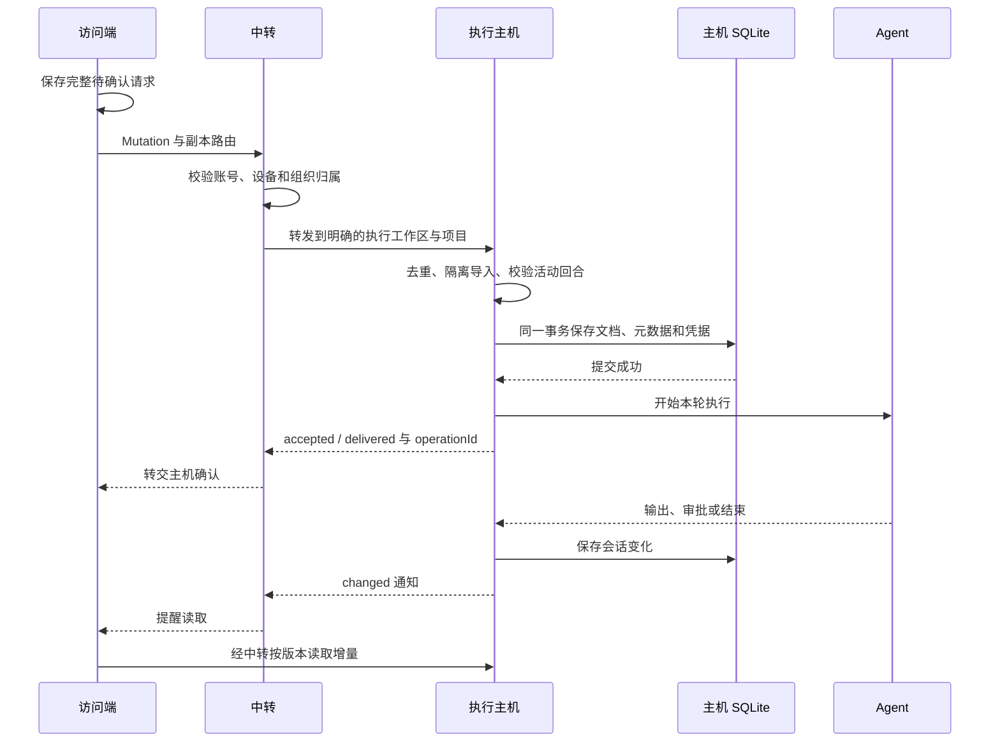

# 同步、送达与重试

在手机上点击发送后，连接可能在任何一步断开：请求尚未到主机、主机正在保存，或者主机已经执行而响应没有回到手机。Moor 保留这些情况的区别，不用一次网络超时推断执行结果。

## 两条不同的路径

读取历史时，访问端提供自己已有文档的版本向量，主机返回缺少的 Loro 更新，同时提供会话元数据。`changed` 消息提醒页面重新读取，它不是完整历史，也不是送达凭据。重新连接后可以补读，不需要中转保留消息历史。

发送指令时，浏览器在本地副本文档里追加一个用户回合，生成增量和元数据变化，再封装成 Mutation。主机决定是否接受它。

```text
Mutation {
  operationId: "op-demo",        // 一次操作及其所有确认重试共用
  workspaceId: "host-demo",      // 执行工作区
  sessionId: "session-demo",
  kind: "turn",                  // 或 permission
  expectedTurnId: "user-before", // 第一条指令为 null
  update: "<Loro 增量的 base64>",
  metaBundle: <本次 Flock 元数据变化>
}
```

`expectedTurnId` 表达“我是基于哪条最近用户输入继续的”。它与用于增量读取的版本向量不同：前者防止基于旧会话状态执行，后者用来计算缺少的文档操作。

缓存保存在当前 origin 的 IndexedDB 中，再按账号、设备、执行工作区和会话区分。草稿与待确认请求也使用这一范围，不能因为切换了逻辑项目分组，就把输入发往另一台电脑。缓存记录的是当前访问端读过的内容；主机离线时，未缓存的历史会明确显示为尚未加载。

## 主机确认发生在哪里



图中确认返回与 Agent 输出的实际到达顺序可能交错。唯一必须成立的顺序是：主机事务提交成功之后，才开始执行或交付审批结果。

“已送达”表示主机已持久接受这次操作。它不保证模型已启动或成功完成，更不代表文件修改已经通过验证。如果事务成功后主机立即退出，操作仍有送达凭据，未完成回合会在恢复时标为中断。

## 主机允许哪些文档改动

主机不会直接信任客户端导入后的状态，而是比较隔离副本与原文档：

- 用户指令只能追加一个合法的用户回合，不能改写历史、助手输出或已有会话的执行目标。
- 审批只能修改当前待处理请求的结果，不能顺带修改正文或元数据。
- 元数据变化只能涉及目标会话的允许字段，不能夹带其他会话、主机或注册信息。
- 运行配置必须来自主机已报告的能力；远程启动参数和 MCP 连接参数不在允许范围内。额外 MCP 仅选择本机登记且授权给当前项目的固定版本编号。

同一会话的操作在主机内串行接受。两台设备基于相同历史发送不同指令时，一条先被接受后，另一条会因最近用户回合改变或已有活动回合而被拒绝。CRDT 可以合并操作，并不意味着两条指令都应该运行。

## 重试同一个请求

浏览器在发网络请求之前，先把完整 Mutation 保存到 IndexedDB。只要结果仍不确定，就锁定输入和运行设置，并保留原始内容。

| 主机中的记录                 | 手动重试原请求的结果                      |
| ---------------------------- | ----------------------------------------- |
| 同编号、同内容已经接受       | 返回原凭据，不再启动 Agent 或重复回应审批 |
| 没有记录，且请求仍有效       | 完成校验与持久接受，开始执行              |
| 没有记录，但会话状态已经改变 | 明确拒绝，保留输入供用户处理              |
| 同编号携带不同内容           | 拒绝编号冲突                              |

请求指纹包含执行工作区和完整 Mutation。因此重试不能只保留文本，再重新生成文档增量或更换模型。操作编号和原请求都必须保留。中转每次转发使用的临时 `requestId` 与这个持久的 `operationId` 也不是一回事；审批本身另有一个 `requestId`。

主机只在确认操作未写入去重记录时，才会在拒绝响应中标明 `rejected`。浏览器可以据此解除待确认状态。中转离线、超时或响应丢失都不足以作这个判断，所以这些错误会保留原请求。若本地待确认请求根本没保存成功，浏览器不会发起网络提交。

“重试确认”有可能是该请求第一次真正到达主机，因此需要用户手动点击。重新联网、重新登录、恢复进程和刷新页面都不会自动提交待确认请求或离线草稿。

## 故障时保留什么

| 情况                             | 当前行为                       | 用户下一步                         |
| -------------------------------- | ------------------------------ | ---------------------------------- |
| 离线输入，尚未发送               | 草稿留在访问端                 | 连接后手动发送                     |
| 主机保存失败                     | 回滚会话与凭据，不调用 Agent   | 处理故障后手动发送或确认           |
| 主机已接受，确认响应丢失         | 原请求留在访问端，主机有凭据   | 重试确认原请求                     |
| 主机已接受，Agent 启动或执行失败 | 回合记录失败，凭据仍有效       | 阅读错误，手动发送下一条或新建会话 |
| 执行中主机重启                   | 未完成助手回合标为失败，不重放 | 核对已产生的结果后手动继续         |
| 中转断线或重启                   | 在线主机仍可执行，本机模式可用 | 重连后补读历史                     |

这种去重保证针对 Moor 接受和派发操作的边界。它不承诺外部副作用“恰好一次”：Agent 可能已修改文件，却未能把最终输出写回。此时应检查项目现状，再决定下一条指令。

继续阅读：[运行与恢复](runtime.md) · [文档目录](README.md)
